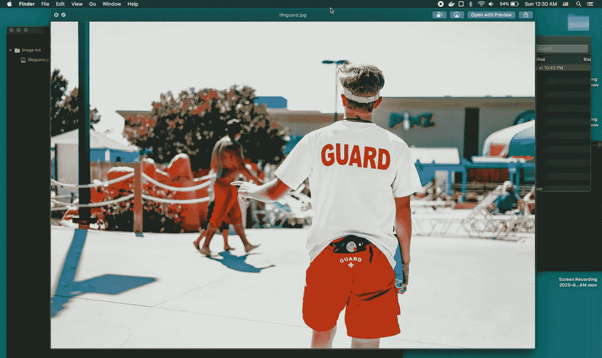

# 使用 Python 调整图像大小并获取十六进制颜色值

> 原文：<https://medium.com/analytics-vidhya/using-python-to-resize-and-get-hex-color-values-from-images-1abbad96b245?source=collection_archive---------8----------------------->



Python 是迄今为止最容易使用的编程语言之一。编写函数是直观的，阅读代码本身也是如此。当处理图像时，我发现 Python 比 NodeJS 和 PHP 更容易使用。

# 用例

假设您正在构建一个类似于 Unsplash 的网站。用户从他们的 DLSR 相机上传 10MB 的图片到你的网站。在前端显示这些图像需要很大的页面负载。那么如何用 Python 来调整图像的大小呢？

1.  找到你的图像
2.  作为图像打开
3.  调整保存大小

依赖关系
-web color:[【https://pypi.org/project/webcolors/】
-python-resize-image:【https://pypi.org/project/python-resize-image/】](https://pypi.org/project/webcolors/)
[-color thief](https://pypi.org/project/python-resize-image/)[https://github.com/fengsp/color-thief-py](https://github.com/fengsp/color-thief-py)

# 安装依赖项

```
pip3 install webcolors python-resize-image colorthief
```

# 调整图像大小

```
from resizeimage import resizeimage 
from PIL import Imageimage_path = './dog.jpeg'
new_max_width = 1800
new_filename = './dog-1800.jpeg'with open(image_path, 'r+b') as f:
  with Image.open(f) as image:
  # Resize
  smaller_image = resizeimage.resize_width(image, new_max_width)
  smaller_image.save(new_filename, image.format)
```

您的图像需要以字节形式打开并且可读。 **image.format** 将图像重新保存为正确的类型(dog.jpeg 保存为 jpeg)。如果你运行上面的代码，你只是调整了图像的大小。高度根据宽度自动计算，保持比例。PIL 包代表“枕头”，安装了“python-resize-image”。枕头是处理图像的终极套装。一种快速获取当前高度和宽度以及其他元数据的方法。

打开同样的**(image _ path，' r+b')** 使用 ColorThief 找到一个调色板。

# 从图像中获取十六进制颜色值

```
from resizeimage import resizeimage
from PIL import Image
import webcolors
from colorthief import ColorThiefimage_path = './dog.jpeg'
new_max_width = 1800
new_filename = './dog-1800.jpeg'image_colors = []with open(image_path, 'r+b') as f:
  with Image.open(f) as image:
        # Resize
        smaller_image = resizeimage.resize_width(image, max_width)
        smaller_image.save(new_image_path, image.format) # Get Colors
        color_thief = ColorThief(new_image_path)
        color_palette = color_thief.get_palette(color_count=10, quality=10)
        for color in color_palette:
            print(webcolors.rgb_to_hex(color))
```

color_palette =返回 RGB 值的数组元组，然后，webcolors.rgb_to_hex 将每个元组转换为十六进制值。

## 例子

```
>>> import webcolors
>>> webcolors.rgb_to_hex((255, 255, 255))
u'#ffffff'
```

按名称获取颜色

```
>>> import webcolors
>>> webcolors.rgb_to_name((255, 255, 255))
u'white'
```

样本代码—[https://github.com/terrillo/learn-python](https://github.com/terrillo/learn-python)

YouTube 视频—[https://youtu.be/modMAADs71w](https://youtu.be/modMAADs71w)