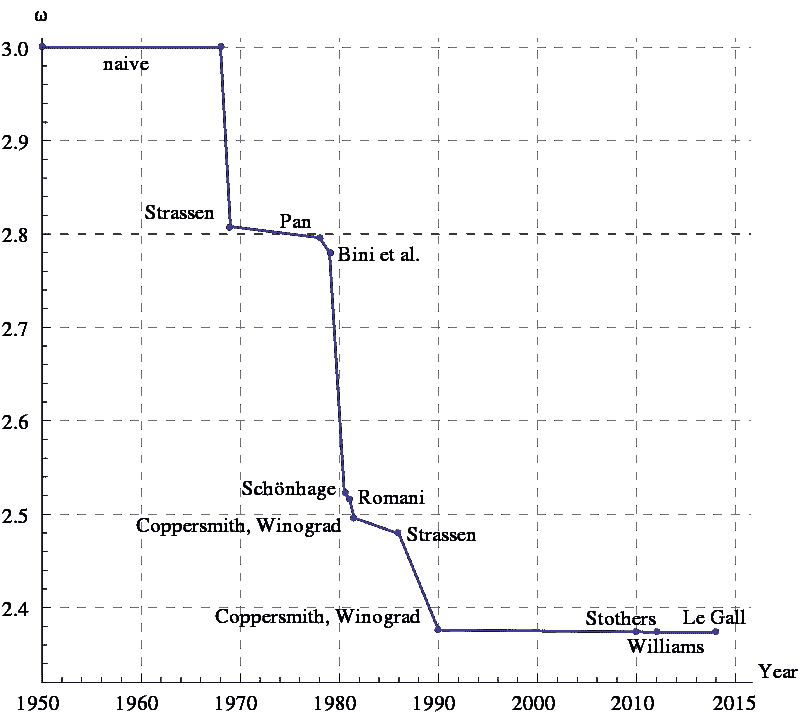
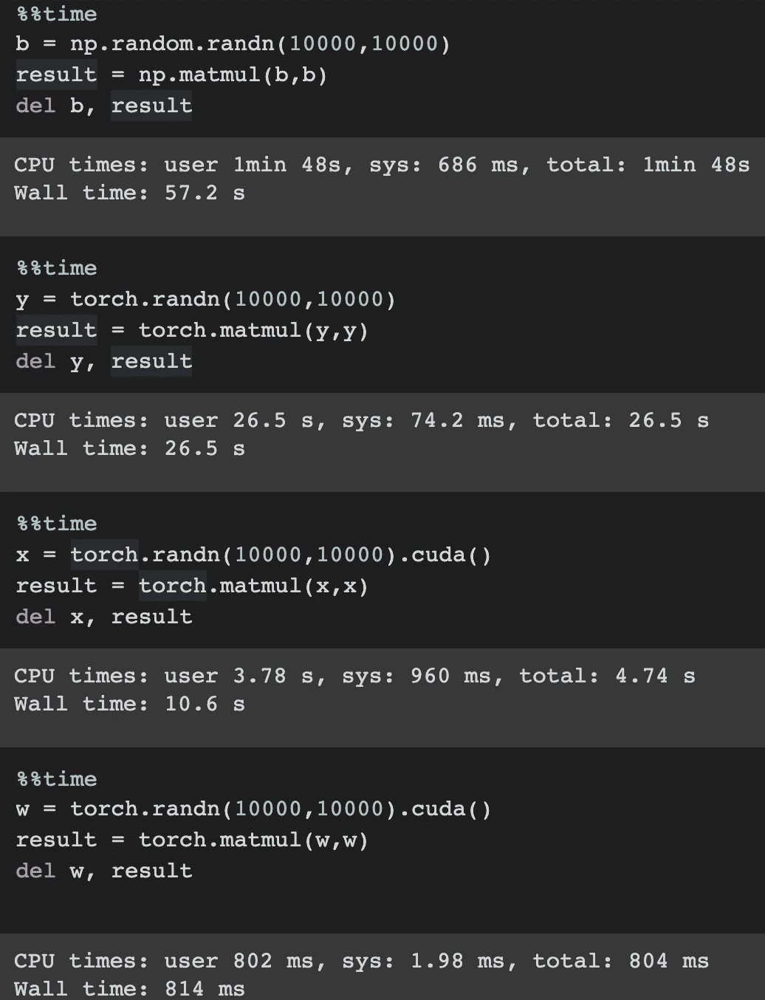

# 使用 Pytorch 和 Cuda 在 Google Colabs 中进行大规模计算

> 原文：<https://medium.com/analytics-vidhya/using-pytorch-and-cuda-for-large-computation-in-google-colabs-f1c026c17673?source=collection_archive---------8----------------------->

马库斯·斯皮斯克在 [Unsplash](https://unsplash.com?utm_source=medium&utm_medium=referral) 上的照片

大多数数据科学家/人工智能爱好者都知道 Pytorch 是一个深度学习框架，用于建立、训练和推理深度神经网络，但很少有人利用 Pytorch 来加快计算速度。

**在这篇文章中，我想比较一下 CPU 上的 NumPy、torch 和 GPU 上的 torch 的速度。**

我会参考这篇[文章](/deep-learning-turkey/google-colab-free-gpu-tutorial-e113627b9f5d)来了解如何在 Google Colab 中设置 GPU

最简单和最常见的方法是模拟矩阵乘法。

# 矩阵乘法

让我们重温一下矩阵乘法

来源:[https://mscroggs.co.uk/blog/73](https://mscroggs.co.uk/blog/73)

它由乘法和加法组成，这种“幼稚”的方式具有三次方的复杂性。例如，4×4 矩阵乘法的复杂度是 O(4)，而 10×10 矩阵乘法的复杂度是 O(10)。

随着时间的推移，这种计算的效率越来越高。

来源:[https://en . Wikipedia . org/wiki/Matrix _ 乘法 _ 算法#次立方 _ 算法](https://en.wikipedia.org/wiki/Matrix_multiplication_algorithm#Sub-cubic_algorithms)

# 结果在谷歌 Colab

试试你自己的谷歌实验室[这里](https://colab.research.google.com/drive/1nw34aks9SdMwHXl9Gf5T9GPxRB9BIIyr)。

我们比较大小为 10，000×10，000 的矩阵乘法。

使用 NumPy (CPU)和 torch (CPU)进行速度对比，torch 的表现比 NumPy 好两倍多( **26.5s vs 57.2s** )。

当我们将矩阵放入 GPU 时，计算速度变为 10.6s。

**但是有一点要注意，GPU 需要预热。**

然后重新运行计算，我们会在 1s 内得到结果！！！

> 在这个小例子中，我们使用 torch GPU 使**比**快 60 倍。

在这个 google colab 文件[这里](https://colab.research.google.com/drive/1nw34aks9SdMwHXl9Gf5T9GPxRB9BIIyr)中，我们实验乘法到 40，000x40，000 只需要 15.9 秒，但是当我们尝试 50，000x50，000 乘法时，它会因为内存不足而出错。

希望这篇文章能有所帮助。

# 干杯！！！