# 使用等级进行比较

> 原文：<https://medium.com/analytics-vidhya/using-rank-for-comparison-5fb075459c0d?source=collection_archive---------11----------------------->


等级是分析学中一个有用的概念。根据我的经验，我使用排名来比较不同的指标、性能随时间的变化以及我最喜欢的计算 CGPA(累积网格点平均值)的版本。在本文中，我们将探讨如何在 Excel、Power BI 和 Tableau 中计算排名。

从数学上来说，秩是数据集中数字的位置，按升序或降序排列。

# 在 Excel 中计算排名

有两个函数可用于计算等级:rank。情商和排名。AVG

下载[样本数据文件](https://vivranin-my.sharepoint.com/:x:/g/personal/vivek_ranjan_vivran_in/EVKB4jfTRINChkKk3j4akz0B1Yys0v7KpQQ8yUD-CDJJwg?e=gy5ICh)

# 等级。情商

等级。EQ 接受三个参数:

*   Number:需要排序的数字
*   Ref:用于比较排名的范围
*   顺序:0 表示按降序排列，1 表示按升序排列

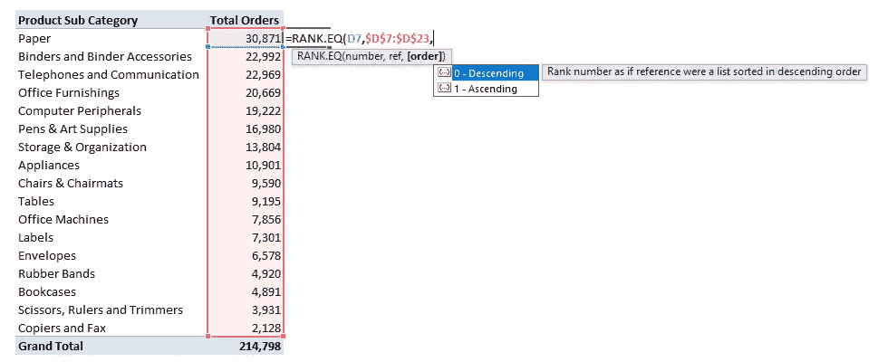

下表显示了输出:

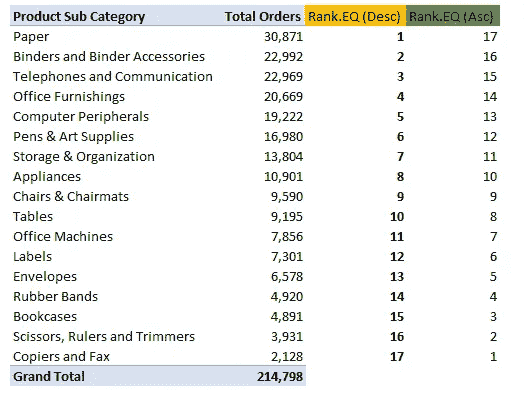

# 等级。AVG

唯一的区别是重复值情况下的输出，RANK。EQ 将较高的可用位置分配给每组副本，然后将下一个可用位置分配给以下值。

在下面的示例中，RANK。EQ 将储物、整理和器具列为第 7 位，而将椅子和椅垫列为第 9 位。是因为第 8 位/秩不可用。

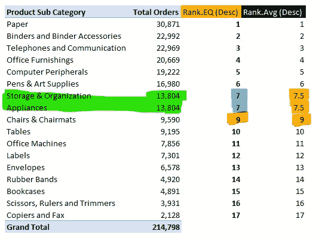

等级。AVG 计算位置的平均值，并将其分配给所有重复的器械包。在上面的示例中，它计算 7 和 8 的平均值(结果是 7.5)，并将其分配给重复集。

在下面的示例中，它计算位置 7，8，9 和 10 的平均值(结果为 8.5)，并将其分配给匹配值:

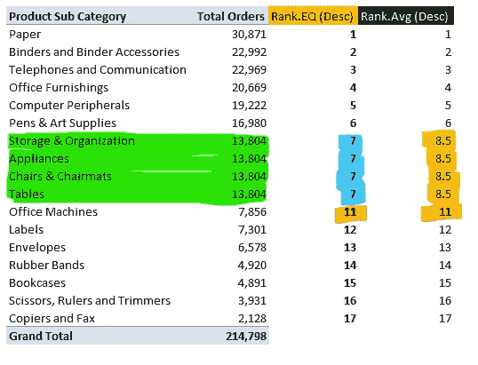

下表演示了 RANK 的输出。AVG，对于位置 7 中不同数量的复本:

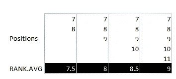

Pivot 还附带了一个获取排名的功能。有关更多详细信息，请参考以下文章:

[对数据透视表执行更多操作:值字段设置](https://www.vivran.in/post/do-more-with-pivot-tables-value-field-settings)

# 在舞台上的地位

计算 Tableau 中的等级非常简单。我们得到以下用于秩计算的公式:秩、秩 _ 密集、秩 _ 修改、秩 _ 唯一

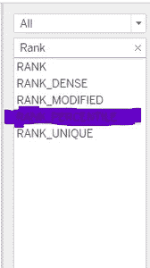

上述所有函数的语法都是相同的:

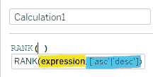

1 >定义计算字段的名称

2 >表达式:排序的值

3 > 'Order ' >排序顺序。该参数是可选的。如果未定义，Tableau 将应用“desc”作为默认顺序。

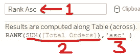

让我们使用第一个等级函数:等级

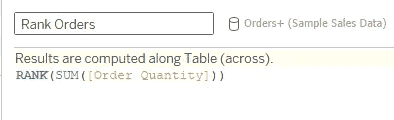

它相当于等级。Excel 中的 EQ 函数

输出:

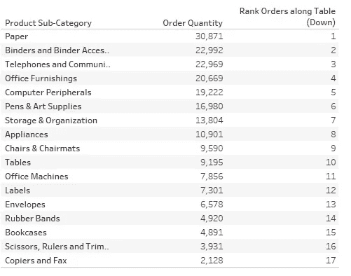

# 多级排名

当我们在视觉中添加产品类别时，我们可以有两个级别的排名:总体和产品子类别级别

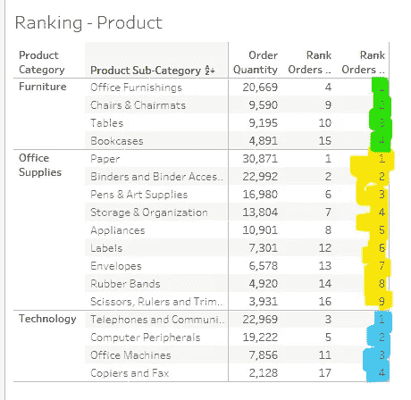

再次拖动度量值下的等级顺序字段。

单击选项箭头>计算使用>产品子类别

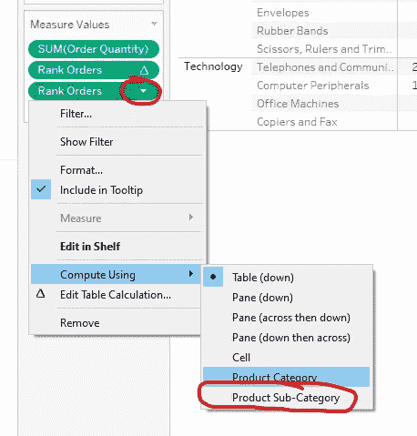

除了秩，Tableau 中还有以下秩函数:

RANK_MODIFIED:相当于 RANK 函数，只是它处理相同值排序的方式不同。RANK 函数将第一个位置分配给所有相同的值。而 RANK_MODIFIED 分配最后一个位置。

在下面的示例中，相同的值是从位置 7 到 10。RANK 指定 7 作为等级值，而 RANK_MODIFIED 指定 10。

RANK_DENSE:相同的值被赋予相同的等级，但它不会在数字序列中插入间隔。

RANK_Unique:相同的值被赋予不同的等级

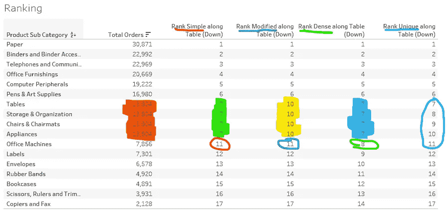

Tableau 中秩函数的不同输出

下载 Tableau 的[样本文件](https://vivranin-my.sharepoint.com/:u:/g/personal/vivek_ranjan_vivran_in/EUju7JP-hzBFvknLtbTjLSIBgHcSe4pu_ZbEAOHVQiWm8A?e=jBzzti)

# 使用 DAX (RANKX)计算 Power BI 或 Power Pivot 中的等级

虽然，达克斯有等级。相当于等级的情商。Excel 中的 EQ 公式，由于功能有限，我们不使用它。相反，我们使用 RANKX。

```
Rank (Prod Sub Cat) = 
 IF(
  //HASONEVALUE helps in getting rid of rank value under Total
    HASONEVALUE(dtOrders[Product Sub-Category]),

  RANKX(
  //Defining the table/column for the scope of the formula
    ALLSELECTED(dtOrders[Product Sub-Category]),
  //the value to be sorted on
        [Total Orders]
      )
 )
```

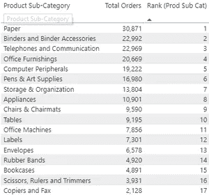

下载[样本文件](https://vivranin-my.sharepoint.com/:u:/g/personal/vivek_ranjan_vivran_in/ETfujvS-KeZMr1_PrjDfWVsBEuKl7CGUfAHoMRsHn5AHSA?e=lvIp0g)

RANKX 公式具有以下参数

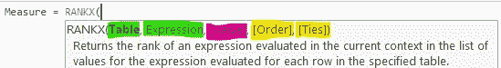

## 

第一个参数

可以是一个物理表，也可以是一个返回表的 DAX 查询的输出。RANKX 是一个迭代器，

参数定义了它运行表达式的范围。关于 Excel 公式，是<ref>参数。</ref>

我们可以把这个参数理解为“排序依据”表达式。关于 Excel 公式，是<number>的说法。</number>

## <value></value>

这是一个可选的论点，也是一个棘手的论点。为了保持简单，如果我们正在寻找简单的排名作为输出，我们不需要这个。我们可以不填。

这也是一个可选参数。如果没有定义，DAX 按降序排序。我们可以选择 ASC 进行升序排序，选择 DESC 进行降序排序。

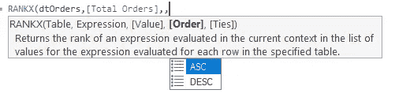

**<平局>**

另一个可选参数。这个名字有点误导，因为它对重复集没有任何作用。相反，它决定我们是要分配下一个可用位置(跳过)还是分配下一个数字排名(密集)

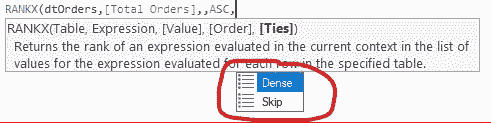

RANKX 中密集和跳过选项的区别

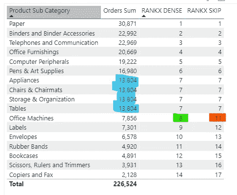

参数决定 rank 函数的范围。例如，前面的 DAX 度量只考虑在可视化中选择的产品子类别。排名会根据产品子类别的选择进行更新:

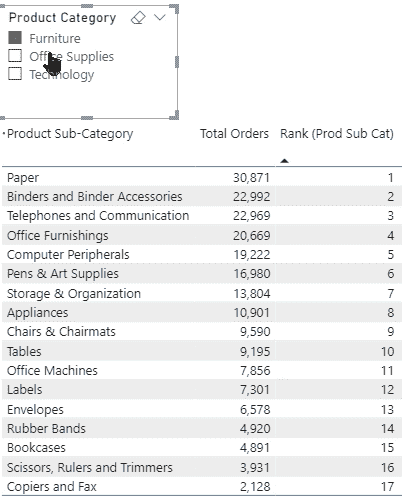

如果我们在范围中包括父层次结构，那么我们可以保留原始排名，即使选择发生变化:

```
Rank (Prod Sub Cat) OverAll = 
 IF(
  RANKX(
  //Removing the filter context applied on Product Category & Sub-category
  ALL(dtOrders[Product Category],dtOrders[Product Sub-Category]),
  [Total Orders]
   )
 )
```

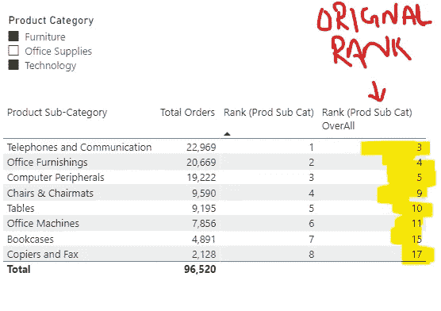

使用矩阵可视化来表示两种不同的排名:

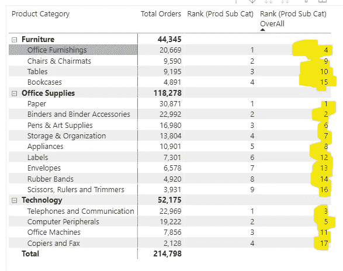

一个概念，三个工具！

*我写关于*[*MS Excel*](https://www.vivran.in/my-blog/categories/excel)*[*权力查询*](https://www.vivran.in/my-blog/categories/powerquery)*[*权力毕*](https://www.vivran.in/my-blog/categories/powerbi)*[*权力中枢*](https://www.vivran.in/my-blog/categories/power-pivot)*[*DAX*](https://www.vivran.in/my-blog/categories/dax)*[*数据分析【数据*](https://www.vivran.in/my-blog/categories/data-analytics)*****

**[@imVivRan](https://twitter.com/imvivran)**