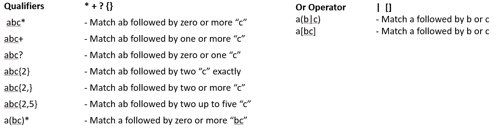
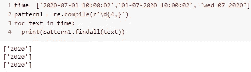

# 正则表达式举例说明

> 原文：<https://medium.com/analytics-vidhya/using-regular-expression-in-datascience-b1fbcd4b60c3?source=collection_archive---------13----------------------->

正则表达式是数据科学家需要了解的最重要的话题之一。正则表达式的知识在编程时发挥了作用。

数据科学家在文本挖掘、计算机视觉等自然语言处理领域使用正则表达式来提取句子的一部分或剥离所需的单词。正则表达式是文本挖掘的基础，现在被认为是 NLP。

使用正则表达式的一个例子是“应用于广告行业的数据科学”。我们在网上看到的每一个广告，都有嵌入广告的文字和图像。比方说，我们需要优化广告，以获得最大的点击率和转化率。那么我们该如何分析优化呢？第一个策略是分析哪些文本影响了最多的受众并带来了最多的点击率，哪些动词和哪种句子类型对社区/地区/国家的回应更多。所以对于执行这样的分析和执行数据科学的工作来说，对正则表达式的基本理解在数据科学领域是非常重要的。

本文分为五个部分，讨论一些基础知识，并通过更多的例子逐步展开讨论，从给定的文本中过滤出复杂的结构。

# **第一节:字符串切片**

如果有简单的方法，为什么要复杂的正则表达式呢？是的，切片效率更高，节省更多时间。

假设我们有一个单独的文本或数据帧中的一个条目带有时间信息，我们想从中提取日期和星期，只需指定您感兴趣的提取文本的开始和停止位置的索引。

简单的文本切片提取日期和日子

但是切片也有缺点，比如我们想从给定的文本中提取年份信息，对于上面的例子，我们可以使用 time[0:4]来提取年份。但是，如果文本是多样化的，比如显示为“2020–07–01”或“01–07–2020”或“2020 年 7 月 3 日”，那么简单的切片将不适用于所有这些示例，除非我们编写单独的切片规则。所以解决方法是使用正则表达式

# **第二部分:正则表达式基础**

彻底理解这些基础知识对于处理文本挖掘是非常必要的

让我们看看这些基础知识的一些例子

\d —仅匹配句子中的数字

\w —匹配句子中找到的所有字母数字字符

\w* —匹配句子中的一个或多个字母数字字符

\w.* —匹配一个字母数字字符，后跟任意数量的字符

正如人们所注意到的，通过玩不同的\d，\w，\s 与+，*，点(。)，我们可以进行基本的模式匹配，提取必要的单词或句子。将这种基本组合与下面提到的限定符结合起来，可以使模式匹配更加高效。

# S **第三节:python 中使用的基本方法**

1.  **编译方法** -使用编译方法存储一个需要经常从任何给定的句子中提取的模式
2.  **匹配方法**——该方法和搜索方法都只返回匹配表达式的第一个匹配项。区别在于 Match 方法只查看句子的起始单词。如果句子的起始单词与正则表达式不匹配，则返回 None
3.  **搜索方法** -当匹配方法只查看句子的起始单词时，搜索方法搜索整个句子以查看是否存在模式匹配，只有在整个句子中都不存在这种模式匹配时，它才返回 None
4.  **findall 方法**——以列表格式返回给定正则表达式的所有匹配项

**编译方法示例:**

*例如，假设我们想要从任何给定的文本中提取年份，这些文本可能看起来像“2020–07–01”或“01–07–2020”或“2020 年 7 月 3 日”。所以我们编译一个 4 位数的模式，并用它来检测 4 位数的任何出现。同样，任何需要找到模式都可以使用编译方法作为模式对象。*

使用 compile 和 findall 提取年份信息

在上面的例子中，使用了 compile 方法和 findall 方法。" **\d{4，}"** 表示后面跟有 4 个或更多数字的任何数字，我们将这种模式传递给 compile 方法。我们可以使用 findall 和 finditer 方法来查找单词及其出现的位置。findall 和 finditer 方法的区别在于， **findall** 方法只返回找到的匹配编译模式的文本(图 a)。而 **finditer** 方法返回找到的文本的位置以及找到的文本本身(图 b)

# **第 4 部分:正则表达式中的标志**

最常用的标志是 ***Multiline、Ignorecase、Dotall 和 Verbose。***

公共标志

下面演示了这些标志的用法；

a.对于下面的给定文本，由于默认情况下 ***正则表达式是区分大小写的*** ，所以它只找到单词“apple”

b.启用 ***忽略大小写标志*** 时，正则表达式不区分大小写，并产生两个字

c.启用 ***多行标志*** 后，正则表达式被逐行搜索

d. ***组合标志*** 是可能的，通过组合多行标志和忽略大小写标志，我们获得大写和小写字

e. ***DOTALL 标志*** 忽略新行文本中的特殊字符' \n '

d. ***VERBOSE 标志*** 用于忽略正则表达式内部编写的注释，基本上在编写复杂的正则表达式时，程序员会显式地编写注释，使正则表达式能够被其他人理解。因此，为了忽略注释并运行正则表达式，使用了这个标志

在这个例子中，匹配正则表达式“a.*e”的单词被写为注释，该表达式用于匹配 apple。忽略注释并运行详细标志被使用

# **第 5 节:示例**

为了从基础到高级熟悉一些正则表达式，下面列出了一些例子

**例 1**

来自 give text《忍者忍者 einja》，1。一个人找“忍者”；2.找到“忍者或者 einja”；3.找到“忍者或忍者”

**例 2**

从给定的文本“aooo cooo 2ooo eooo a c”。1.找到“aooo 和 cooo”；2 .找出除了“aooo 和 cooo”以外的单词；3.查找任何以字母开头的单词；4.查找所有以字母和数字开头的单词。

**例 3**

在给定文本中查找电话号码，请按 1。查找任何超过 1 位数的数字；2.只查找 10 位数的数字；3.查找超过 10 位的数字；4.查找 10 到 13 位数的数字

**例 4**

查找任何 3 位数字后跟任何字符的匹配项

**例 5**

提取以“cl”开头，以“ly”结尾的单词

**例 6**

查找这些格式的日期“工作日日月年”或“日/月/年”

我们用 or 运算符(|)组成组，并用它们来搜索我们感兴趣的组合。符号“/”不是特殊字符，因此我们在“/”前使用转义序列“\”，以便在正则表达式中考虑它。

**例 7**

**例 8**

查找电子邮件，如 britany2020@kaggle.com，britany.raj@hotmail.com，britany.raj@yahoo.co.in。写一个适用于查找任何此类电子邮件的正则表达式。这是一个复杂的正则表达式，因为我们需要将多个表达式合并成一个，所以下面的表达式将适用于所有三种电子邮件格式

但是我是如何形成如此复杂的模式的呢，让我们来打破这些表达式，如下所示

为了跟进这个正则表达式的基本指南，不久我将写高级正则表达式指南。

如需任何帮助，请联系我@ Linkedin。我很乐意帮助你。

 [## Induraj Ramamurthy -深度学习实习生- Joovence | LinkedIn

### 聪明、有趣、富有同情心，我提升自己的技能以适应不断增长的市场。被情绪波动所吸引…

www.linkedin.com](https://www.linkedin.com/in/indurajpr/)