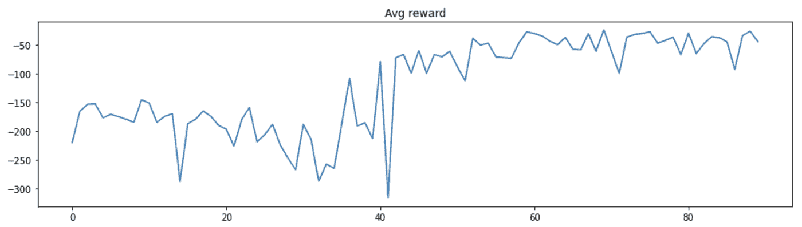

# 用 RL 教无人机引导人控车

> 原文：<https://medium.com/analytics-vidhya/using-rl-to-teach-a-drone-to-guide-a-human-controlled-vehicle-3805a13c982e?source=collection_archive---------17----------------------->

AirSim 运行在无人机和汽车的非关联引擎上

# 解决人机交互(HRI)任务，即自主无人机学习在 AirSim 环境中引导人类控制的车辆，并使用强化学习算法

与马坦·韦克斯勒一起工作

在最近出现的自主代理的任务中，更具体地说，在与人类交互的任务中，有一类任务需要引导人类通过路径或任务。可能只是穿过一条繁忙的道路，学习一项新的任务，就像阿里·沙夫蒂等人所做的那样。al 在他们的“[工作中，一种人-机器人协作强化学习算法](https://scholar.harvard.edu/files/kartoun/files/1ca003_83c9850ad8cde33e4cae5bb72077a132.pdf)，或者甚至跟随它在机器人带领的博物馆参观中前进，就像 Wolfram Burgard 等人在他们的[工作中所做的那样，交互式博物馆导游机器人](https://www.aaai.org/Papers/AAAI/1998/AAAI98-002.pdf)。

然而，随着机器人成为我们日常生活中更大的一部分，以及它们在各种任务中帮助我们的能力，这样的算法一定会越来越受欢迎。

说了上面的话，我想我们应该以机器人导航的形式分享一下我们最近在人机交互(HRI)领域的项目，也就是说，自主无人机需要引导人类智能体通过模拟的 3D 网格世界环境。

我们所理解的任务是机器人主体需要学习人类的控制约束(如等待时间、机器人的视线、机动性等)。)以允许人类沿着路径正确地跟随它，同时在最短的时间内完成它。

换句话说，无人机需要学会优化飞行，这样人类控制的汽车才能沿着路径跟随它。无人机将监控他们的相对状态，并决定其行动，如果他们都在合理的延迟内达到目标，则结束成功的一集。

# 空气模拟环境

为了开始模拟这样的任务，我们设置了一个运行在 UnrealEngine 上的(非常棒的)微软 AirSim 插件，并让它模拟汽车和无人机。虽然单独模拟其中任何一个，甚至两个一起模拟都很容易做到，但同时处理两个还不支持，我们不得不稍微变通一下以这种方式设置它。如果你也想尝试一下，你可以在这里跟随我们的指南。

我们在训练中使用了简单的 3D 积木环境，但是如果需要的话，也可以很容易地切换到不同的环境。

# 操作中枢

在我们深入研究我们实现的不同模块之前，让我们简要描述一下该算法的工作方案，如下面的框图所示:

粗略地说，两辆车都降落在 3D 网格世界中，无人机捕捉鸟瞰图像，规划通往给定(随机)目标的路径，并开始飞向目标，不断监控由试图跟随它的人类驾驶员控制的车辆的相对状态。

此时你可能会问自己，谁在学什么，什么时候学？在“游戏”期间，无人机需要不断地决定它的行动(即减速、停止、增加速度)，此外，它还会根据它所处的状态获得奖励。在每一集(或游戏)结束时，无人机的决策者(或政策制定者)会根据游戏中积累的经验接受培训，以根据该集的整体成功做出更好的决策。等等，我们很快会详细介绍算法。

# 路径规划

我们遇到的第二个需要是无人机需要有一些路径或轨迹来飞行，虽然出于训练的目的预先设置轨迹是可能的，但我们希望设计一个更通用的解决方案，只是给无人机提供一个目标，让他做规划工作，还负责特定的任务(让一个人跟着你)，正如你将在下面看到的。

总的来说，路径规划是机器人学中一个彻底研究的主题，其算法范围从简单的最短路径规划器到复杂密集环境中基于值的复杂规划器。我们选择关注两个共同的计划者，PRM 和 RRT，稍微增加了一点支持一个外部的(后来知道的)参数来控制计划路径的平滑度(因此，根据我们的直觉，使它以后更容易跟随)

1.  **平滑 RRT**——一种快速探索随机树的风格，另外还限制了给定路径的允许转弯角度。该算法仅在检查新分支是否可行(即在避障方面)时类似于原始算法。我们添加了最大旋转角度阈值检查，查看前一个节点，并计算两条边之间所需的旋转角度，仅允许低于 th 的边。该超参数是灵活的，并且将由算法根据其从先前情节中获得的经验来控制/学习。虽然这种算法不一定得出最佳路径，但由于它在稀疏环境中运行迅速，所以我们能够执行多次运行，每次都生成一条轨迹和一个成本，然后选择最佳路径。

由平滑 RRT 算法找到的路径，可以看出，只允许产生小于 50 度转向角的分支，因此得到平滑路径。

1.  **PRM 与类似 BFS 的动态规划设计者**设计寻找从起点到目标的最佳路径，但同时考虑路径的距离和平滑度。要做到这一点，每个节点不仅要保持到它的最短路径，还要保持从它的每个邻居穿越的平滑度，以便如果从一个新节点到达，它可以重新计算从那里开始什么最佳路径是合适的。转弯相对于距离的成本权重是可控的，并且可以通过算法来调整。虽然在理论上，该算法应该导出最佳路径(在上述意义上以及在 PRM 生成的图中)，但是与 RRT 算法相比，其复杂性有时不值得花费时间，该算法在不太密集的环境中收敛得相当快。

由平滑 PRM 算法找到的路径。请注意，该路径仅是它随机生成的最佳 wrt 点(因此，仅当点数趋于无穷大时才是全局最佳的)

**免责声明** —在测试了两者之后，我们决定继续使用基于 RRT 的方法来实现算法，主要是因为它在简化的环境和每集的总运行时间中有足够的结果。也就是说，如果需要的话，两者(或任何其他的启发式规划)都可以被插入并用作路径规划块。

# 现在是算法

我们实现了一个类似健身房的环境包装器和一个具有演员-评论家模式的 RL 算法。粗略地说，这意味着两个不同的功能(或者我们的例子中的神经网络)，一个输出可能动作的概率分布；从 0 到 10 的速度的离散表示，第二个是特定状态的值(状态的值是已知的 RL 项，用于表示就游戏的最终目标和达到该目标的能力而言状态有多好)。第一个用于生成下一个动作，而第二个用于减少学习过程中损失项的方差。我们不会深入 RL 算法的工作机制的所有细节，因为它是一个已知的方案，而不是我们的新工作。我们的实现包括实现它，以便它接收我们从模拟器实时提取的状态向量，并将动作返回给模拟器执行。大量的努力也投入到算法的奖励形成中，即，代理人因什么得到奖励/惩罚，以及以什么样的规模。目前，代理将获得每秒-1 的时间惩罚(以产生完成路径的趋势)，如果代理之间没有视线，将获得-50 的惩罚，无人机和汽车的相对距离、速度和方向的惩罚，以及到达计划轨迹图中的节点的里程碑奖励(也是为了产生完成路径的激励)。我们研究了平衡完成路径的倾向与“礼貌”的参数尺度，我们认为可以做进一步的工作来产生更有益的启发，以产生更优的政策制定者。

从 Elmar Diederich 的“强化学习——技术介绍”中摘录的一个演员兼评论家的总体方案

# 那么成功了吗？

5X 速度下的单场比赛

首先，为了训练我们的代理，我们总共有大约 100 个训练集(游戏)，每个训练集花费大约 100 秒(直到达到目标或超时)。培训由 3 个不同的用户完成，并由 7 个用户进行测试，每个用户玩 10 个评估游戏。虽然就学习算法而言，这实际上并不多，但即使只有这么多的经验，我们也能够开始看到学习的线索，我们很快就会看到。

正如你在下面看到的，代理首先学会的事情之一是当相对距离增加时减速(即汽车远远落后于无人机)。第二级观察是一般的速度降低，最有可能满足相对速度的惩罚/奖励。如上所述，一个只有 2 个入门游戏的用户能够完成 8/10 的游戏，并获得大约 80%的整体成功率(在训练之前，在无人机刚刚飞到目标之前，甚至很难看到它)。然而，仍然需要更多的训练来实际优化算法，并在更多样化的数据集(即更多用户)上进行训练，以减少我们学习游戏的偏见，并允许它捕捉关于人类代理的更复杂的见解。

单集的状态动作剧情。大约运行 60 次后，无人机能够学会在汽车离得更远时减速

虽然需要更多的数据来证明该算法确实有效，并在更多新用户中进行更具体的测试，但可以看到的结果确实表明一些学习正在发生

下图是学习阶段每集的平均奖励。可以注意到，在大约 40-50 集时，该算法能够捕捉到相对距离的惩罚与当汽车更远时开始减速之间的关系。也就是说，所有的剧集都在 100 秒或更短的时间内完成(因此它一直在追求它的目标回报)

最近 90 集(游戏)的平均奖励。大约 40 集后，无人机“学会”最好等汽车来减少相对距离的损失。

# 包扎

这个项目的主要收获首先是实际建立一个环境来构建和训练这样的算法的复杂性，更具体地说，是我们必须建立的外部模拟器和插件的工作。此外，在每一集都必须与人一起完成的情况下收集数据的挑战(例如，与学习玩视频游戏的算法相反)在需要大量训练数据来收敛的算法中是一个巨大的挑战，因此在某些情况下，需要降低复杂性或分解成子问题，以实际上允许学习可行。也就是说，我们很高兴看到无人机开始捕捉人/车响应时间和速度限制的约束(尽管微不足道)，并相信随着进一步的工作和训练数据，它可以走得更远。

我们希望很快投入更多的时间来稳定平台和复制它，这样我们就可以让它异步训练，从而扩大我们的训练集。此外，我们计划探索状态向量的结构和内容，最初包括更广泛的状态指标，后来甚至可能只通过无人机的摄像头输入，让它的神经网络学会自己提取状态特征(尽管需要大量数据，但这是一个浪漫的想法)。此外，奖励函数的形成肯定会产生改进，既可以适当地缩放它，也可以找到更复杂的机制作为基础。

该项目的所有源代码都可以在这里找到以及一些更多的实施细节，如果想要的话。

谢谢！