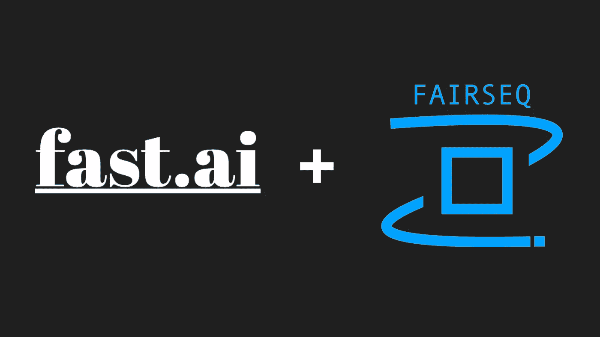
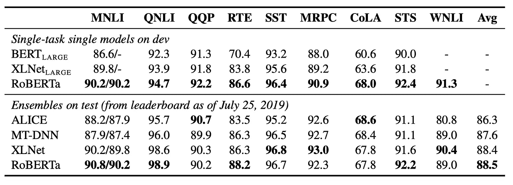
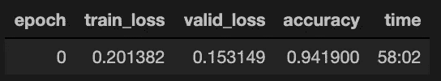

# 将 RoBERTa 与 fast.ai 一起用于 NLP

> 原文：<https://medium.com/analytics-vidhya/using-roberta-with-fastai-for-nlp-7ed3fed21f6c?source=collection_archive---------1----------------------->

## 在 fast.ai 中实现当前最先进的 NLP 模型

本教程将带你通过拥抱脸的变形金刚和 fast.ai 库来集成 Fairseq 的 RoBERTa 模型。我们将在 Keita Kurita 的 [*文章的基础上，用快速 AI*](https://mlexplained.com/2019/05/13/a-tutorial-to-fine-tuning-bert-with-fast-ai/) *对 BERT 进行微调。最后，我们将使用* [*IMDB 数据集*](https://www.kaggle.com/lakshmi25npathi/imdb-dataset-of-50k-movie-reviews) *。*

*更新 2020.11:* [*自本文发布后，fast.ai 已升级至 v2*](https://www.fast.ai/2020/08/21/fastai2-launch/) *。为了与下面的步骤兼容，v2 没有经过测试。因此，*[*v1*](https://pypi.org/project/fastai/1.0.61/)*的用法推荐与本文一并关注。*



Fastai 提供了一个简化的界面来构建数据集和训练模型。然而，它没有为当前最先进的 NLP 模型(如 RoBERTa、BERT 或 XLNet)提供内置功能(截至 2019 年 9 月)。将这些整合到 Fastai 中，可以让您享受 Fastai 方法的便利，以及这些预训练模型的强大预测能力。

迁移学习的概念对于 NLP 来说还是一个相对较新的概念，并且正在以非常快的速度发展。因此，很有希望看到像 RoBERTa 这样的模型在几个不同的 NLP 任务中在 [SuperGLUE benchmark](https://super.gluebenchmark.com/leaderboard) 上表现得非常好。



罗伯塔与强力胶任务的其他模型。[来源](https://arxiv.org/pdf/1907.11692.pdf)

本质上，RoBERTa 建立在 BERT 的基础上，通过更多数据、更大的批量进行更长时间的预训练，同时只对掩蔽语言建模进行预训练，而不是对下一句预测进行预训练。底层架构保持不变，因为两者都利用屏蔽语言模型预训练。你可以阅读[这里的](https://arxiv.org/pdf/1907.11692.pdf)了解更多关于差异的信息。

# 0.先决条件

您需要安装 Fastai 和 transformers 库，最好能够访问 GPU 设备。对于 Fastai，您可以遵循此处提供的[说明。对于变压器:](https://github.com/fastai/fastai#installation)

```
pip install transformers
```

# 1.设置记号赋予器

首先，让我们导入相关的 Fastai 工具:

```
from fastai.text import *
from fastai.metrics import *
```

还有《变形金刚》中罗伯塔的记号赋予器:

```
from transformers import RobertaTokenizer
roberta_tok = RobertaTokenizer.from_pretrained("roberta-base")
```

RoBERTa 使用与 BERT 不同的默认特殊标记。例如，不使用[CLS]和[SEP]作为开始和结束标记，而是分别使用~~和~~。例如，标记化的电影评论可能看起来像:

“电影很棒”→ [ ~~，movie，was，great，~~

我们现在将围绕 RobertaTokenizer 创建一个 Fastai 包装器。

现在，我们可以初始化我们的 Fastai tokenizer:(注意:为了 Fastai 兼容性，我们必须将 Fastai 包装器包装在 tokenizer 类中)

```
fastai_tokenizer = Tokenizer(tok_func = FastAiRobertaTokenizer(roberta_tok, max_seq_len=256), pre_rules=[], post_rules=[])
```

接下来，我们将加载罗伯塔的词汇。

```
path = Path()
roberta_tok.save_vocabulary(path) with open('vocab.json', 'r') as f:
    roberta_vocab_dict = json.load(f)

fastai_roberta_vocab = Vocab(list(roberta_vocab_dict.keys()))
```

# 2.设置数据中心

在构建 Fastai 数据束之前，我们需要为记号赋予器和词汇表创建适当的预处理器。

现在，我们将专门为 Roberta 创建一个 DataBunch 类。

最后，我们还需要一个特定于 Roberta 的 TextList 类:

```
class RobertaTextList(TextList):
    _bunch = RobertaDataBunch
    _label_cls = TextList
```

# 3.加载数据

咻，现在我们已经完成了相关的设置过程，我们可以把它们放在一起读入我们的 [IMDB 数据](https://www.kaggle.com/lakshmi25npathi/imdb-dataset-of-50k-movie-reviews)。

```
df = pd.read_csv("IMDB Dataset.csv")feat_cols = "review"
label_cols = "sentiment"
```

我们现在可以简单地创建一个 Fastai 数据集群，使用:

```
processor = get_roberta_processor(tokenizer=fastai_tokenizer, vocab=fastai_roberta_vocab)data = RobertaTextList.from_df(df, ".", cols=feat_cols, processor=processor) \
    .split_by_rand_pct(seed=2019) \
    .label_from_df(cols=label_cols,label_cls=CategoryList) \
    .databunch(bs=4, pad_first=False, pad_idx=0)
```

# 4.构建自定义 Roberta 模型

在这一步，我们将定义模型架构，并传递给我们的 Fastai 学习者。本质上，我们向 RobertaModel 的输出添加了一个新的最终层。这一层将被专门训练用于 IMDB 情感分类。

初始化模型:

```
roberta_model = CustomRobertatModel()
```

# 5.训练模型

初始化我们的 Fastai 学习器:

```
learn = Learner(data, roberta_model, metrics=[accuracy])
```

开始训练:

```
learn.model.roberta.train() # set roberta into train modelearn.fit_one_cycle(1, max_lr=1e-5)
```

在仅仅一个时期之后并且没有解冻层的情况下，我们在验证集上实现了 94%的准确度。



. 941900 在一个训练时期内的准确度

您现在还可以利用其他 Fastai 方法，例如:

```
# find an appropriate lr
learn.lr_find()
learn.recorder.plot()# unfreeze layers
learn.unfreeze()# train using half precision
learn = learn.to_fp16()
```

# 6.创建预测

由于 Fastai 的 get_preds 函数没有按顺序输出预测，我们可以使用下面的方法。

```
def get_preds_as_nparray(ds_type) -> np.ndarray:

    preds = learn.get_preds(ds_type)[0].detach().cpu().numpy()
    sampler = [i for i in data.dl(ds_type).sampler]
    reverse_sampler = np.argsort(sampler)
    ordered_preds = preds[reverse_sampler, :]
    pred_values = np.argmax(ordered_preds, axis=1)
    return ordered_preds, pred_values# For Valid
preds, pred_values = get_preds_as_nparray(DatasetType.Valid)
```

注意:如果我们有一个测试集，我们可以很容易地在前面的步骤 3 中通过初始化“数据”来添加一个测试集，如下所示:

```
data = RobertaTextList.from_df(df, ".", cols=feat_cols, processor=processor) \
    .split_by_rand_pct(seed=2019) \
    .label_from_df(cols=label_cols,label_cls=CategoryList) \
    .add_test(RobertaTextList.from_df(test_df, ".", cols=feat_cols, processor=processor)) \
    .databunch(bs=4, pad_first=False, pad_idx=0)
```

因此，如果我们有一个测试集，我们可以通过以下方式获得 preds:

```
test_preds = get_preds_as_nparray(DatasetType.Test)
```

现在，您可以使用 RoBERTa 和 Fastai 在几乎任何基于文本的数据集上进行训练，结合两种非常强大的工具来产生有效的结果。你可以在我的 [*github 页面*](https://github.com/devkosal/fastai_roberta/tree/master/fastai_roberta_imdb) *或* [*kaggle 内核*](https://www.kaggle.com/ds3761/using-roberta-with-fastai-tutorial) *上的数据一起访问本教程的 jupyter 笔记本。(如果在 github 上查看 nb 有困难，使用* [*这个链接*](https://github.com/devkosal/fastai_roberta/tree/master/fastai_roberta_imdb) *)。如果你有兴趣看到强力胶任务的类似实现，请继续阅读我下面关于使用 RoBERTa 和 Fastai 完成强力胶任务 CB* ***的工作。***

 [## 德夫科萨尔/法斯泰 _ 罗伯塔

### 此时您不能执行该操作。您已使用另一个标签页或窗口登录。您已在另一个选项卡中注销，或者…

github.com](https://github.com/devkosal/fastai_roberta/tree/master/fastai_roberta_imdb)