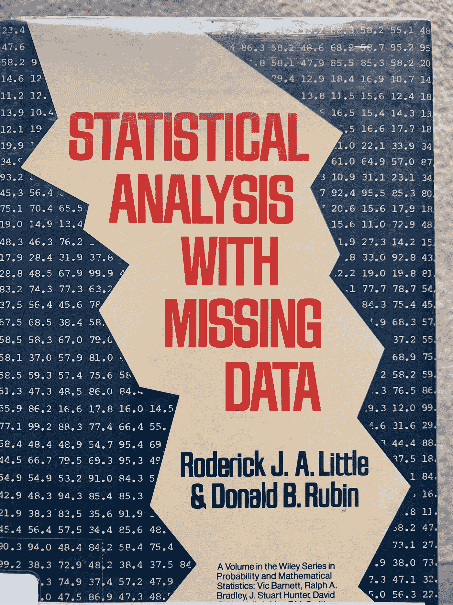
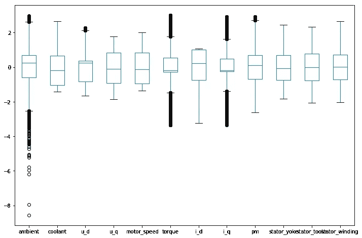

# 使用 scikit-learn 的迭代估算器

> 原文：<https://medium.com/analytics-vidhya/using-scikit-learns-iterative-imputer-694c3cca34de?source=collection_archive---------1----------------------->

我对数据模式非常着迷，任何分析的结果都取决于数据集的健壮性。但是，在当前时代，由于诸多原因——传感器故障、调查受访者偏差、缺失值、不正确的数据输入或记录等等，实现数据集中的稳健性几乎是不可能的。

我最讨厌的事情之一是数据集中缺少值。通过对给定数据集的精心设计的假设，我相信通过某些算法，您可以智能地填充缺失的值。

Rubin 和 Little 所著的《缺失数据的统计分析》一书详细讨论了几种技术。我建议查看一下，但总的来说，它们涉及了处理缺失值的三个主要思想:

1.  **删除缺失值。**只要与现有记录相比数量非常少，这是可以接受的。
2.  **用从给定字段/列中的其他值导出的统计值填充所有缺失值。**我在这里讨论了一些不足之处:[https://medium . com/swlh/practical-technique-for-filling-missing-values-in-a-data-set-f8d 541492 b1f](/swlh/practical-technique-for-filling-missing-values-in-a-data-set-f8d541492b1f)
3.  **通过回归估算缺失值。**



当然，现代软件让它变得简单了。

我了解了 sklearn 的迭代估算器，发现它令人印象深刻。你可以在这里了解 sklearn 的*实验性*迭代估算器的实现:[https://sci kit-learn . org/stable/modules/generated/sk learn . impute . iterative imputr . html](https://scikit-learn.org/stable/modules/generated/sklearn.impute.IterativeImputer.html)

这个类实现了书中讨论的一些算法，非常有用。我想对它进行如下测试:

1.  获取完整的数据集，假设可用数据是干净的。
2.  随机选取一些列，随机去掉一些数据点。
3.  使用迭代估算器上的污损数据集来填充缺失值。
4.  将新数据集与原始数据集进行比较，以评估 sklearn 的迭代估算器的性能。

我使用来自 Kaggle 的[电机温度数据集来演示这一点。这是一个大约有一百万个数据点的数字数据集。我加载了数据集并删除了列“Profile ID ”,这是一个键。其余的列如下:](https://www.kaggle.com/wkirgsn/electric-motor-temperature)

```
<class 'pandas.core.frame.DataFrame'>
RangeIndex: 998070 entries, 0 to 998069
Data columns (total 12 columns):
ambient           998070 non-null float64
coolant           998070 non-null float64
u_d               998070 non-null float64
u_q               998070 non-null float64
motor_speed       998070 non-null float64
torque            998070 non-null float64
i_d               998070 non-null float64
i_q               998070 non-null float64
pm                998070 non-null float64
stator_yoke       998070 non-null float64
stator_tooth      998070 non-null float64
stator_winding    998070 non-null float64
dtypes: float64(12)
memory usage: 91.4 MB
```



数据集中每一列的分布

我编写了下面的函数，随机选择数据集中 40%的列，并在每一列中抽取 15%到 50%的值。

```
def defile_dataset(df, col_selection_rate=0.40):
    cols = np.random.choice(df.columns, int(len(df.columns)*col_selection_rate))
    df_cp = df.copy()
    for col in cols:
        data_drop_rate = np.random.choice(np.arange(0.15, 0.5, 0.02), 1)[0]
        drop_ind = np.random.choice(np.arange(len(df_cp[col])), size=int(len(df_cp[col])*data_drop_rate), replace=False)
        df_cp[col].iloc[drop_ind] = np.nan
    return df_cp, cols
```

在数据帧上调用上述函数后的结果:

```
<class 'pandas.core.frame.DataFrame'>
RangeIndex: 998070 entries, 0 to 998069
Data columns (total 12 columns):
**ambient           509016 non-null float64**
coolant           998070 non-null float64
u_d               998070 non-null float64
u_q               998070 non-null float64
motor_speed       998070 non-null float64
**torque            768514 non-null float64**
i_d               998070 non-null float64
i_q               998070 non-null float64
**pm                628785 non-null float64**
stator_yoke       998070 non-null float64
stator_tooth      998070 non-null float64
**stator_winding    628785 non-null float64**
dtypes: float64(12)
memory usage: 91.4 MB
```

在使用下面的类之前，你必须确保启用 sklearn 的迭代估算器:

```
from sklearn.experimental import enable_iterative_imputer  
from sklearn.impute import IterativeImputer
```

一旦我设置好了，我就使用下面的函数，大部分默认参数用于迭代估算，但迭代次数(n_iter)为 100，以确保我给的足够多，使函数收敛。

```
def impute_once(df_orig):
    df_miss, cols = defile_dataset(df_orig)
    df_orig_slice = df_orig[cols]
    imputer = IterativeImputer(max_iter=100)
    df_stg = df_miss.copy()
    imp_arr = imputer.fit_transform(df_stg)
    return df_orig_slice, df_miss[cols], pd.DataFrame(imp_arr[:,[df_orig.columns.get_loc(i) for i in cols]], columns=cols), imputer.n_iter_
```

然后我调用函数并检查一些信息:

```
df_og, df_def, df_imp, n_iter = impute_once(df)
print(df_og.columns)
print(df_imp.columns)
print(n_iter)Index(['i_q', 'stator_winding', 'u_q', 'stator_tooth'], dtype='object')
Index(['i_q', 'stator_winding', 'u_q', 'stator_tooth'], dtype='object')
23
```

看起来它在 23 次迭代中收敛了。

为了比较迭代估算与用一个统计值(如平均值)填充所有缺失值的最基本技术(sklearn 的简单估算或 pandas 的 fillna ),我在数据集副本上使用简单估算填充缺失值，并评估两种情况下的均方误差。

简单估算器:

```
for i in range(len(df_og.columns)):
    print("Simple Imputer: MSE for {} is {:.4f}.".format(df_og.columns[i], mean_squared_error(df_og[df_og.columns[i]], df_simimp[df_simimp.columns[i]])))**Simple Imputer: MSE for i_q is 0.3498.
Simple Imputer: MSE for stator_winding is 0.1499.
Simple Imputer: MSE for u_q is 0.3909.
Simple Imputer: MSE for stator_tooth is 0.3498.**
```

迭代估算器:

```
for i in range(len(df_og.columns)):
    print("Iterative Imputer: MSE for {} is {:.4f}.".format(df_og.columns[i], mean_squared_error(df_og[df_og.columns[i]], df_imp[df_imp.columns[i]])))**Iterative Imputer: MSE for i_q is 0.0016.
Iterative Imputer: MSE for stator_winding is 0.0023.
Iterative Imputer: MSE for u_q is 0.0724.
Iterative Imputer: MSE for stator_tooth is 0.0009.**
```

结论:你可以看到，当使用迭代估算时，MSE 要低得多。接下来我将尝试并分享的是多次运行上述方法，以查看 MSE 的分布，尝试调整迭代估算类的其他参数，尤其是更改估计值。默认值是 BayesianRidge()。

我鼓励你尝试一下，并在评论中分享你的想法！