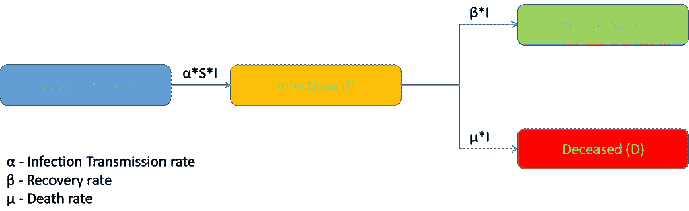
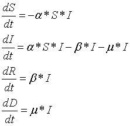
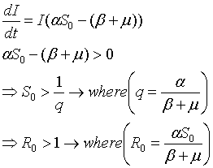
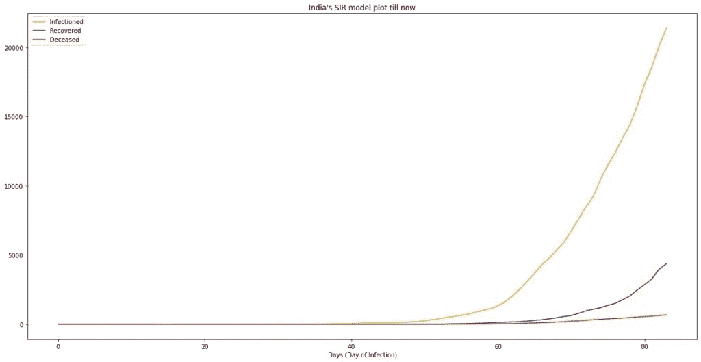
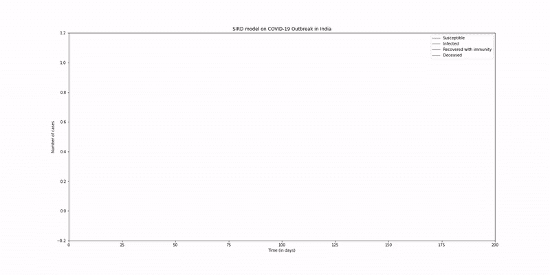
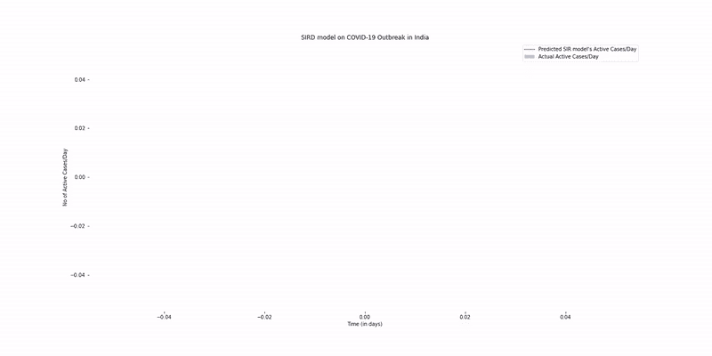
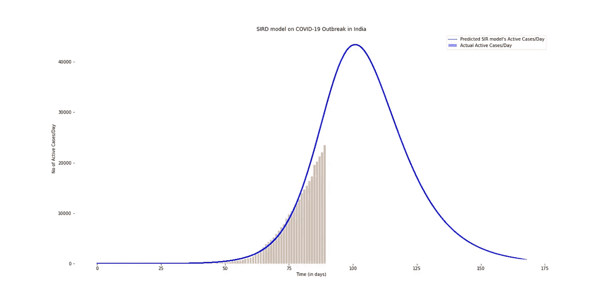

# 利用 SIRD 模型预测新冠肺炎疫情

> 原文：<https://medium.com/analytics-vidhya/using-sird-model-to-predict-the-covid-19-outbreak-in-india-c3eb6ebd101e?source=collection_archive---------11----------------------->

疫情新冠肺炎冠状病毒是我们这个时代最大的全球性健康灾难，也是二战以来最大的挑战。自从去年 12 月首次出现以来，这种病毒已经扩散到除南极洲以外的每一个大陆。各国都面临着一个障碍，即通过检测、识别和在控制区提供治疗来减缓传播，同时也带来了全国范围的封锁。

新冠肺炎不仅是一场健康危机，它还会造成毁灭性的经济、社会和政治危机，让世界倒退数年。大多数世界上最大的城市都被遗弃了，因为人们呆在室内，或者是出于选择，或者是出于政府的命令。人们正在失去工作和收入，不知道什么时候会恢复正常。

对于政府来说，建模和预测疫情何时结束以及它将如何影响各个地区非常重要。这有助于提前采取更好的预防措施，将整体损失降至最低。最好也是最简单的方法是使用分室模型。分室模型简化了传染病的数学模型。SIRD 是车厢模型之一。

# 什么是 SIRD？

**SIR 模型**是最简单的房室模型之一，很多模型都是这种基本形式的衍生物。SIRD 模型来源于 SIR 模型。该模型由四个区间组成: **S** 表示可接受的 **s** 的数量， **I** 表示 **i** 感染的数量， **R** 表示 **r** 恢复(或免疫)的个体数量， **D** 表示 **d** 接收的个体数量。



SIRD 模型的分室模型图

# SIRD 模式是如何运作的？

在 SIRD 模型中，我们假设人口在疫情时间内保持不变。总人口是常数(N)，在任何时刻，易感、感染、康复和死亡个体的总和等于总人口(N)。

```
(Eq.1) S + I + R + D = N
```

没有生命动力学，让我们从初始条件开始我们的模型。最初，假设我们有 10 个感染病例。最初不会有恢复或死亡的病例。因此，初始易感病例数等于初始感染病例数与总人口数之差。

```
(Eq.2) D0 = 0; Re0 = 0; I0; S0 = N - I0
```

从图中我们可以了解到，人会以传播/接触率(α)从易感走向传染。为了找出在任何时候有多少人从易感变为传染，我们找到了可能的总相互作用，即`S*I`，并将总相互作用乘以接触/传播率`-α*S*I`(负号是因为随着时间的推移，易感区间中的人会减少)。类似地，对于康复的或死亡的，人们分别以康复率(β)和死亡率(μ)来自感染室。回收或死亡舱的变化分别由`β*I`和`μ*I`给出。最后，对于传染区，人们来自易感区，也去康复/死亡区，因此传染区的变化由`α*S*I - β*I - μ*I`给出。



微分方程

我们知道`S≤S0`，用 S0 代替 S，`dI/dt`变成了一个不等式。从这个不等式我们推导出`q`和`R0`，分别是接触比和基本再生产比。



`R0`称为[基本再现数](https://en.wikipedia.org/wiki/Basic_reproduction_number)(也称为基本再现比)。`R0`是所有受试者均易感的人群中单次感染的预期新感染数。

现在，我们得到了微分方程，初始条件和常数。我们求解该微分方程，并通过对 SIR 方程进行时间积分得到输出。由于新冠肺炎是一个正在进行的疫情，我们必须根据封锁、社会距离练习和采取的其他预防措施的效果来猜测和找出传播率、恢复率和死亡率，或基本再生产数。

# SIRD 模式的案例研究

我们用 SIRD 模型预测了新冠肺炎病毒在印度的爆发。我们从 https://www.covid19india.org/获得了印度的新冠肺炎数据。通过分析印度 1 月 30 日至 4 月 23 日的新冠肺炎历史数据，我们发现疫情是在德里的一次社区事件后传播的。我们对超参数进行了合理的假设，以适应新冠肺炎病毒在印度的爆发。



印度当前感染、康复和死亡病例数图表

## 假设:

1.  最初把印度总人口作为易感人群是不太好的。因此，我们将总人口作为现有感染病例乘以 10 倍。我们得到的总人口是 275498
2.  考虑到早期锁定、社会距离的影响并进行回归测试，我们发现传递率(α)为 0.277
3.  最后在分析历史数据后，我们取平均回收率(β)为 0.138，死亡率(μ)为 0.0125

# 结果

下面是印度的超参数 SIRD 模型模拟。



SIRD 模型模拟

下面给出了使用 SIRD 模型对印度感染病例的最终预测，以及到目前为止的实际感染病例数。



使用 SIRD 模型模拟当前感染病例与预测感染病例。



使用 SIRD 模型比较当前和预测的感染病例。

从上图可以看出，预测的最大感染病例数接近 46，000，发生在 5 月 9 日。预计结束日期是实现 97%的总预期流行病例的时间。印度预计在 6 月 15 日左右结束。

# 结论

尽管新冠肺炎是一个持续的疫情，但仍然有可能对 SIRD 超参数进行建模，并随时间推移估计疫情。可以看出，当超参数调整得相当好时，SIRD 模型对新冠肺炎疫情的估计足够好，可以采取更好的预防措施。