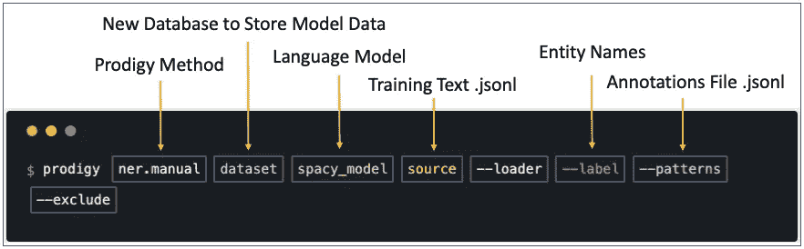
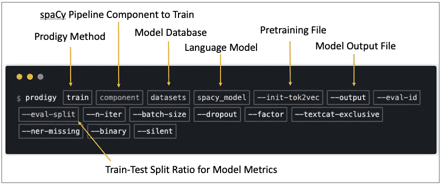

# 利用 spaCy 和 Prodigy 训练实体识别模型

> 原文：<https://medium.com/analytics-vidhya/using-spacy-and-prodigy-to-train-an-entity-recognition-model-692c0f264298?source=collection_archive---------2----------------------->

注意:本文假设读者熟悉 NLP、词向量等。

我喜欢自然语言处理(NLP)。我发现人类很迷人，因为人类很大程度上是一堆杂乱的语言，我被吸引去研究他们如何使用语言，看看我能从中得出什么意义。

当我第一次被介绍给 NLP 时，我是通过 [NLTK](https://www.nltk.org/) 和 [scikit-learn](https://scikit-learn.org/stable/) 了解它的，这两者都没有给我留下什么印象。我记得有一次我问，“等等，我们只是解析字符串和计算单词？就这样？”[scikit-learn 的 TfidfVectorizer](https://scikit-learn.org/stable/modules/generated/sklearn.feature_extraction.text.TfidfVectorizer.html) 让它变得更有趣了，但我想做得更多。进入[空间](https://spacy.io/)和[神童](https://prodi.gy/)。

SpaCy，一个开源 python 库，已经成为我学习 NLP 的首选。虽然像 NLTK 这样的老库还在继续，但是 spaCy 所提供的远远超过了它的能力。

NLP 的真正困难之一是，从一开始就很难知道你的实验是否会成功。有了 Prodigy 和 spaCy，如果我有一组格式正确的好数据，并对我想做的事情有一个好的想法，我就可以知道我正在做的事情是否会在大约一个小时内奏效。我可以创建大约 500 个上下文驱动的实体示例注释，使用这些注释来训练使用 500 多个文本示例的模型，然后在模型上运行指标来评估它的性能，所有这些都在一个小时内完成。这太不可思议了，它让我可以尝试以前需要太多时间来证明的想法。

Prodigy 是 spaCy 的包装器，由 spaCy 的开发者创建。虽然它不是免费的，但如果你对 NLP 很认真，它的价值远远超过成本，特别是因为钱直接用于 spaCy 的进一步开发。

为了让你们感受一下空间和奇迹，我将用大约一个小时的时间简要概述一下我昨晚做的一个项目。要做到以下几点，需要大量的库和数据包。这些都可以从这个 [Prodigy github 页面](https://github.com/explosion/projects/tree/master/ner-food-ingredients)下载。这个 github 页面概述了一个在线教程，我推荐[去看看](https://youtu.be/59BKHO_xBPA)。


图 Spacy NLP 管道(图片来自 Spacy.io)

空间管道由许多可以使用或停用的模块组成。在我们的例子中，我们将创建一个实体识别模型，因此我们将训练空间管道的 **ner** 部分。

通常，使用 NLP 模型，你越能概念化你正在寻找的东西，你就越能训练一个算法来找到它。涉及搜索具体对象的问题往往是最容易训练的模型(例如，食物类型、汽车类型等)。一个好的经验法则是:你能更好地度量事物，你就能更好地建模。

我对试图检测在线社交媒体中的骗局和虚假信息非常感兴趣。这是很难衡量或量化的事情，骗局和虚假信息可能非常微妙。当你或我阅读某样东西时，我们会带着所有的经历去理解我们正在阅读的东西。计算机不能像我们的大脑那样概念化主题，我们必须教会计算机这样做，这样做通常很有挑战性，但这些是有趣的问题。

# **文件准备**


图 2:。jsonl 培训文本文件

spaCy 要求将所有文件格式化为. jsonl。图 2 显示了 spaCy 的. jsonl 格式培训文件的示例。它由每行一个字典组成。每个字典键必须是**“文本”**，关联的值是训练文本。其他格式选项也是可用的，但这是最低要求。

以上数据由 3000 个 Reddit 帖子标题组成，取自 r/阴谋论 subreddit。当你训练一个 NLP 模型的时候，你要教会算法信号是什么样子的。我对信号的理解越好，我就能更好地教算法去寻找它。由于我正试图建立一个检测错误信息的模型，我认为获得强信号的一个好地方是专门传播错误信息的子网站。我们会看到，即使在这种环境下，捕捉错误信息的信号仍然非常具有挑战性。

我们将使用 [sense2vec](https://arxiv.org/abs/1511.06388#:~:text=sense2vec%20%2D%20A%20Fast%20and%20Accurate%20Method%20for%20Word,Disambiguation%20In%20Neural%20Word%20Embeddings&text=Neural%20word%20representations%20have%20proven,semantic%20and%20syntactic%20word%20relationships.) 单词矢量包。sense2vec 是对用于创建包含语义上下文的词向量空间的 [word2vec](https://en.wikipedia.org/wiki/Word2vec) 模型的改进。sense2vec 结合了神经单词表示来收集更多的上下文。

**建模过程如下:**

*   创建种子术语。我们使用这些作为创建实体注释的起点。
*   使用 Prodigy 收集我们的实体注释，并将它们保存到一个. jsonl 文件中。
*   使用我们的实体注释来训练空间管道的 **ner** 部分。我们使用我们正在分析的实际文本来训练模型，在这种情况下，是 3000 个 Reddit 提交标题。
*   酸洗我们的模型，并运行一个火车-测试-分裂。
*   运行一个训练曲线测试，看看模型是否会从进一步的训练中受益。
*   决定我们是否对模型指标满意，以及继续当前的道路是否合理。

# **创建实体标注**


图 3: Prodigy terms.teach 方法用法(图片取自[Prodigy](https://prodi.gy/)

```
$ prodigy sense2vec.teach hoax_terms ./s2v_reddit_2015_md --seeds "conspiracy, planes, hoax, sharks, ants, lies, rumor, floods, hurricane, evacuation, fake"
```

Prodigy 有许多非常有用的方法，可以无缝地与 spaCy 交互。我们将使用 **sense2vec.teach** 方法，它遵循 **terms.teach** 方法的语法。**数据集**变量是该方法将创建和存储实体注释的数据库的名称。 **vectors** 变量指定您想要使用哪个单词列表。在我们的例子中，我们将把它传递给**。/s2v_reddit_2015_md** 文件。该文件包含来自 reddit 的 10 亿个单词，使用 spaCy 的**预训练**方法训练，预测 **en_vectors_web_lg** 向量(我们将使用)。如果使用这种预训练方法，也必须使用它们被训练的向量。

种子变量给了 Prodigy 一个起点。这就像对 Prodigy 说，“我正在寻找类似这样的东西……”然后 Prodigy 聚焦于这些词，以搜索我们想要捕捉的实体示例。

执行上述命令后，您可以使用 web 浏览器进行注释，如这里的[和](https://prodi.gy/demo)所示。使用 Prodigy 浏览器工具时，我们处于一个积极的学习循环中。本质上，spaCy 给了我们一个词，我们告诉它是否匹配我们正在寻找的实体。如果我们告诉 spaCy 它确实匹配，spaCy 从中学习，并为我们提供越来越接近我们想要识别的实体的单词。这个 Prodigy 工具可以非常快速地收集注释示例。

在浏览器中添加注释后，Prodigy 会将您确定的实体示例保存到您指定的数据库中。这是一个很棒的特性，因为它允许这些数据集在未来被重用。

# **为我们的实体实例创建一个. jsonl 文件**


图 4: Prodigy 术语到模式方法的用法

```
$ prodigy terms.to-patterns hoax_terms --label HOAX --spacy-model blank:en > ./hoax_patterns.jsonl
```

既然实体示例已经存储在我们的数据库中，我们可以使用 **terms.to-patterns** 方法来创建一个. jsonl 格式的实体注释文件。因为我们正在从头开始创建一个模型，所以我们向该方法传递一个空的语言模型。我们现在有了一个实体注释的格式化文件，可以用于 **ner** 培训。

# **培训空间管道的 ner 组件**



图 5: Prodigy ner.manual 方法的使用

```
$ prodigy ner.manual hoax_conspiracy blank:en ./conspiracy_3000.jsonl --label HOAX --patterns ./hoax_patterns.jsonl
```

我们使用 **ner.manual** 方法进行培训。这需要我们指定一个新的数据库、一个语言模型、我们将要训练的文本、实体名称以及我们已经收集了注释的例子。因为我们正在创建一个新的模型，所以我们向该方法传递一个空的语言模型。

执行上述命令后，您可以使用 web 浏览器交互式地训练您的模型。再次，当使用浏览器工具时，我们处于一个活跃的训练循环中，除了现在不是 spaCy 给我们选择单词，而是它从我们的训练文件中提取一行文本，并预测存在什么实体。如果空间是错的，我们改正错误，空间从错误中学习。如果训练进展顺利，spaCy 在预测实体方面应该会越来越好。在浏览器中训练后，Prodigy 会将你所做的一切保存到你指定的数据库中。

通常，在计算模型指标之前，我会尝试训练大约 500 个文本示例。在训练这个模型时，我注意到 spaCy 在预测实体的能力上并没有提高，它的表现相当平淡。在大约 300 点的时候，我决定退出，做一些快速衡量，看看继续下去是否值得。

# **模型指标**



图 6: Prodigy 训练方法使用

```
$ prodigy train ner hoax_conspiracy en_vectors_web_lg --init-tok2vec ./tok2vec_cd8_model289.bin --output ./temp_model --eval-split 0.3
```

**train** 方法获取我们收集的所有信息，并用它来训练空间管道。这个方法使用我们之前创建的数据库、语言模型、预训练文件、输出文件路径和测试训练分割比率。由于我们已经使用了 sense2vec，我们需要使用附带的单词 vectors**en _ vectors _ web _ LG**。我们还将使用预训练模型**。/Tok 2 vec _ CD8 _ model 289 . bin**spaCy 训练预测 **en_vectors_web_lg** 语言模型。我们为测试序列分割指定值 0.3。

# **F 分数**


图 7:10 个训练循环的 F 值

默认情况下，Prodigy 会进行十次训练，计算每一步的 F 分数，然后调整模型。从上面的指标中我们可以看出，我的直觉是正确的，这个模型表现得不是很好。我现在必须回答的问题是:我是继续训练这种模式，还是尝试其他模式？

# **列车曲线度量**

```
$ prodigy train-curve ner hoax_conspiracy en_vectors_web_lg --init-tok2vec ./tok2vec_cd8_model289.bin --eval-split 0.3
```


图 8:列车曲线模型度量

Prodigy 提供了一个名为 **train-curve** 的伟大方法，专门用来帮助回答关于是继续训练我们的模型还是尝试另一种方法的问题。这种方法用 25%、50%、75%和 100%的数据创建了四个模型。我们的目标是，当我们给它更多的数据时，看看这个模型有多好。我们可以从上面的度量中看到，在最后一步中，我们的准确性增加了。这通常意味着使用更多示例进一步训练模型将提高模型的准确性。

请记住，我们正在寻找的实体是错误信息的文本示例。即使从 Reddit 上的 r/阴谋论中提取数据，这个充斥着错误信息的地方，也很难获得错误信息的信号。

这种模式足够好，可以继续训练。因为我们腌制了模型，我们可以从我们停止的地方继续我们的训练。展望未来，我想我会使用不同的训练语料库。阴谋对我们相当好，但是我想挖掘一些其他的错误信息来源。这个实验需要我大约一个小时的时间。现在，我可以利用我所学到的知识，相应地修改我的训练策略。这就是 Prodigy 如此伟大的原因，它为希望创建和完善 NLP 模型的数据科学家提供了快速的培训和快速的指标。


图 9:噪音，而不是信号

NLP 的另一个好处是你可以读到有趣的东西。否则我怎么会发现骆驼正在密谋控制世界的水供应呢？