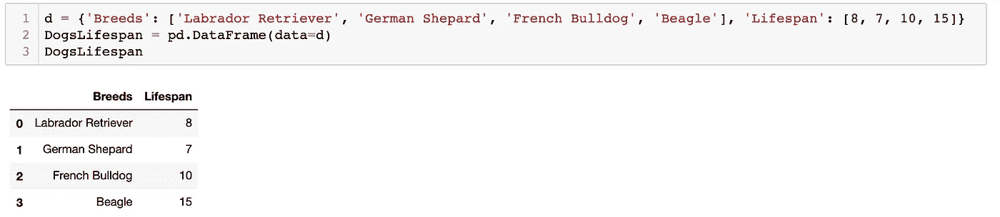
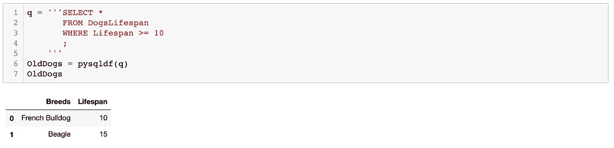
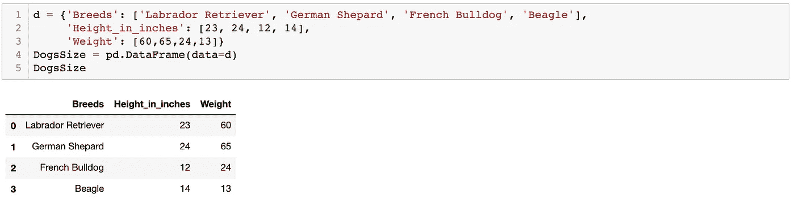
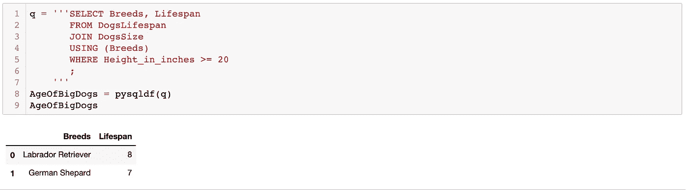

# 使用 SQL 语法从 Python 中的 Pandas 数据帧中提取数据

> 原文：<https://medium.com/analytics-vidhya/using-sql-syntax-to-pull-data-from-pandas-dataframes-in-python-8497772e1045?source=collection_archive---------17----------------------->

*如果您了解 SQL 并熟悉其语法，您可能会发现这篇博客文章在使用 Pandas 数据框时很有帮助。*

从多个 pandas 数据框中收集数据可能是一件令人头疼的事情，尤其是如果您不熟悉 Python 并且不熟悉 Pandas 的话。然而，有一个名为 pandasql 的简洁包可以简化这一切。有点像翻译器，Pandasql 能够接受用 sql 语法编写的查询，并将它们应用于 Pandas 数据帧。

# 设置 pandasql

首先，需要安装 pandasql。为此，您只需在终端中运行这一行:

```
$ pip install -U pandasql
```

然后可以将包导入 python，如下所示:

```
from pandasql import sqldf
```

sqldf 使用两个参数来运行。第一个是表示为 **q** 的查询，第二个是一组会话/环境变量 **(locals()或 globals())** 。可以创建一个快捷函数来帮助简化事情，这样我们就不必一直输入第二个参数:

```
pysqldf = lambda q: sqldf(q, globals())
```

现在我们都设置好了。Pandasql 能够自动检测数据帧，因此只要在查询中正确键入名称，该函数就应该工作。我们唯一要做的就是编写查询并通过 pysqldf 传递它。

那么什么是查询呢？查询基本上是对信息的请求。使用查询可以做很多事情，但是基本结构可以分为三部分:

*   选择—这是我们想要的信息
*   自-这是信息所在的数据框
*   其中—这是我们要选择的条件

# 现在，让我们浏览一些数据帧，看看它们是如何组合在一起的。

免责声明:数据框中的信息是出于这些示例的目的而编造的。



设置第一个数据帧

现在让我们编写一个查询，它将从数据帧(来自 DogsLifespan)中选择生命周期等于或大于 10(其中生命周期≥10)的所有列(SELECT *)。



太好了！我们看到我们能够选择正确的狗品种。查询语法的编写方式与在 SQL 数据库中的编写方式完全相同。现在，假设我们有一个新的表格，上面有狗的尺寸，我们想知道大狗的寿命。



设置第二数据帧

在查询中，我们可以使用语句 JOIN 来组合数据帧。JOIN 语句通过使用包含相同类型信息的列来联接数据框。在本例中，我们可以使用名为“品种”的列。在同一个查询中，我们还将选择 20 英寸或更高的狗的品种和寿命。



以上两个例子非常简单，但是您可以想象使用 SQL 语法是如何快速简便地从大型/多个数据框中收集数据的。