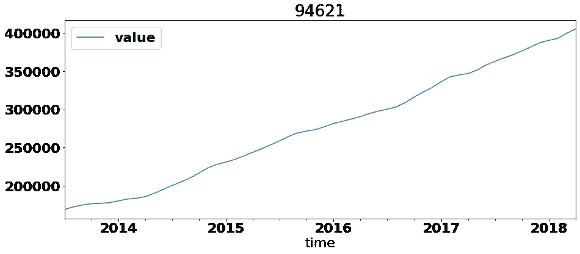
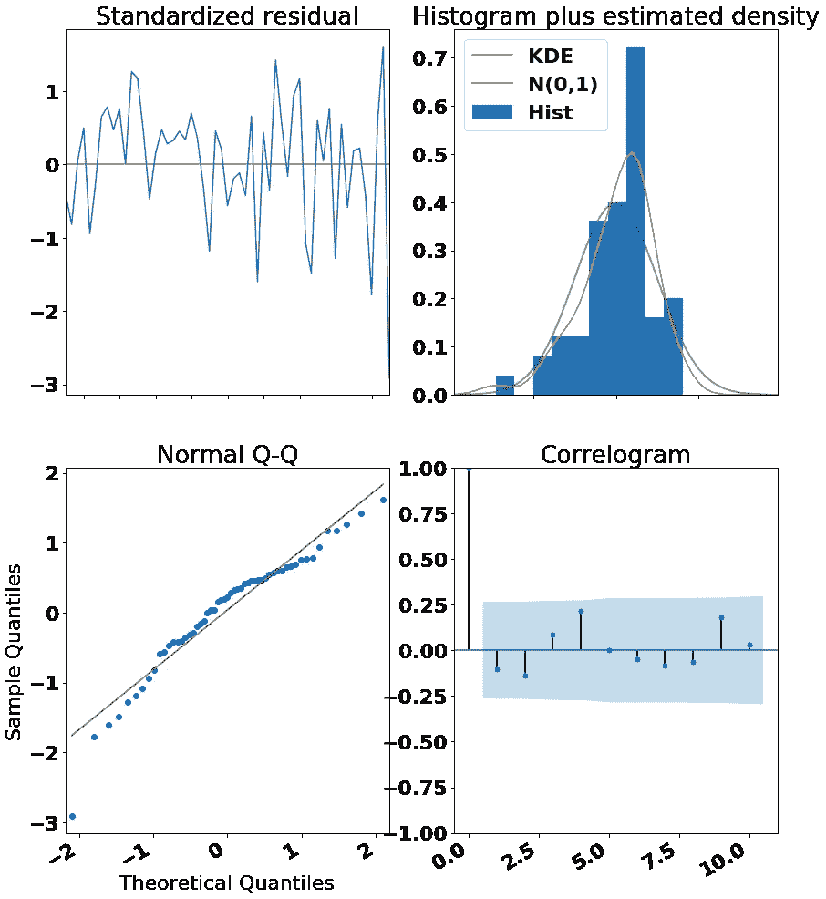
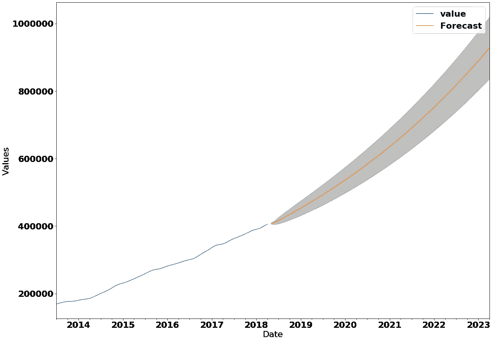

# 使用 Statsmodels 的 SARIMAX 对来自 Zillow 的房屋数据进行建模

> 原文：<https://medium.com/analytics-vidhya/using-statsmodels-sarimax-to-model-housing-data-pulled-from-zillow-c0cce905aaed?source=collection_archive---------11----------------------->

时间序列是一系列按时间顺序排列的数据点。以下时间序列数据来自邮政编码 94621。如果你熟悉湾区，你可能会注意到这个邮政编码是在加利福尼亚州奥克兰。此时间序列包含从 2013 年 7 月到 2018 年 4 月 94621 中的房地产每月平均销售价格。

现在让我们来看看这段时间的数据:



正如你所看到的，房屋销售的平均价格已经翻了一倍多，大约 140%的投资回报率。如果你不熟悉这个术语，ROI 的公式是[(现价)——(原价)] /(原价)。你可以从视觉上对 94621 的未来价格得出许多结论和一些预测。另一种方法是使用 Statsmodels 的 SARIMAX，即带有外生回归元的季节性自回归综合移动平均模型。

如果你熟悉时间序列建模，你会发现我们的曲线基本上没有季节性。我将只输入 p、d 和 q 的值。要了解更多关于 SARIMA 模型的信息，请试试这个[博客](https://machinelearningmastery.com/sarima-for-time-series-forecasting-in-python/)。

```
ARIMA_MODEL = sm.tsa.statespace.SARIMAX(ts,
                                        order=best_order,
                                        enforce_stationarity=False,
                                        enforce_invertibility=False)
 output = ARIMA_MODEL.fit()
 output.plot_diagnostics(figsize=(14,18))
 plt.gcf().autofmt_xdate()
 plt.show()
```

SARIMAX 的两个主要组成部分是你放入的时间序列(ts)和(p，d，q)的顺序。在这个例子中，经过一些测试后，我发现(1，0，2)工作得足够好了(请随意询问我是如何获得这些值的)。诊断图如下所示:



这四个表格可以帮助您确定您的 SARIMAX 模型是否能够实际产生有意义的信息。所有的诊断图都有标题，您可以对每个图进行更多的研究，以查看它们到底显示了什么。但要知道，在这种情况下，他们通过了 SARIMAX 模型的所有假设。

```
prediction = output.get_forecast(steps=60)
pred_conf = prediction.conf_int()

ax = df.plot(label=’observed’, figsize=(20, 15))
prediction.predicted_mean.plot(ax=ax, label=’Forecast’)
ax.fill_between(pred_conf.index,
pred_conf.iloc[:, 0],
pred_conf.iloc[:, 1], color=’k’, alpha=.25)
ax.set_xlabel(‘Date’)
ax.set_ylabel(‘Values’)plt.legend()
plt.show()
```

现在，每个人真正想从时间序列模型中得到的是——预测。上面的代码采用经过训练的模型，用它来预测未来五年，然后绘制这些信息:



黄线表示尚未看到的数据的预测值。线周围的灰色区域是不确定的圆锥体。正如你所看到的，这个模型预测未来五年这个地区的房价将会快速上涨。

ARIMA 或萨里玛建模只是时间序列的冰山一角，可以很快变得复杂得多。谁不想能够预测未来呢？

感谢你阅读这篇博文。如果您有任何问题或顾虑，请给我发消息。