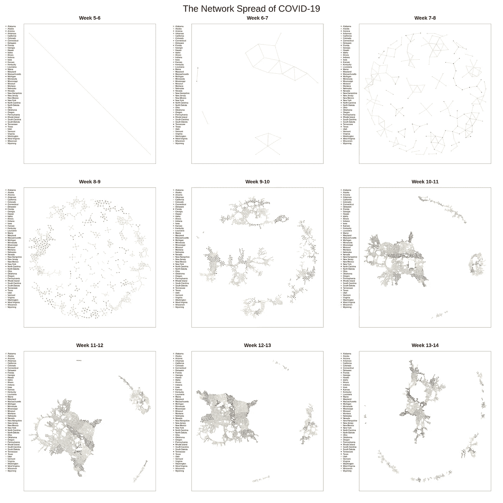
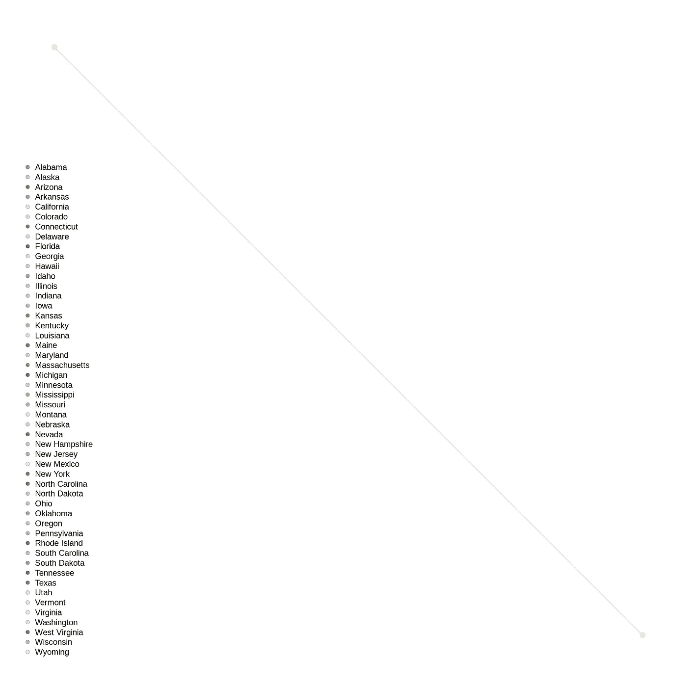
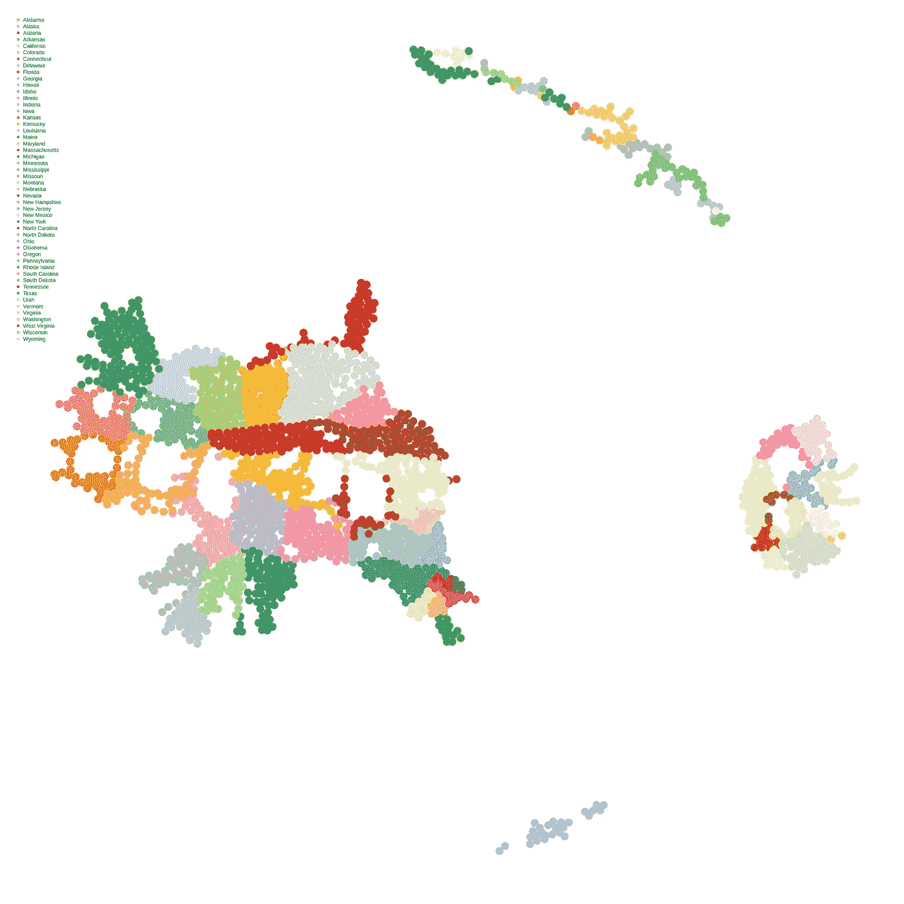
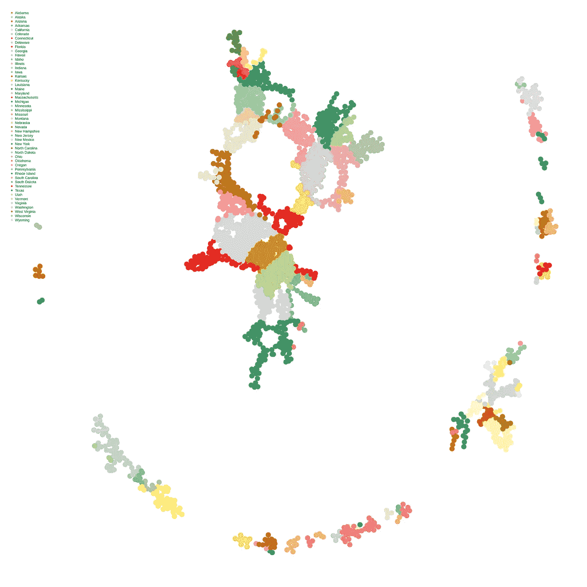

# 使用 R 的计算工具绘制美国新冠肺炎的逐县分布图

> 原文：<https://medium.com/analytics-vidhya/using-the-computational-tools-of-r-to-map-the-county-by-county-spread-of-covid-19-in-the-united-6139f172a1e6?source=collection_archive---------29----------------------->

大卫·阿肯耶米、[尼古拉斯·比蒂](https://www.linkedin.com/in/nick-beati-1b51b3167/)和[玛格丽特·史密斯](https://www.linkedin.com/in/margaret-smith-529247191/) | *贝茨学院*

> “自 2020 年 1 月以来，美国各县冠状病毒病例的传播模式是什么？”

新冠肺炎(新型冠状病毒)是一种席卷全球的病毒，正如我们所知，它改变了许多人的生活。这种病毒突然出现，迫使我们的日常生活发生了许多变化，学校关闭，公司关门，社会距离开始拉开。这些警戒措施的实施是为了努力减缓病毒的传播，以便给科学家更多的时间找到治疗方法，并结束这种疫情。这种病毒传播迅速，并且一直在快速增长，特别是美国，目前在确诊病例和死亡人数方面都领先世界。作为一个小组，我们希望使用 R 的计算工具和我们获得的计算网络知识来模拟新冠肺炎在美国的传播过程

我们研究了病毒是如何在邻近的县传播的。我们希望从 2020 年 1 月开始，分析美国各县的任何潜在模式，并揭示冠状病毒病例数量方面可以进一步研究的内容。如下所示，我们的计划是每两周模拟一次 COVID 病例的传播。我们选择使用 R 的计算工具来促进这一过程，并根据各种定量图表来表示网络结构信息，例如为病毒运动的每个时间片绘制图表，并计算每个时间片各县的中心性。这种分析使我们能够练习将理论与数据联系起来，并从专业数据中获得关于我们周围世界的见解。我们将使用这两个数据集:[来自《纽约时报》的感染数据](https://github.com/nytimes/covid-19-data/blob/master/us-counties.csv)和一个[美国相邻县矩阵](https://github.com/btskinner/spatial/blob/master/data/neighborcounties.csv)。


[https://www.kansashealthsystem.com/covid19-update](https://www.kansashealthsystem.com/covid19-update)

# 背景

我们今天所经历的悲剧事件都可以追溯到新冠肺炎疫情的传播。一个多月来，人们一直在避免旅行，避免社交，戴着口罩和手套，在家工作，吃外卖而不是去餐馆，从亚马逊订购一切可能的东西，这一切都是为了保护自己和他人免受这种病毒的影响。当它第一次在中国武汉传播时，没有多少人预料到它的迅速传播程度。不幸的是，它已经迅速传播到世界各地，感染了数百万人。许多人想知道并可能每天都在思考的问题包括:为什么它传播得如此之快，是什么让它传播开来？

首先，正如《纽约时报》的一篇文章所说，“分析可能会确定，比如说，一个住在华盛顿州雷蒙德市中心的 12 岁男孩。他将定期与父母、姐姐以及当地中学平均 20.5 名同学联系”(来源:[nytimes.com](https://www.nytimes.com/2020/03/13/science/coronavirus-social-networks-data.html))。考虑到像这样的分析，它展示了美国普通人接触多少人，美国政府正在努力实施协议以避免人类接触，减少病例数量，最终“平坦化曲线”。其中一些协议包括就地避难法、宵禁法、取消拥挤的活动以及与人交往的 6 英尺限制。

尽管如此，基本业务必须继续运营，以满足人们的需求。严格的社会距离规定不会促进公民的正常生活或健康的经济。对模式和趋势的进一步研究对于找到可能的治疗方法和/或疫苗至关重要。尽管病毒传播的负面影响是巨大的，但我们有可能通过传播的数据学到很多东西。例如，Albert-Laszló Barabási 的【T2 链接:一切事物如何与其他事物相联系，以及这对商业、科学和日常生活意味着什么】讨论了来自艾滋病等病毒的数据如何帮助重要的研究成为可能，从而激励我们的研究。有证据表明，这种病毒更严重地影响老年人和有潜在健康问题的人，但它对不具备这些特征的人也是致命的，这表明，无论多么年轻或健康，可能没有人能免于感染它并受到它的严重影响。

**处理措施和控制蔓延**

今天，在所有州长的清单上，最重要的是采取必要的预防措施来控制当前全球疫情的蔓延。然而，今年并不是唯一的担忧。使用接触追踪以及增加检测对减少明年冬天可能出现的第二波疫情传播至关重要。尽管接触追踪在经常无症状的年轻人群中可能不会太有效，但最近的研究表明，它可能对医疗机构或疗养院(这两个大的关注领域)内的人有重大影响。实现大量这些示踪剂的最大挑战是资金和生产。周三，州长安德鲁·科莫(Andrew Cuomo)宣布，亿万富翁慈善家、前纽约市市长迈克·彭博(Mike Schmidt)将帮助纽约州制定和实施一项积极的计划，对新冠肺炎进行检测，并追踪与感染者有过接触的人。

在数周的社交疏远之后，数百万美国人非常愿意离开他们的家，让企业和学校重新开放。为了尽可能安全地做到这一点，需要建立系统来识别可能接触过病毒的人，并在他们被隔离时为他们提供支持。彭博慈善机构在一份新闻稿中说，霍普金斯大学的彭博公共卫生学院将“为接触追踪人员建立一个在线课程和培训计划。该组织计划与纽约州卫生部合作，从各州机构、县和公立大学招募“接触追踪候选人”(来源:[美国消费者新闻与商业频道](https://www.cnbc.com/2020/04/22/billionaire-mike-bloomberg-will-help-new-york-develop-coronavirus-test-and-trace-program-gov-cuomo-says.html))。接触者追踪已经成功帮助减缓了新冠肺炎的传播。一些国家，如德国、新加坡和韩国，已经有效地使用了接触者追踪，随后能够重新开业，同时经历了更少的死亡和更低的感染率。值得注意的是，我们得出的结果只会提示可能的传染例子，但在这种前所未有的情况下，有太多未知的东西。

# 数据解释和假设

为了正确运行我们想要的分析，我们必须对我们的数据做出决策和假设。第一个假设是，我们得到的数据集具有美国这些县的准确病例数。由于测试的模糊性，确诊病例的数量难以验证。另一个假设是，由于不是所有的县都每天报告，将我们的时间框架合并成 14 天的增量通常是可行的，但会导致我们错过数据的关键部分。此外，为了限制外部变量，我们只跟踪国内，县之间的邻近运动。这就把我们限制在 48 个内陆州，不包括阿拉斯加和夏威夷。

# 代码方法论:任务完成、执行和专业实践

出于多种原因，最初的两个数据集相当复杂，但要强调的一个关键方面是，每次一个县报告时，即使他们没有报告新的病例，如何添加新的一行。这意味着我们必须真正专注于使用我们的技能来最好地展示网络如何随着时间的推移而变化，因为停滞不前的快照可能会非常误导人。这个计算过程分为四个关键步骤。每一步都允许我们操作和执行许多不同的工具，以显示案件如何随着时间的推移而增长，并将我们的数据集放在产生信息可视化的最佳位置。

## 第一步

第一步的目标是在每周末生成一个包含每个报告县的总计数的数据框。首先清除所有像元的数据集，并在提供的日期、县标识联邦信息处理标准(fips)代码和案例数量范围内专门工作。随后，我们将所有日期转换为最近的周日上限日期，以便获得整体的每周视图。通过仅保留该数据集中的唯一值，我们将数据帧中的周末日期转换为周数。我们不断地将数据框架细分为周，并按县排列每周的子集数据框架。这有助于我们存储每个县每周的最高计数，从而将纽约时报 COVID 数据转换为包含最终计数的每个县每周一行的数据框。

```
# Create an empty df to hold the highest count for each county for each week
highest_count <- data.frame()# Write a for-loop that does the following:
# 1) Subset COVID df into weeks.  
# 2) Subset each week subset df into counties
# 3) Keep only the highest count for each county for each week
# 4) Store the resulting df, which should have just the end count for every week for every county, in a new variablefor(w in 1:length(weeks$weeks)) {
    Working_week <- subset(COVID, COVID$week_number == w)
    Working_week <- (unique(Working_week))
    Working_week <- aggregate(Working_week$cases, by = list(Working_week$fips), max)
    Working_week$week_number <- w
    highest_count <- rbind.fill(highest_count, as.data.frame(Working_week))
}
names(highest_count)[1] <- "fips"
names(highest_count)[2] <- "cases"
highest_count <- as.data.frame(highest_count)
```

## **第二步**

为了跟踪新冠肺炎病例从一个县到另一个县的传播，我们必须为包含美国所有县的第二个数据集导入并创建一个变量..各县用相应的识别码和不同的邻居来标记。对于这一步，最大的挑战是区分未包含在两个数据集中的县。使用 R 中代码的“%in%”行，出现在两个数据集中的县被标记为 TRUE，并专门用于向前移动。

```
## STEP 2: Creates a data frame containing neighboring county# Read in neighboring county data
NEIGHBORS <- read.csv("neighborcounties.csv")# Drop all neighbor pairs where one of each pair does not appear in all_counties
NEIGHBORS <- NEIGHBORS[NEIGHBORS$orgfips %in% COVID$fips,]
NEIGHBORS <- NEIGHBORS[NEIGHBORS$adjfips %in% COVID$fips,]
```

## **第三步**

在这里，我们分析了所有县的病例上升情况。我们生成了一个矩阵，它有 14 列，说明了我们研究的周数和 2752 行，描述了两者中存在的县数。首先，我们定义了总周数来帮助我们制定矩阵，如上所述是 14 周。接下来，我们创建了另一个变量，它将所有的县代码存储为一个列表，并按升序排列。构建了一个空数据框来输入我们的值。为了完成这项工作，我们创建了一个循环，将周与各县及其相应的病例数进行匹配。最后，我们对每周的变化感兴趣，所以我们创建了一个新的数据框架来保存差异。在这个场景中，我们在特定的两周时间内查看了同一个县。例如，第 2 周的新病例数表示第 2 周测得的确诊阳性个体总数减去第 1 周测得的数量。

```
# Loop through all of the weeks to count total cases per county each week
for(w in 1:totalweeks) {
    subset_week <- highest_count[(highest_count$week_number == w),]     # Subset the df produced in step 1 to just one week
    for(r in 1:nrow(subset_week)) {     # Loop through the rows in the subset
        county_id <- as.numeric(subset_week$fips[r])         # Store the county code in a variable
        number_cases <- as.numeric(subset_week$cases[r])     # Store the number of cases in a variable
        CC_matrix[which(as.numeric(row.names(CC_matrix)) == county_id), w] <- number_cases # Store the number of cases at the intersection of the county code and the week
    }
}# Create a new df that contains only new cases each week 
CC_matrix_diff <-matrix(c(NA), ncol=ncol(CC_matrix), nrow=nrow(CC_matrix), byrow=TRUE)
cols <- ncol(CC_matrix) #14 should be the number of weeks
cols_minus_1 <- ncol(CC_matrix) - 1
rows <- nrow(CC_matrix) #Should be 2thousandish, the amount of counties
rownames(CC_matrix_diff)<-1:rows;colnames(CC_matrix_diff)<-1:cols# Loop through each column of your cumulative totals df to keep only new cases of COVID
# (the number of new cases in week 2 will be the total number measured in week 2, minus the number measured in week 1)
for(i in 1:rows){for(j in 1:cols_minus_1){CC_matrix_diff[i,j+1]<-(as.numeric((CC_matrix)[i,j+1])-as.numeric((CC_matrix)[i,j]))}}
CC_matrix_diff <- as.data.frame(CC_matrix_diff)
CC_matrix_diff$"1" <- CC_matrix$"1"
CC_matrix_diff <- as.matrix(CC_matrix_diff)
rownames(CC_matrix_diff)<- rownames(CC_matrix)
```

## 第四步

最后一步，即步骤 4，使用了在步骤 1 中创建的数据框，该数据框包含每个报告县每周的总计数。我们使用它来生成一个数据框，其中每个县占一行，疫情每周占一列，并记录病例总数。这明确描述了病例的增长，并产生了一个边缘列表，显示是否在两周内发生了传播。对于每一对连续的几周，我们循环遍历所有的县邻居，以查看哪些对符合以下条件:

*   原县(orgfips)在第 1 周的 COVID 病例数是否有所增加
*   邻近县(adjfips)在第 2 周的 COVID 病例数是否有所增加。

由此，我们确定是否发生了传播。我们对该数据帧进行了子集化，并且只保留了通过传输连接的边。这使我们能够为每个新的两周周期生成新的和更新的边缘列表，并观察病例随时间的分布。

```
# Subset dataframe, keeping only the edges connected by whether there was transmission
COVID_week <- function(first_week, second_week) {

    week_pair <- CC_matrix_diff[,first_week:second_week]

    COVID_pairs <- as.data.frame(NEIGHBORS)
    COVID_pairs$transmission <- ""

    for(n in 1:nrow(COVID_pairs)) {
        orgfips <- as.numeric(COVID_pairs$orgfips[n])
        new_cases_w1 <- as.numeric(week_pair[which(row.names(week_pair) == orgfips),1])
        adjfips <- COVID_pairs$adjfips[n]
        new_cases_w2 <- as.numeric(week_pair[which(row.names(week_pair) == adjfips),2])
        transmission <- new_cases_w1 > 0 & new_cases_w2 > 0
        COVID_pairs$transmission[n] <- transmission
    }COVID_pairs <- COVID_pairs[which(COVID_pairs$transmission == TRUE),]
    COVID_pairs <- COVID_pairs[,1:2]
    COVID_pairs <- as.matrix(COVID_pairs)
    row.names(COVID_pairs) <- NULL
    return(COVID_pairs)
}
```

我们将这一过程转换成一个函数，并在两周的时间间隔内循环。这产生了每个时间片的图，然后我们计算其中心性和介数。

# 结果



当病例在国内跨县传播时，我们网络的进展情况。

我们将重点放在三个时期，以完成深入的网络分析。首先，我们选择第 5-6 周，因为它为我们的网络提供了一个清晰的起点。本周之前的每个时段包含相同的信息，而之后的所有时段的大小将随着时间的推移而增加。我们继续关注第 10-11 周，因为我们认为这是一个完美的中间时刻，可以显示我们数据集的进展以及病毒是如何传播和传播的。最后，我们查看了第 13–14 周，因为这是我们数据集的最后一期。这两周对于分析为大幅减少每周新增病例而发布的居家命令的有效性至关重要。我们认为这三个集合的进展可以通过深入分析一些关键的时间片来提供网络的整体视图。

## 第 5–6 周



第 5-6 周网络

在检查了我们第 5-6 周的视觉化之后，我们观察到了相对停滞的行为。这些日期与 2 月底和 3 月初的时间相关，这一时期已知病例数量最少。尽管这个网络很小，我们仍然能够在网络上运行一个简短的摘要分析。根据我们的数据框架，仅出现两种情况，表明上图中出现了两个节点。因此，当我们运行中心性和中间性测试时，我们没有收到非常有用的结果。

## 第 10–11 周



第 10-11 周网络

查看第 10–11 周的可视化，您可以看到网络中更紧密的集群的形成。这表明更多的县在美国相互传播病例。这是 3 月的最后一周，当时美国各地的病例开始达到高峰。此时，由于大量的病例，传播知识变得更加普遍。此外，第 10–11 周网络的统计网络总结得出了许多有启发性的结论。

这个网络在这个时间段内有 8907 条边或连接，代表病毒在美国各县之间的传播，以及 2363 个节点，即各县本身。就我们的数据集而言，这是一个非常高的边数，超过了第 13–14 周(见下文)。此外，该网络具有 87 的大直径。这是因为网络中有大量的集群；并非所有的县都相互连接，因为仍有大量的节点分布。这证实了一个观点，即每个县的病例不会直接影响该国的所有其他县；即使在病毒高峰期，仍可能有独立的县群在全国不同地方相互传播。我们在这个时间段的传递性大约是 0.368，这告诉我们，与潜在的封闭三元组的数量相比，有大约 37%的封闭三元组。这再一次证实了不是每一个单独的节点或县都有可能通过病毒传播与所有其他节点相连，但仍有相当数量的节点相连。我们使用介数测试了这个网络的中心性，我们发现印第安纳州的沃里克县在病毒发生的这个时候具有最高的介数分数。我们对这一发现的假设是，印第安纳州的沃里克县是我国内陆和中部地区。这意味着它是一个门户，许多县从各个方面与它相连，病毒通过它从各个不同的方向传播到这些县，延伸得很远。

## 第 13–14 周



第 13–14 周阶段网络

从我们的统计网络总结中，我们立即注意到从第 10–11 周到第 13–14 周网络的节点数、边数和直径的变化。似乎第一波新型冠状病毒的高峰发生在第 10-11 周(2020 年 3 月的最后一周)。在此期间，节点、边和直径都显著下降，这可归因于留在家中订单。这是有道理的，因为该国大部分地区处于部分封锁状态，只有必要的企业开放，并发出严重警告，建议个人留在家中，尽量减少旅行。

一些州，如罗德岛州，甚至逮捕了试图违反州长发布的命令的高尔夫球手，声称只有里的公民才被允许在他们的球场打高尔夫球。这都是为了尽量减少病毒在特定时间从热点的传播。说明这一举措有效性的一个很酷的警告是社交距离指数。我们可以按州和行业查看建筑进入活动。我们可以追踪三月中旬和三月底之间哪些数字下降最多(来源:[openpath.com](https://www.openpath.com/social-distancing-index))。在第 13-14 周，中间值最高的县是位于佐治亚州中部的威尔金森县。如上文印第安纳州沃里克县所述，威尔金森县也是一个内陆县，由于邻近众多邻居，具有容易传播的潜力。病例数量并不惊人，但我们确实看到威尔金森县呈指数增长。

# 结束语

“新冠肺炎的网络传播”整体图像无疑追踪了病毒在我们 14 周内的传播。我们带您了解疫情的不同阶段，提供定性和定量研究。高峰似乎出现在第 10-12 周。我们的可视化结果表明，在新冠肺炎病例高峰期，网络内会形成集群。在最后一周的分析中，我们开始看到节点和边缘的分解，这为我们提供了一个证明，即州政府关闭已经发挥了作用，并证明对数百万美国人的生活至关重要。

这一经历让我们深入了解了真实的世界网络，以及它是如何随着时间的推移而发展的。使用 R 的计算工具，我们模拟了这种病毒的发展。虽然这种模拟有许多实验限制，但我们相信这种分析提供了关于病毒的非常重要和有益的信息。接下来，我们希望将这个网络转换成地理空间地图，并使用 JavaScripts D3 在地图上制作这个网络的动画。

【Github 上的 全代码:【https://github.com/DAkinyemi/COVID_19_Network_Analysis】T4

# 参考

艾伯特·拉兹洛·巴拉巴希。*链接:一切事物如何与其他事物相联系，这对商业、科学和日常生活意味着什么*。珀尔修斯，2002 年。

凯里本尼迪克特。“绘制冠状病毒的社会网络。”*《纽约时报》*《纽约时报》，2020 年 3 月 13 日，[www . nytimes . com/2020/03/13/science/coronavirus-social-networks-data . html](http://www.nytimes.com/2020/03/13/science/coronavirus-social-networks-data.html)。

"新冠肺炎社会距离指数&国家和行业的回应."*新冠肺炎社会距离指数&分州分行业回应*，[www.openpath.com/social-distancing-index](http://www.openpath.com/social-distancing-index)。

斯金纳，本杰明。“邻郡。” *GitHub* ，2020，GitHub . com/Bt skinner/spatial/blob/master/data/neighborhood counties . CSV。

太阳，艾伯特。《纽约时报新冠肺炎数据》 *GitHub* ，2020，GitHub . com/nytimes/新冠肺炎-数据/blob/master/us-counties.csv

威廉·福尔，凯文·布莱宁格。"州长科莫说，亿万富翁迈克·彭博将帮助纽约州发展冠状病毒检测和追踪项目."*美国消费者新闻与商业频道*，美国消费者新闻与商业频道，2020 年 4 月 22 日[www . CNBC . com/2020/04/22/billionary-Mike-Bloomberg-will-help-new York-develop-coronavirus-test-and-trace-program-gov-Cuomo-says . html](http://www.cnbc.com/2020/04/22/billionaire-mike-bloomberg-will-help-new-york-develop-coronavirus-test-and-trace-program-gov-cuomo-says.html)。