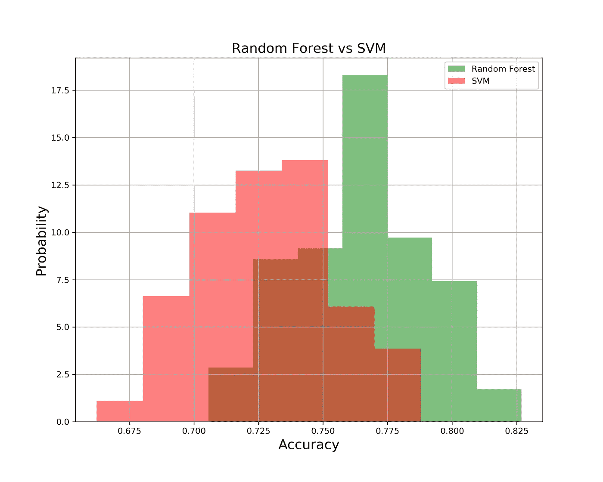

# 使用校正后的配对学生 t 检验来比较机器学习模型

> 原文：<https://medium.com/analytics-vidhya/using-the-corrected-paired-students-t-test-for-comparing-the-performance-of-machine-learning-dc6529eaa97f?source=collection_archive---------1----------------------->

比较机器学习(ML)方法对于给定任务的性能并选择最终方法是应用 ML 中的常见操作。

这篇文章的目的是，首先，展示为什么我们需要使用统计方法来选择最终的模型。然后，它解释了为什么一种常用的统计假设检验(即配对学生的 t 检验)不足以比较 ML 模型的性能。最后，这篇文章演示了如何实现配对学生 t 检验的校正版本，以检查 ML 模型的性能。

下图显示了十种不同分类模型在使用特定数据集训练的 F 分数方面的性能。


十种不同 ML 模型的性能(QDA:二次判别分析，LDA:线性判别分析，SVM:支持向量机，KNN K-最近邻)

模型的性能使用测试数据集或看不见的数据集来衡量。此外，使用 K 折叠交叉验证对它们进行训练，K 折叠交叉验证将数据集随机划分到不同的折叠中，如下图所示。


将数据集分成测试和训练数据集。这两个数据集可能每次都改变，因此，训练的 ML 模型的性能可能改变

从图中可以清楚地看出，对于这个特定的数据集，QDA 比其他分类模型表现得好得多。可能出现的问题是:“这些结果是否在统计上提供了令人信服的证据，证明 QDA 优于其他应用的 ML 模型？”。事实上，我们需要估计最大似然模型之间的性能差异是真实可靠的，还是仅仅由于统计上的偶然。

在回答上述问题之前，我们需要知道，在实践中，我们通常有一个大小为 N 的数据集，所有的估计都必须从这个数据集获得。通常通过二次采样获得不同的训练集，并使用未采样的实例进行测试训练。当使用不同的数据子样本进行测试和训练时，分类器的性能可能会发生变化。换句话说，ML 模型的性能对训练过程中使用的特定随机划分非常敏感。下图显示了当使用不同的训练和测试子集时，ML 模型的性能可能会发生变化。


为了训练 ML 模型，我们应该将数据集分成两个不同的测试和训练数据集。然后，我们使用 k-fold 交叉验证基于训练数据集训练模型，并在维持测试数据集上评估模型。

为了理解改变训练集和测试集可能如何改变模型的性能，我们将用 [Pima Indians diabetes](https://www.kaggle.com/uciml/pima-indians-diabetes-database) 数据集做一个非常简单的例子。数据集的目的是基于数据集中包含的某些诊断测量结果，诊断性地预测患者是否患有糖尿病。我们使用两种不同的 ML 模型，包括随机森林和支持向量机(SVM ),来训练预测一个人是否患有糖尿病的模型。我们对模型进行了两次训练，每次都使用不同的数据子样本作为训练集(这可以通过更改种子数量或 random_state 来实现)。此外，我们使用那些没有被采样用于训练的观察值作为测试数据集。

```
#Import required libraries
#import kaggle
import random
import pandas as pd
import numpy as np
from sklearn.model_selection import train_test_split
from sklearn import model_selection, svm
from sklearn.ensemble import RandomForestClassifier
from sklearn.model_selection import cross_val_score
from sklearn.metrics import classification_report, confusion_matrix
from sklearn.model_selection import RandomizedSearchCV
import warnings
warnings.filterwarnings("ignore")# To download the dataset
!kaggle datasets download -d uciml/pima-indians-diabetes-database#To read the dataset
df_pima = pd.read_csv('pima-indians-diabetes-database.zip')X = df_pima.drop('Outcome', axis=1)
y = df_pima['Outcome']RFC_score = []
SVM_score = []
for random_state in [42, 193]:
    # Splitting the dataset into train and test set
    #random_state = random.randint(100, 10000)
    #print(random_state)
    X_train, X_test, y_train, y_test = train_test_split(X, y, test_size=0.3, random_state= random_state)

    # number of trees in random forest
    n_estimators = [int(x) for x in np.linspace(start = 200, stop = 2000, num = 10)]
    # number of features at every split
    max_features = ['auto', 'sqrt']# max depth
    max_depth = [int(x) for x in np.linspace(100, 500, num = 11)]
    max_depth.append(None)
    # create random grid
    random_grid = {
     'n_estimators': n_estimators,
     'max_features': max_features,
     'max_depth': max_depth
     }
    # Random search of parameters
    rfc_random = RandomizedSearchCV(estimator = RandomForestClassifier(), param_distributions = random_grid, 
                                    n_iter = 100, cv = 3, verbose=0, random_state=42, n_jobs = -1)
    # Fit the model
    rfc_random.fit(X_train, y_train)# print results
    best_params = rfc_random.best_params_rfc = RandomForestClassifier(n_estimators=best_params['n_estimators'], 
                                 max_depth=best_params['max_depth'],
                                 max_features=best_params['max_features'], 
                                 random_state=42).fit(X_train,y_train);
    RFC_score.append(rfc.score(X_test, y_test))

    ##Train SVM 
    random_grid_svm = {
    'C': [0.001, 0.01, 0.1, 1, 10],
    'gamma': [0.001, 0.01, 0.1, 1]}
    svm_random = RandomizedSearchCV(estimator = svm.SVC(kernel='rbf'),
                                    param_distributions = random_grid_svm, 
                                    n_iter = 100, cv = 3, verbose=0,
                                    random_state=42, n_jobs = -1)
    svm_random.fit(X_train, y_train)

    best_params = svm_random.best_params_

    SVM_model = svm.SVC(kernel='rbf',C = best_params['C'],
              gamma=best_params['gamma'], random_state=42).fit(X_train,y_train);

    SVM_score.append(SVM_model.score(X_test, y_test))

    #print('Iteration {}'.format(i))
    print('The accuracy of SVM model is {}'.format(round(SVM_model.score(X_test, y_test),2)*100))
    print('The accuracy of Random Forest model is {}'.format(round(rfc.score(X_test, y_test),2)*100))
    print('-'*30)
```


我们可以看到，随机森林法第一次表现得比 SVM 好；而 SVM 在第二次迭代中表现出更好的性能。这意味着利用模型性能之间的差异来选择最终模型并不合适。此外，我们不知道域下面的分布，因此不能精确地计算差异。因此，我们需要估计差异的分布。有了差异的分布，我们就可以检查估计的差异是否可能是“真正的”差异，或者只是由于偶然。为了回答这个问题，我们可以使用统计测试。

为了执行统计测试，我们还需要不同迭代的差异的均值和方差。如果有足够的数据供应，获得差异的均值和方差的无偏估计是容易的。为此，我们可以从主数据集中抽取一些训练集和测试集。然后，我们应该在每个训练集上训练 ML 模型，并使用维持测试子集测量模型的性能。接下来，我们可以计算每对分类器的模型性能差异。


两个分类器性能差异的均值和方差的估计

让我们在例子中实现它。我们将训练 ML 模型的过程重复了 100 次，以观察随机分割数据集对模型性能的影响。下图比较了随机森林模型和 SVM 模型在准确性方面的性能。



随机森林和 SVM 重复 100 次的性能比较


随机森林和 SVM 重复 100 次后的性能差异

# 统计假设检验

有了以上信息，我们现在可以使用统计假设检验来选择最终模型。统计显著性检验旨在比较最大似然模型的表现，并量化表现得分样本被观察到的可能性，假设它们来自相同的分布。如果这个假设或无效假设被拒绝，这表明技能得分的差异在统计学上是显著的。

用于比较 ML 模型性能的最常见的统计假设检验是通过训练数据集的随机子样本组合的成对[学生 t 检验](https://en.wikipedia.org/wiki/Student's_t-test)。该测试中的零假设是两个应用的 ML 模型的性能之间没有差异。换句话说，零假设假设两个 ML 模型表现相同。另一方面，另一个假设假设两个应用的 ML 模型表现不同。


虽然配对的[学生的 t 检验](https://en.wikipedia.org/wiki/Student's_t-test)是比较两个不同 ML 模型性能的一种非常常见的方法，但我们需要在使用它之前检查这个检验背后的假设。关键的假设是:“用于进行配对学生 t 检验的数据应独立于被比较的两个总体进行抽样”。这种假设通常无法从数据中得到验证。然而，如果已知数据是独立抽样的，那么配对学生的 t 检验可能会给出误导性的结果。违反这一假设的主要后果是一个高 I 型错误(即拒绝一个真正的零假设)。

在比较 ML 模型的性能的情况下，如上所述，测试和训练集通常从原始数据的不同子样本中获得。测试集和训练集在不同的迭代中重叠，因此它们不是独立的。这违反了适当的显著性检验所必需的独立性假设，因为我们重复使用数据来获得差异。违反独立性假设的后果是 I 类误差超过显著性水平。因此，如果我们使用这个测试，我们可能会发现两个 ML 模型的性能之间有“显著的”差异，而实际上没有。

总的来说，配对学生的 t 检验不是比较两个 ML 模型性能的有效检验。

[Nadeau 和 Bengio](https://link.springer.com/article/10.1023/A:1024068626366) 表明，违反独立性 t 检验可能会导致差异方差的低估。为了用配对学生的 t 检验解决这个问题，他们建议通过考虑这种依赖性来修正方差估计。下图显示了我们如何使用由[纳多和本吉奥](https://link.springer.com/article/10.1023/A:1024068626366)提出的方法修改方差估计并计算 P 值。


由[纳多和本吉奥](https://link.springer.com/article/10.1023/A:1024068626366)提出的校正后的配对学生 t 检验

上面计算的 t 统计与具有 *n-1* 自由度的 Student-t 分布一起使用，以量化模型性能差异的置信水平或显著性。这使得作为模型选择的一部分，比使用原始的成对学生 t 检验更有力和更可靠。

由于零假设是没有任何事情发生或者两个 ML 模型的性能之间没有差异，所以小于所考虑的显著性水平的 P 值拒绝零假设，而支持替代假设，替代假设假设 ML 模型的性能不同。此外，大于显著性水平的 P 值表明我们未能拒绝零假设。

我们使用上面的过程来比较随机森林和 SVM 模型对于我们的案例研究数据集的性能。

```
#Compute the difference between the resultsdiff = [y - x for y, x in zip(RFC_score, SVM_score)]#Comopute the mean of differences
d_bar = np.mean(diff)#compute the variance of differences
sigma2 = np.var(diff)#compute the number of data points used for training 
n1 = len(y_train)#compute the number of data points used for testing 
n2 = len(y_test)#compute the total number of data points
n = len(y)#compute the modified variance
sigma2_mod = sigma2 * (1/n + n2/n1)#compute the t_statict_static =  d_bar / np.sqrt(sigma2_mod)from scipy.stats import t#Compute p-value and plot the results 
Pvalue = ((1 - t.cdf(t_static, n-1))*200)Pvalue
```


本案例研究的 P 值约为 1.85%，小于考虑的显著性水平(即 5%)，表明我们可以拒绝零假设。因此，统计结果提供了令人信服的证据，表明随机森林和 SVM 表现不同。平均而言，随机森林模型的平均精度比 SVM 模型高 4%。