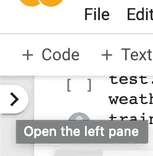

# 使用 Kaggle API 将数据集导入 Google 联合实验室

> 原文：<https://medium.com/analytics-vidhya/using-the-kaggle-api-to-import-datasets-into-google-colaboratory-3ce56fb6ced0?source=collection_archive---------23----------------------->

*本规范自 2020 年 1 月 13 日起实施。*

第一步是创建一个 Kaggle 帐户并生成一个 API 密匙。登录后，点击右上角的个人资料图片，然后选择**我的帐户**。向下滚动并点击**创建新的 API 令牌**。这将提示下载一个名为 *kaggle.json* 的 JSON 文件，其中包含您的 kaggle 用户名和个人 API 令牌。


在您的 Google Colab 笔记本中，确保使用 **pip** 命令安装了 Kaggle 包。

`!pip install kaggle`

接下来，创建一个名为*的目录。kaggle* 在这里可以存储包含 API 令牌细节的 JSON 文件。

`!mkdir .kaggle`

现在，您可以确保已经创建了这个目录。

`!ls -a`

如果操作正确，输出将包含*。卡格尔*。

打开您之前下载的 *kaggle.json* 文件，它应该是这样的:

```
{“username”:”YOUR USERNAME”,”key”:”YOUR API KEY”}
```

将您的信息放入下一个代码块，并运行它以将其保存在正确的位置。

```
import jsontoken = {"username":"YOUR USERNAME","key":"YOUR API KEY"}with open('/root/.kaggle/kaggle.json', 'w') as file: json.dump(token, file)
```

Kaggle 的 API [文档](https://github.com/Kaggle/kaggle-api)建议运行下一行代码，防止你电脑的其他用户访问你的凭证。

```
!chmod 600 /root/.kaggle/kaggle.json
```

现在你可以去 Kaggle 找到你想要的数据集。在这个教程中，我将使用来自[这个](https://www.kaggle.com/c/ashrae-energy-prediction/data)页面的数据，Ashrae 能源预测竞赛。在标有*数据*的部分，您可以找到一个链接，将下载命令复制到您的剪贴板。


将复制的命令粘贴到新的代码块中，不要忘记感叹号！

```
!kaggle competitions download -c ashrae-energy-prediction
```

您从 Kaggle 下载的数据现在应该在您的 Google Colab 环境中。要检查这一点，请单击屏幕左上角的箭头(将鼠标悬停在箭头上会提示您“打开左窗格”):



这将打开一个面板，显示您上传的文件。对于 Ashrae 能源数据，它看起来像这样(我已经解压缩了压缩文件，接下来我将向您展示如何执行此操作):


此时，在解压缩压缩文件后，您可以使用 pandas 读入数据。

```
import pandas as pdbuilding = pd.read_csv('building_metadata.csv')
!unzip test.csv.zip
test = pd.read_csv('test.csv')
!unzip train.csv.zip
train = pd.read_csv('train.csv')
!unzip weather_test.csv.zip
weather_test = pd.read_csv('weather_test.csv')
!unzip weather_train.csv.zip
weather_train = pd.read_csv('weather_train.csv')
```

现在您可以随心所欲地处理您的数据了！请让我知道，如果你发现任何错误或其他潜在的解决方案。我希望这是对您的数据科学之旅有帮助的教程！