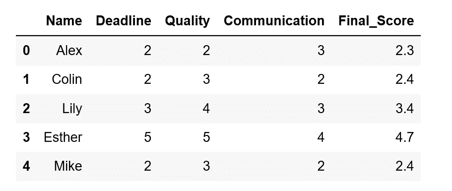

# 在 Pandas 中使用 rank()函数

> 原文：<https://medium.com/analytics-vidhya/using-the-rank-function-in-pandas-f03c4cb0bd2c?source=collection_archive---------14----------------------->

通过一个实际的业务用例，了解如何计算数据列上的数字数据等级。


在 [Unsplash](https://unsplash.com?utm_source=medium&utm_medium=referral) 上由 [Helloquence](https://unsplash.com/@helloquence?utm_source=medium&utm_medium=referral) 拍摄的照片

绩效评估是跟踪员工表现的关键。

在大多数组织中，员工的加薪或年度奖金将取决于他们在评估周期中的表现。

如果一名员工在市场研究部门比她的同事表现得更好，那么对她的工作给予相应的奖励是合理的。

让我们假设员工的分数取决于三个属性*(实际上会有更多):*

1.  截止日期:从 1 到 5，员工在指定的截止日期前完成工作的可能性有多大？*(权重:0.30)*
2.  **工作质量:**从 1 到 5 分，员工分享的可交付成果质量如何？*(权重:0.40)*
3.  **沟通:**从 1 到 5 分，员工与客户沟通的效率如何？*(权重:0.30)*

是时候对熊猫的员工表现进行排名了。启动你的 Jupyter，跟着走！

```
#import the pandas module
import pandas as pd#read the data
data=pd.read_excel('Appraisal.xlsx')#Check out a sample of the data
data.head()
```



评估数据样本

我们将使用列 ***Final_Score*** 对员工进行排名，这是三个绩效属性的加权和。

我们将创建一个新列***【rank】***，用于存储员工排名。

```
data['rank']=data['Final_Score'].rank(ascending=False, method='dense')
```

我们在等级函数中使用了两个参数:

1.  ascending=False:这是为了确保等级 1 授予得分最高的员工
2.  method= 'dense ':这是在得分时试图解决平局的最佳属性。

> 如果我们**不**将**方法**的值设置为“**密集**”，并且第一个位置有一个 3 向平局，会发生什么？

1.  这三名员工最终都只能排在第二位
2.  下一个雇员将得到等级 4

这不仅对员工不公平，而且完全没有道理！

现在我们清楚了这一点，让我们检查我们的最终数据集…

```
data.sort_values(by='rank').head()
```


任务完成。

绩效评估很复杂，在现实生活中，公司会使用各种各样的变量来完成这项任务，但希望通过学习这些简单的技能，你可以将一些自动化引入到你的过程中。

下次见！

# 资源:

[熊猫文档](https://pandas.pydata.org/pandas-docs/stable/reference/api/pandas.Series.rank.html#pandas.Series.rank)关于秩函数

[该数据集的 Github 链接](https://github.com/ddailycoder/HouseOfCode/blob/master/Appraisal.xlsx)