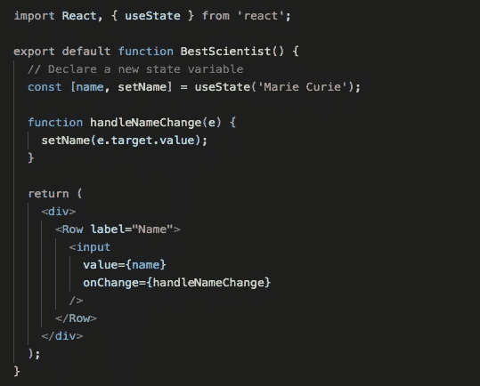
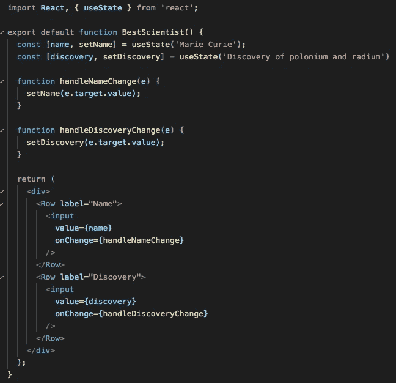

# 在 React 中使用状态钩子进行状态管理

> 原文：<https://medium.com/analytics-vidhya/using-the-usestate-hook-for-state-management-in-react-f2dd5c90ef98?source=collection_archive---------29----------------------->

我的上一篇文章， [Props vs State in React](/@kristyparker1/props-vs-state-in-react-2234468a5f52) ，提到了在添加钩子之前使用类组件来控制 React 中的状态的必要性。这篇文章将展示自 2019 年 2 月 React 16.8.0 发布以来，如何在功能组件中使用 *setState* 钩子来管理状态。

钩子的引入是为了简化组件。它们允许在不使用类组件的情况下访问 React 状态和生命周期功能。您可以创建自己的钩子来重用有状态行为，但是这篇文章将关注其中一个内置的钩子。按照惯例，他们以‘T4’开头，用‘T5’。

状态挂钩

为组件添加本地状态并通过重新渲染来保存它的内置钩子是 *useState* 。

在下面的例子中， *useState* 钩子用于设置*名称*的初始状态。该初始状态参数将仅用于组件的第一次呈现。

你可以看到*名称*和*集合名称*被一起声明为相关变量。 *useState* 返回当前状态值，以及一个让你更新它的函数。可以认为它类似于 *this.setState* ，并且可以类似地从事件处理程序中调用。

*使用状态*与 *this.setState* 的主要区别在于*使用状态*取代了旧状态；它不会将新旧状态合并在一起。如果您有另一个不相关的变量要作为状态跟踪，您可以在函数顶部的第一个变量旁边声明它，并通过变量名直接访问它，而不是将它们收集在一起并通过单个状态对象访问。

调用 *setName* 或 *setDiscovery* 将触发 React 重新渲染该组件。

使用挂钩的规则

在功能组件的顶层挂钩是很重要的。这将使 React 能够通过重新渲染可靠地保持状态。

钩子可以在定制钩子中使用。参见 React [文档](https://reactjs.org/docs/hooks-rules.html)了解更多信息。

更多信息

有关使用钩子的更多详细信息，请查看钩子[的 React 文档。](https://reactjs.org/docs/hooks-intro.html)

查看我在[道具 vs 状态在 React](/@kristyparker1/props-vs-state-in-react-2234468a5f52) 上的帖子。

我永远在进步。如果你有纠正或反馈，我很乐意学习和修复。谢谢大家！