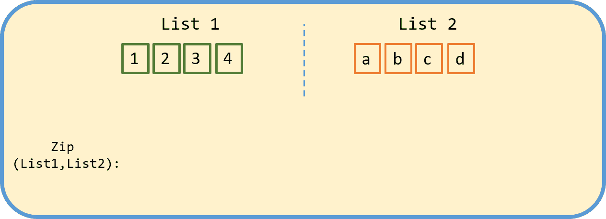

# 如何在 Python 第 1 部分中使用 Zip 函数

> 原文：<https://medium.com/analytics-vidhya/using-the-zip-function-in-python-part-1-c658219df52d?source=collection_archive---------4----------------------->

Python 是一种直观的语言，有很多资源可以帮助你掌握这门语言的基础知识。一旦掌握了基础知识，还有更多的东西要学！zip 函数是 Python 提供的 69 个内置函数之一，对于初学者来说非常有用。

有关内置函数的更多信息，请参阅 Trey Hunner 的优秀…