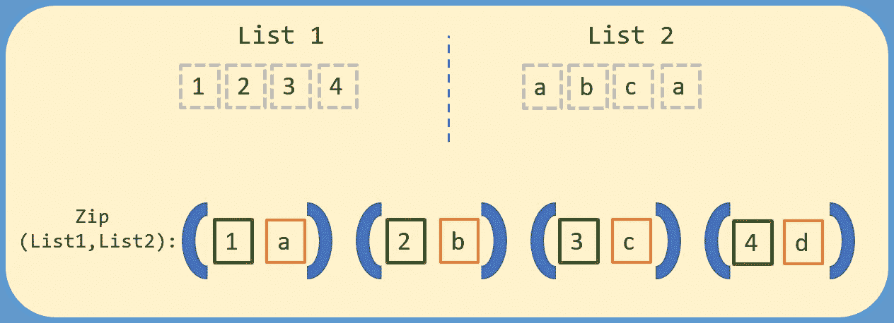

# 如何在 Python 第 2 部分中使用 Zip 函数

> 原文：<https://medium.com/analytics-vidhya/using-the-zip-function-in-python-part-2-b5ce4fb7ecf3?source=collection_archive---------11----------------------->

在第 1 部分的上一篇文章中，我们介绍了 zip 函数的基础知识，现在我们可以更深入地讨论 zip 函数如何处理不同的参数以及 zip 函数如何解包。我们还将深入研究一个例子，看看我是如何在自己的脚本中使用这个函数的。

# 没有参数的 zip 函数