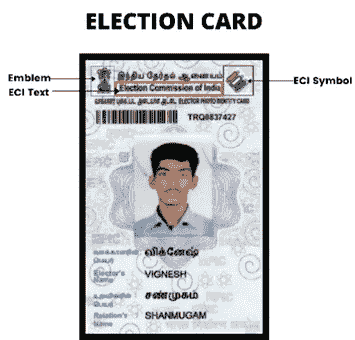
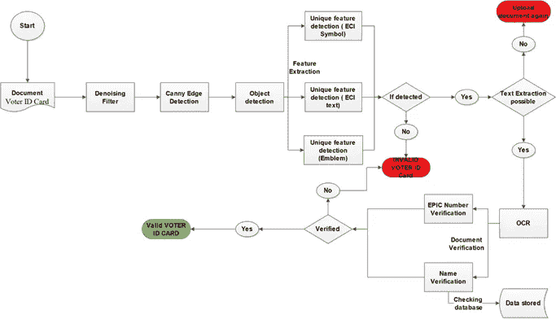
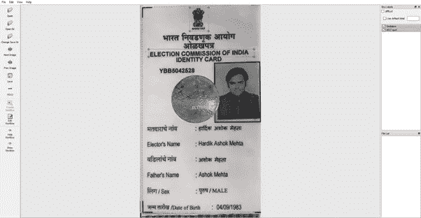
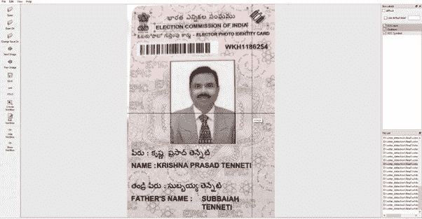
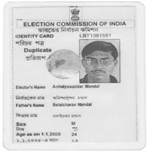
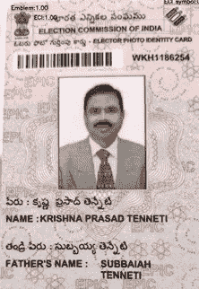
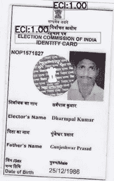
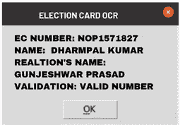
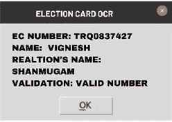

# 使用 YoloV3 和 OpenCV 实现自定义对象检测和 OCR，对选举卡(选民证)进行智能分析。

> 原文：<https://medium.com/analytics-vidhya/using-yolov3-and-opencv-to-implement-custom-object-detection-and-ocr-for-smart-analysis-of-the-aad46c349962?source=collection_archive---------11----------------------->

T 将 OCR 技术提升到另一个层次，自定义对象检测和 OCR 的结合已被证明是通过用户的选举卡来验证用户身份的非常有效的方法。这对于金融机构和文档验证是绝对必要的许多领域来说将是一种有效的帮助。

> 为了理解我们要展示的技术的实现和方法的关键；首先深入基础是很重要的。

我们系统最基本的模块由代表光学字符识别的“ **OCR** ”组成。OCR 提供的服务是一种解释和识别数字图像和扫描文档中的文本的技术。另一方面，**对象检测**被描述为根据使用领域的需要和要求定制的程序化过程。为了理解将两种不同技术分层的基础，对象检测嵌入了用于检测卡的各个区域的特征。

该技术系统的主要目标是捡起一张选举卡(选民证)并进行扫描。扫描是在物体检测的帮助下进行的，在物体检测中，一组特定的特征被灌输到程序中，在物体检测的帮助下，程序获得所需的参数，用于进一步分类显示的信息。所提出的方法包括从我们的文档中选择一些独特的参数，从而有助于识别上传的图像是否与所需的文档类型相匹配。

*图像的质量直接影响系统的效率，因此上传的图像应该具有良好的质量，以便从中获取信息。*

为了更好的理解。每个文档都有一些使其独一无二的特殊功能。

**选民证**

> ***选举或选民证的独有特征有:-***
> 
> *1。图像的左上方有* ***印度国徽*** *。*
> 
> *2。图像的右上方有* ***【印度选举委员会】(符号)*** *。*
> 
> *3。在最上面的中央提到了* ***印度选举委员会(text)*** *。*

人们必须选择可以训练机器学习模型的特征。我们训练过的模型在上面提到的 3 个类上玩。为了从我们设计的模型中获得更高的准确性，出于考虑，全息图(在旧版本的选民证上)已被整体取消。所有上述特征使选民证不同于其他证件。

# **方法论**

采用的方法

# **第 1 部分:独特特征的检测**

**第一步:定制数据集准备**

**I:图像的收集—** 收集足够的选民 ID 的图像，以便可以高效地训练模型。

**II:数据集的预处理—** 可以使用任何去噪滤波器去除图像中的噪声，在这种情况下**高斯噪声滤波器**最适合选民身份证图像。

**III:注释图像—** 在收集了足够多的高质量图像(数据集)后，我们将用我们要为其训练模型的类来标记它。这里用来标注数据集的工具是*[***LabelImg***](https://github.com/tzutalin/labelImg)用来进行数据标注，以加快整个过程。这里使用了 3 个类，即“**会徽**”、“ **ECI 文字**”和“ **ECI 符号**”。由于已经完成了训练对象检测模型的基本要求，因此向前推进是可行的。*

****

*使用标签的数据集旋转(从 google 废弃的图像)*

***第二步:** **训练模型—** 向前看，为了检测对象，我们可以使用许多不同的算法，如 R-CNN、YOLO、更快的 RCNN、SSD 等。在这里，算法 **tiny-YOLOv3** 被赋予了优于其他算法的优先权，因为它可以更快地检测到物体，而不会影响准确性。我已经使用 Darknet 神经网络框架来训练我的模型。为了了解更多关于模特的训练，更多更详细的信息已经在 [**这个**](https://www.spritle.com/blogs/2019/12/20/real-time-custom-object-detection-using-tiny-yolov3-and-opencv/) 平台上讲解过了。*

***步骤 III: ROI(感兴趣区域)——**在提取感兴趣区域后，这些步骤进一步涉及特征提取和对象检测算法。下一步是检测和标记选民证特有的特征。这些特征已经非常精确地非常微妙地适应，以便只有特定的区域被整合，并根据我们训练过的模型进行标记。如果未能检测到这些特定特征，它将宣布文件无效(参照选民证),整个程序将结束。*

# ***第二部分:文本识别***

***第一步:输入图像去噪—** 准备好数据集并在自定义数据集上成功训练后，可以轻松应用于图像。输入图像的预处理是当前需要的，至于文档的确认和验证，它不应该有任何种类的噪声或干扰。使用高斯滤波器进行去噪。当图像去噪时，将提取 ROI(感兴趣区域),这是通过 Canny 边缘检测算法完成的，它有助于删除任何不需要的数据。*

***步骤 II:文本提取—** 如果在对象检测之后文档是有效的，即现在已经完成了验证，则该过程进入验证部分。文本提取将由 **OCR** (光学字符识别)完成。应用 OCR 后，估计的结果如下所示。*

> *名字*
> 
> *关系的名称*
> 
> *史诗数字*

***第三步:验证 EPIC 编号—** 一旦提取了文本，就使用 **LUHN 算法**验证 EPIC 编号，然后与政府数据库进行交叉检查。如果所有条件都满足，那么我们只能说该文件是有效的选民证或选举证。*

## ***选民证号码格式- XXX0000000***

> ***史诗编号分解***
> 
> *XXX0000000*
> 
> *前三个字符- **印度议会选区(字母表)***
> 
> *前六位数字— **随机数***
> 
> *最后一位 **—前 6 位的校验和(使用 Luhn 算法)***

*[**Luhn 算法**](https://en.wikipedia.org/wiki/Luhn_algorithm) ，一种简单的校验和验证算法，也被称为 Luhn 公式、模数 10 算法，或者 mod 10 算法。EPIC 号的第 10 位是 EPIC 号的第 4 到第 9 位的校验和。并且校验和与 **LUHN 算法**相关联。*

# ***测试用例:***

***1。检查上传的文件是否为选民证—** 在这种情况下，程序将检查上传的文件是否为所需的选民证或任何其他文件。当用户上载任何其他文档而不是选民证时，可能会发生这种情况。因此，在这里，验证部分的过程将进入图片。ECI 符号和 ECI 文本将是这种情况下的标识符。*

***2。上传的选民证是否为原件—** 在这种情况下，Luhn 算法会检查上传的文件是否为原件。如果没有，会弹出“无效选民证”。*

***3。用户上传他的原始选民 ID 卡—** 在这种情况下，它将接受该文档，因为这是理想情况。*

# ***样本输出***

***

对象检测模型的输出(从 google 废弃的图像)* *****

OCR 工具的输出* 

*请在下面的评论区分享你的想法和主意。*

*在 [*LinkedIn*](https://www.linkedin.com/in/kritika-ahuja28/) 上连接我。*