# 使用 YOLOv3 检测交通标志。

> 原文：<https://medium.com/analytics-vidhya/using-yolov3-for-detection-of-traffic-signs-57f30b3c561c?source=collection_archive---------1----------------------->

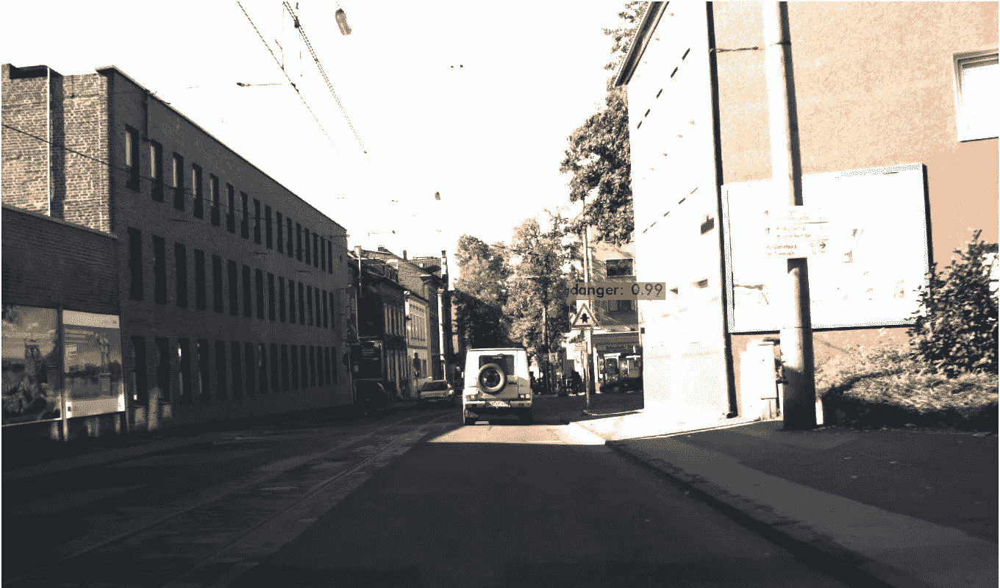

交通标志为司机和其他道路使用者提供了有价值的信息。它们代表了保护我们安全的规则，并有助于向司机和行人传达信息，以维持秩序和减少事故。忽视它们可能是危险的。

大多数标志利用图片，而不是文字，所以他们很容易理解，可以解释的人说各种语言。每年大约有 135 万人死于道路交通事故。世界上大多数政府都强制要求遵守交通规则和标志。

在本案例研究中，我们将了解 YOLOv3 如何用于检测交通标志。案例研究包括数据预处理、数据分析、YOLO 模型创建和数据扩充。我们将使用来自 INI 基准网站的德国交通标志检测基准数据集。

> ***注*** *:完整代码在我的* [*Git-hub 库*](https://github.com/vignesh-bhat1999/Traffic-sign-detection) *上。*

## 问题陈述

交通标志检测是一个具有高度工业相关性的具有挑战性的现实世界问题。就连特斯拉最近也给自己的汽车升级了检测红绿灯和停车标志，这也是交通标志之一。**本案例研究的主要目的是检测交通标志并将其分为四类(禁止、强制、危险或其他)。**

**数据概述:**

从[数据](http://benchmark.ini.rub.de/?section=gtsdb&subsection=dataset)中获取数据

数据集由 900 张 ppm 格式的图像组成。数据集还包含一个 CSV 格式的 txt 文件，包含图像中所有交通标志的地面实况。地面实况文件包含图像文件名、边界框坐标和交通标志的类别 id，边界框坐标包含图像中出现的交通标志的左、上、右和下坐标。

# 索引:

*   **第一步:**探索性数据分析。
*   **第二步:**数据预处理。
*   **第三步:** YOLO v3。
*   **第四步:**预测。
*   **第五步:**结论。

# 步骤 1:探索性数据分析

总共有 43 个交通标志，然后分为 4 类，即禁止，强制，危险和其他。

## 加载数据:

为了加载数据，我们只需要包含地面真实值的 txt 文件。我们将把它加载到一个熊猫数据框架中。

将 gt.txt 加载到数据帧中

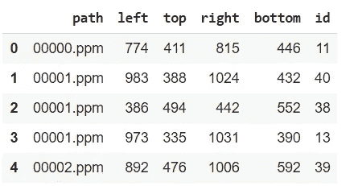

数据集的前 5 行

训练数据中总共有 600 幅图像，数据集中总共有 852 行。图像的多行是指同一图像中的多个交通标志。

**分析数据:**

让我们想象其中一幅图像并检查它的大小，

检查图像的大小

形象化图像

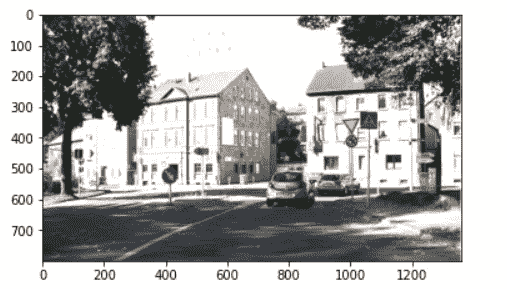

可视化输出

所有图像的大小为 800*1360，有 3 个通道。

## 类别 id:

让我们现在检查类别 id 的分布，目前共有 43 类交通标志。

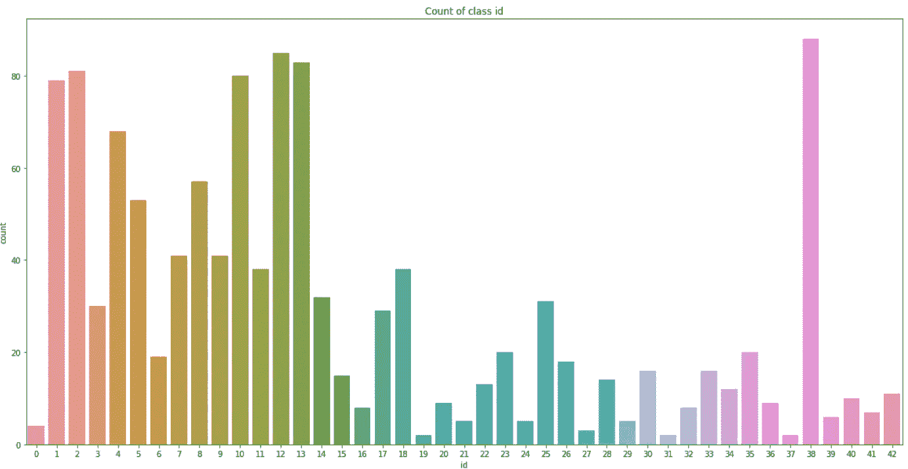

交通标志 ID 分配

我们可以清楚地观察到，

*   与其他标识号相比，标识号 1、2、4、10、12、13 和 38 的数量较大。
*   标志 id 的 0、19、31 和 38 在数量上最少。

让我们将 43 个类别 id 分为 4 个主要类别 id，即禁止、强制、危险和其他。

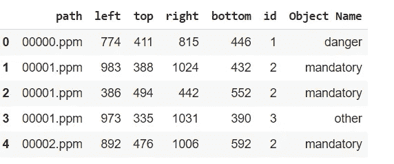

数据集的前 5 条记录

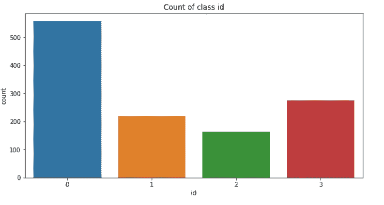

类别 id 计数

*   我们可以观察到数据集中禁止类 id 的数量很高。

## 边界框的大小:

现在让我们检查图像中交通标志的尺寸分布，

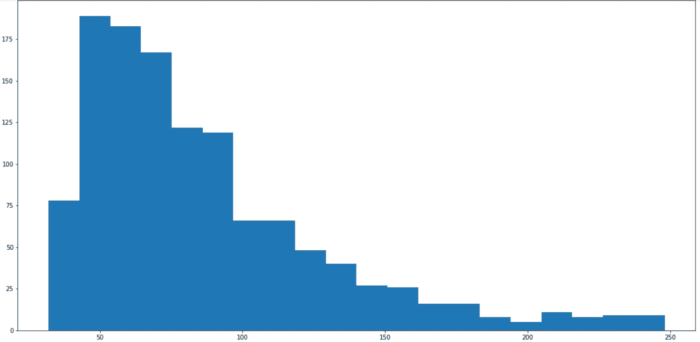

交通标志像素分布

*   我们可以观察到边界框的大小范围从 32 到 248 像素。
*   大多数方框位于 40 到 100 像素范围内，很少方框超过 150 像素。

# 第二步:数据预处理

**从 ppm 图像创建 png 图像:**

现在让我们从 ppm 图像创建 png 图像，

png 图像创建

上面的代码从 ppm 图像创建 png 图像，并将其存储在 images 文件夹中，这确保了没有单个交通标志的图像与包含交通标志的图像分开。这是通过使用数据集 dataframe 实现的。

## 创建注释文件:

为每个图像创建注释文件。这些注释文件包含图像文件路径、地面真实值和图像中交通标志的类别 id。这些文件以 xml 扩展名存储。

## Tfrecord 文件:

TFRecord 格式是一种用于存储二进制记录序列的简单格式。使用 tfrecords 可以高效地存储和读取数据。更多可以在这里了解 tfrecord， [tfrecord](https://www.tensorflow.org/tutorials/load_data/tfrecord)

我们将创建训练和验证数据 tfrecords，它将包含原始图像数据和边界框坐标以及类 id。由 600 个图像组成的训练数据被分成训练和验证数据，然后从该数据创建 tfrecord 文件。注释文件将用于创建 tfrecord 文件。

下面的代码片段将帮助我们实现创建 tf 记录文件。

让我们想象一个有边界框的图像，

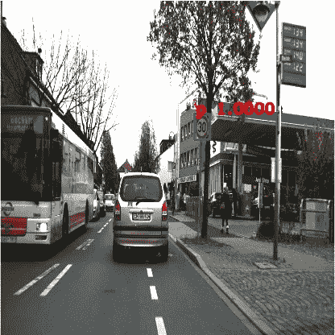

带有基本事实边界框的图像

dataframe 可以直接在 tf 数据管道中使用，而不是先转换为 xml，然后再转换为 tfrecords。

# 第三步:YOLO v3

YOLO v3 是对以前的 YOLO 检测网络的改进。这是一个单次检测器，运行速度非常快，可以在 GPU 设备上进行实时推断。

让我们看一下理解 yolo 所需的一些术语，

*   **网格单元:**

YOLOv3 将输入图像划分成一个 **S** × **S** 网格。每个网格单元只预测**一个**对象。

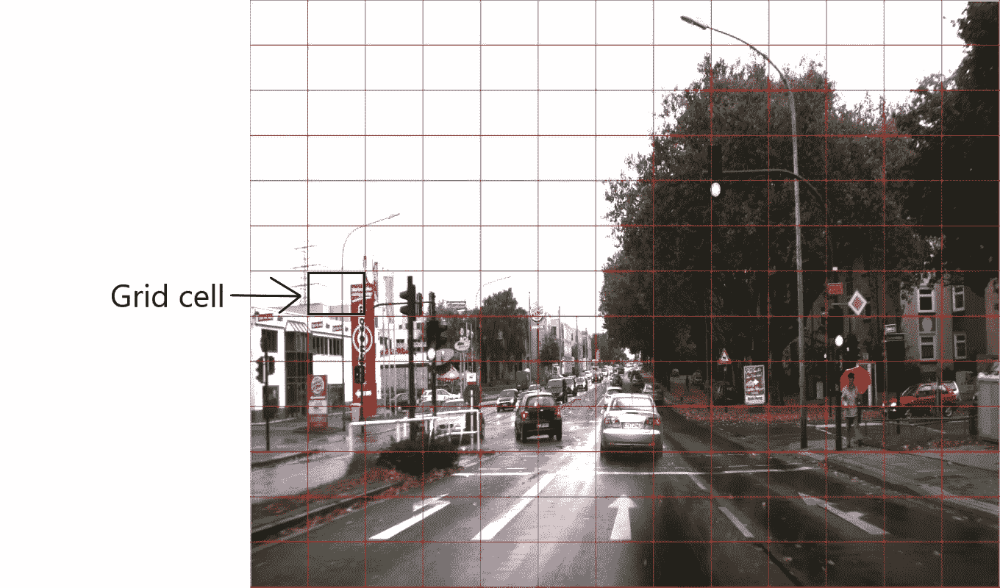

S 为 13 的网格单元

*   **锚箱:**

锚定框是先前的框，其可以具有不同的预定义纵横比。这些纵横比在训练之前通过在整个数据集上运行 K-means 来确定。锚定框被分配给网格单元，我们可以确定地面真相框与锚定框重叠的程度，并选择具有最佳 IOU 的一个。

在 YOLO v3 中，每个网格单元有三个锚盒。我们有三个等级的网格。因此，我们将为每个秤配备 52x52x3、26x26x3 和 13x13x3 锚盒。对于每个锚盒，我们需要预测 3 件事:

1.相对锚箱的位置偏移: *tx，ty，tw，th* 。这有 4 个值。
2。指示此框是否包含对象的对象性分数。这有 1 个值。
3。类别概率告诉我们这个盒子属于哪个类别。这有 num_classes 个值。

总之，我们为一个锚盒预测了 *4 + 1 + num_classes* 个值。

*   **非最大抑制:**

YOLO 可以对同一对象进行重复检测。为了解决这个问题，YOLO 应用了非最大抑制来去除置信度较低的重复。具有高于阈值的最高分数的检测框被保留，而其他框被去除。

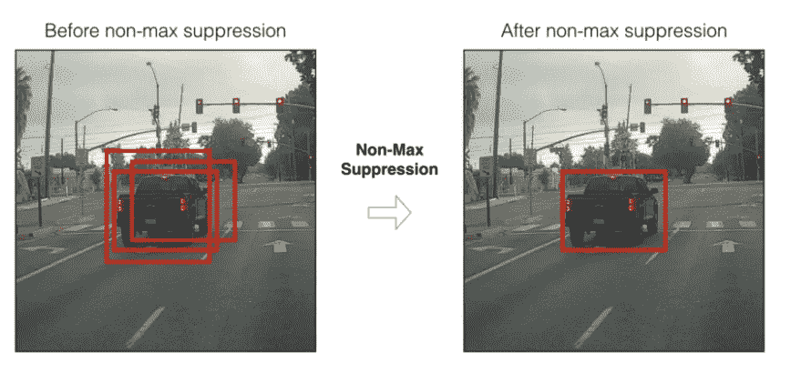

图片来自[分析 Vidhya](/analytics-vidhya/yolo-v3-theory-explained-33100f6d193) 的 [Python 课程](/@pythonlessons0)

让我们看看 YOLO v3 架构，

**暗网-53**

YOLO v3 使用 Darknet-53 作为它的特征提取器(主干)。这里使用了跳过连接的想法，以帮助激活通过更深的层传播，而没有通过 ResNet 获得的梯度递减。

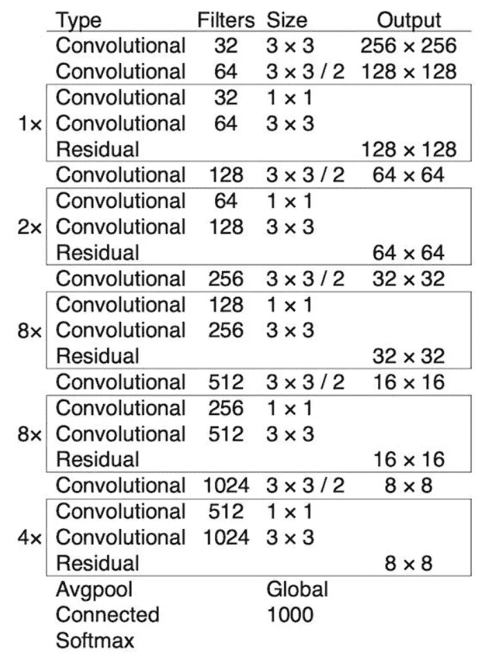

来自`[YOLOv3: An Incremental Improvement](https://arxiv.org/abs/1804.02767)`的图表

由于 YOLO V3 被设计为多尺度检测机，我们也需要多尺度的特征。因此，来自最后三个残差块的特征都被用于后面的检测。

从 darknet-53 获得的特征向量被送入多尺度检测器。检测器的最终输出将为[(52，52，3，(4 + 1 +数量类))，(26，26，3，(4 + 1 +数量类))和(13，13，3，(4 + 1 +数量类))] *。*(4+1+num _ classes)是因为锚盒预测。

darknet-53 架构由 darknetConv 函数中的 conv 层和剩余块组成。conv 层和残差块被组合以形成暗网块，残差层如在架构中提到的那样被重复。使用跳过连接，x_36 层、x_61 层和最后一层是暗网输出返回的特征向量。

**损失函数:**

YOLO 使用预测值和地面实况之间的误差平方和来计算损失。损失函数包括:

*   L **定位/回归损失**(预测边界框和地面实况之间的误差)。
*   C **信心损失**(箱子的实物)。
*   **分类损失**。

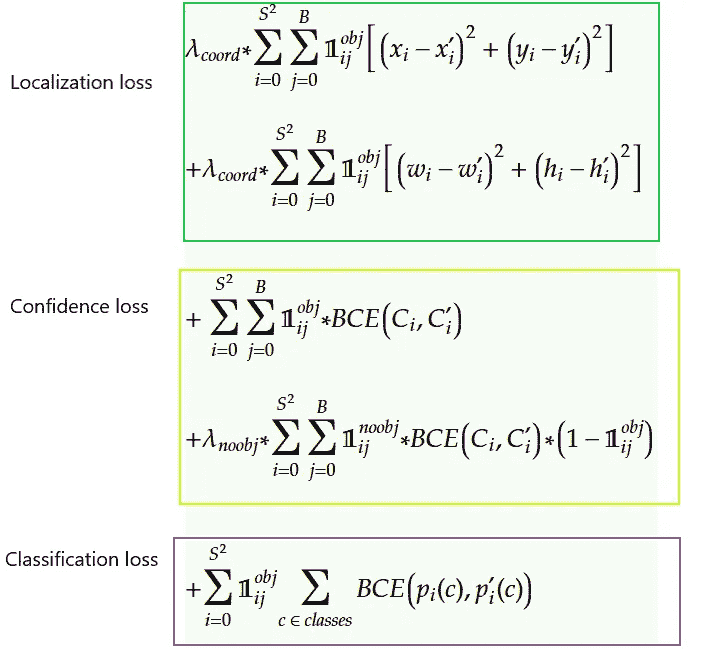

回归损失的第一部分是边界框质心的损失。 *x* 和 *y* 是相对于地面的质心位置。*x’*和*y’*是来自检测器的质心预测。这种损失越小，预测和地面实况的质心就越接近。如果在那些单元的基础事实中没有对象，则 obj 分数为 0，如果对象存在，则 obj 分数为 1。lambda_cord 是更强调本地化而不是分类的权重。

回归损失的第二部分是边界框宽度和高度的损失。这种损失与回归损失的第一部分相同。

第二个损失是信心损失。c 表示当前单元格中有对象的可能性。这里我们将使用二进制交叉熵代替均方误差。信心损失的第二部分， *noobj_loss* 是惩罚网络如果到处提出对象，所以用来惩罚这些假阳性的提议。因为在我们的基本事实中，noobj 比 obj 多得多，所以我们也需要这个 *Lambda_Noobj = 0.5* 来确保网络不会被没有对象的单元所控制。

最后一个损失是分类损失。如果总共有 80 个类，则*类*和*类'*将是具有 80 个值的独热编码向量。在 YOLO v3 中，它被更改为多标签分类，而不是多类分类。因此，每个输出像元可能有不止一个类为真。相应地，我们也对每一类逐一应用二元交叉熵并求和，因为它们并不互斥。就像我们对其他损失所做的一样，我们也乘以这个 *obj_mask* ，这样我们只计算那些具有基础真值对象的单元格。

**YOLO v3 损耗实现:**

**预测输出**是形状(批量大小，网格，网格，锚，(x，y，w，h，obj，…cls))。预测的输出被传递到 yolo _ boxes 函数，该函数返回包含 x1，y1，x2，y2 坐标的 pred_box，包含预测的对象得分的 pred_obj，包含预测的类的 pred_class 和由 x，y(即预测的中心坐标)和 w，h(即预测的宽度和高度)组成的 pred_xywh。

**真实输出**是形状(批量大小，网格，栅格，锚，(x1，y1，x2，y2，obj，cls))。真实输出被分成包含 x1、y1、x2 和 y2 的 true_box、包含对象性分数的 true_obj 和包含类的 true_class_idx。中心坐标以及高度和宽度从 x1、y1、x2、y2 坐标值获得。

box_scale_loss 赋予小盒子更多的权重。它与 lambda_coord 相同。

**计算 obj_mask** ，obj_mask 为 1 或 0，表示是否有物体。best_iou 分数通过使用 pred_box、true_box 和 obj_mask 来计算。使用 best_iou 得分的值，计算忽略屏蔽。

通过使用在先前步骤中计算的值来计算定位损失、置信度损失和分类损失。最后将所有这些损失相加得到 **YOLO 损失。**

**训练:**

通过使用训练 tfrecord 文件来完成训练，并且验证 tfrecord 文件用于验证..我们还需要传递必要的参数。训练代码可以在我的 [github 库](https://github.com/vignesh-bhat1999/Traffic-sign-detection)中看到。

还对训练图像进行了增强，增强包括水平翻转、色调、饱和度、剪切、缩放、平移和旋转。边界框值也必须随着每次扩充而改变。

# **第四步:预测**

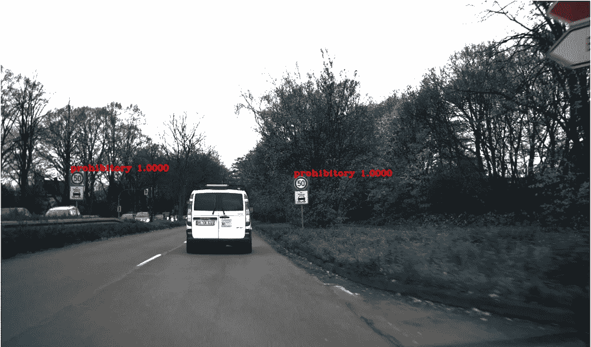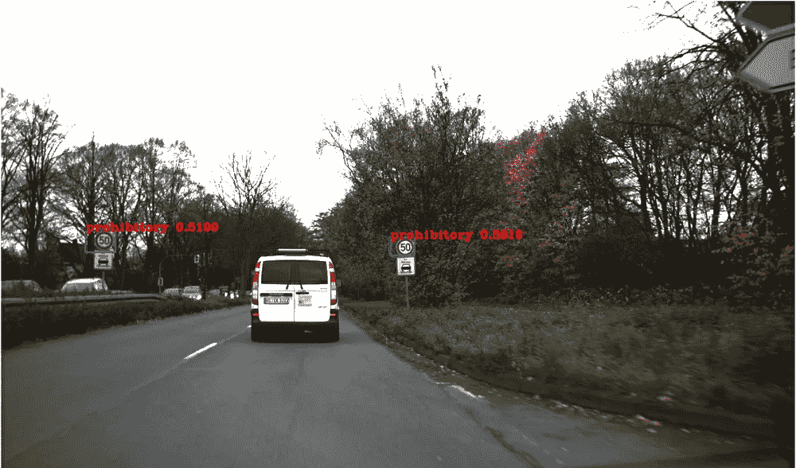

禁止检测

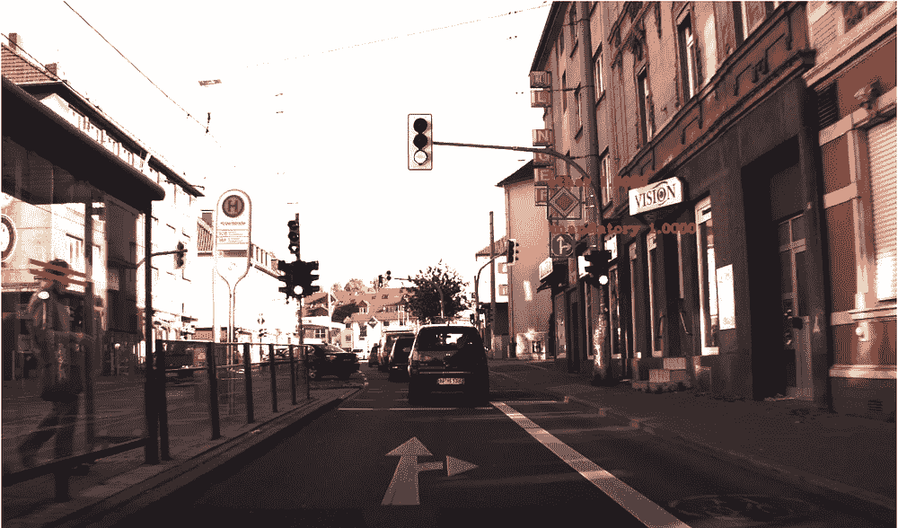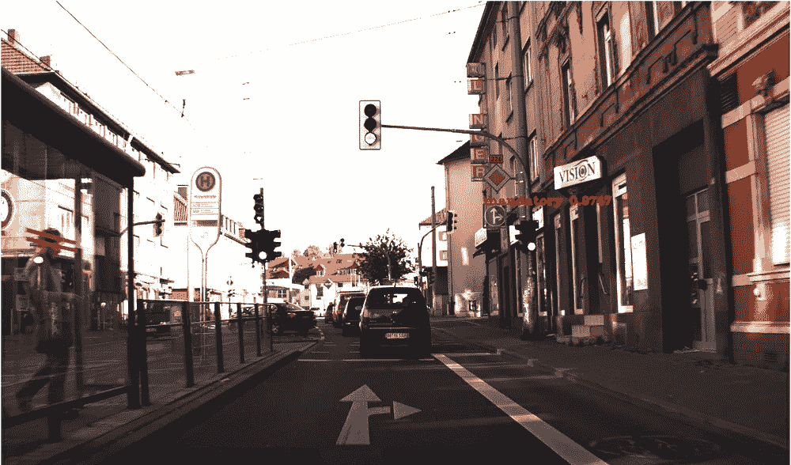

强制检测

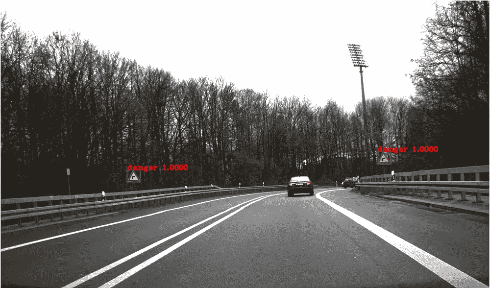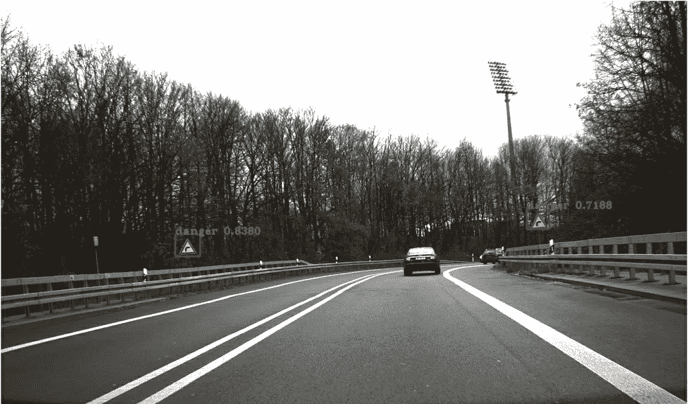

危险检测

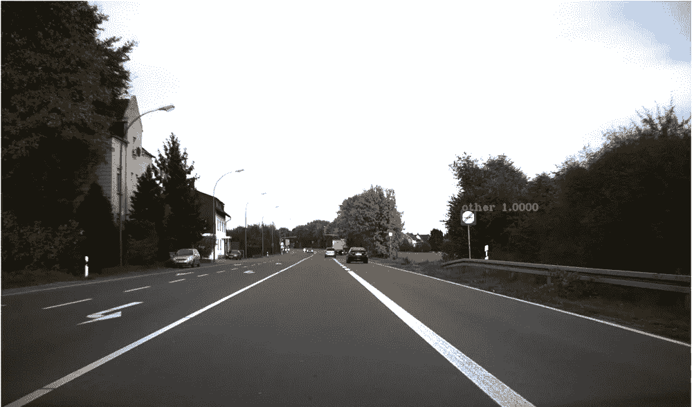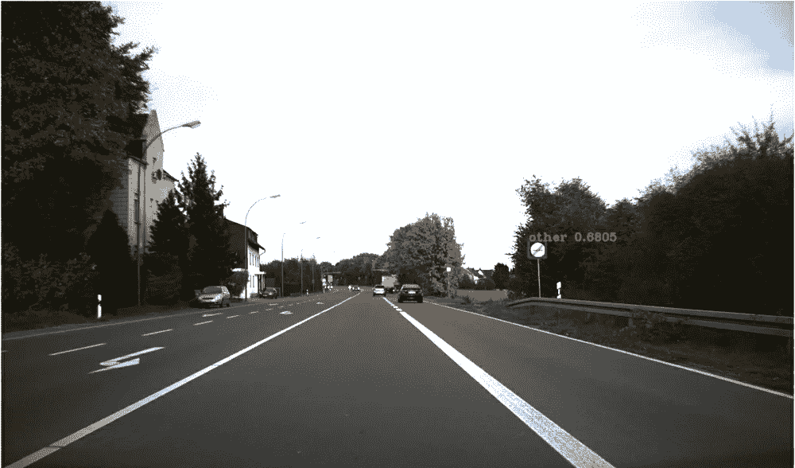

其他检测

## 进一步改进:

我们也可以用损失函数而不是二元交叉熵来训练。我们可以使用其他损失函数，例如聚焦损失，这可能有助于对检测到的对象进行分类。

yolov3 中使用的锚盒是 imagenet 的锚盒。我们可以在整个数据集上使用 K-means 为数据集创建自定义锚盒。

# 第五步:结论

这是我第一次体验计算机视觉，也是我第一次与深度学习相关的案例研究，我希望你喜欢阅读它。在这个案例研究中，我学到了很多技巧。我感谢 AppliedAI 和我的导师，他们在整个案例研究中帮助了我。

我的工作到此结束。感谢您的阅读！

# **参考文献:**

1.  [https://github.com/zzh8829/yolov3-tf2](https://github.com/zzh8829/yolov3-tf2)
2.  [https://towards data science . com/dive-really-deep-into-yolo-v3-a-初学者指南-9e3d2666280e](https://towardsdatascience.com/dive-really-deep-into-yolo-v3-a-beginners-guide-9e3d2666280e)
3.  [https://medium . com/@ Jonathan _ hui/real-time-object-detection-with-yolo-yolov 2-28 B1 b 93 e 2088](/@jonathan_hui/real-time-object-detection-with-yolo-yolov2-28b1b93e2088)
4.  [https://www.appliedaicourse.com/](https://www.appliedaicourse.com/)

*你也可以在**[***LinkedIn***](https://www.linkedin.com/in/vignesh-b-s-b7a805152/)*和*[***GitHub***](https://github.com/vignesh-bhat1999)*上找到并联系我。**