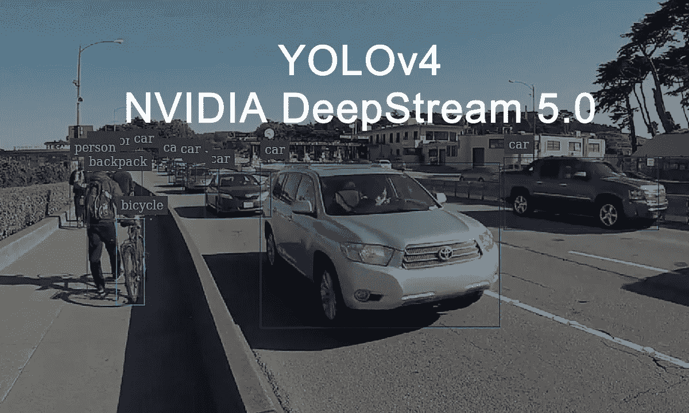
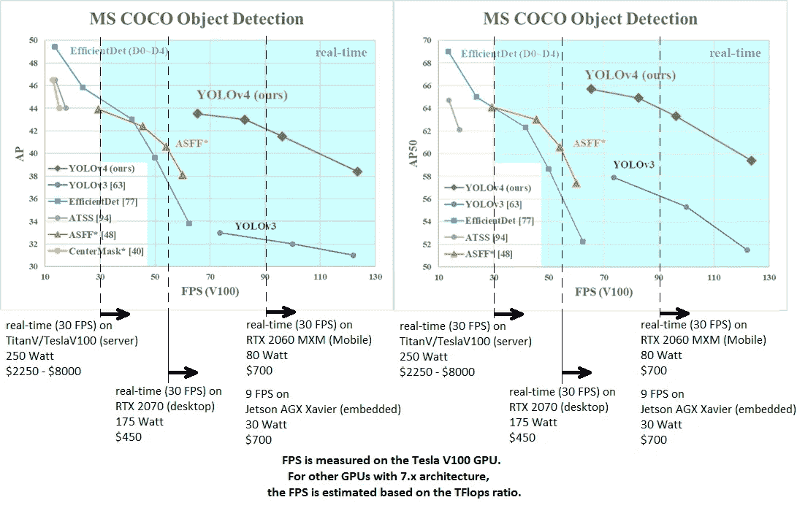
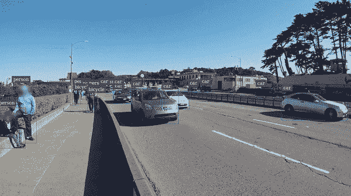

# 在 NVIDIA DeepStream 5.0 上使用 YOLOv4

> 原文：<https://medium.com/analytics-vidhya/using-yolov4-on-nvidia-deepstream-5-0-89d8c1e6fd1d?source=collection_archive---------2----------------------->



本文将指导您在 NVIDIA DeepStream 5.0 上安装和使用 Yolo-v4。如果你是 NVIDIA DeepStream 5.0 的新手，请关注我之前的文章 [**链接**](/analytics-vidhya/getting-started-with-nvidia-deepstream-5-0-8a05d061c4ee) **。**

我想你已经知道 YOLOv4 了。它声称拥有最先进的精度，同时保持高处理帧率。它在 Tesla V100 上以大约 65 FPS 的推理速度对 MS COCO 实现了 43.5% AP (65.7% AP₅₀)的准确度。你可以在这个[链接](https://github.com/AlexeyAB/darknet/)上找到关于 YOLOv4 的更多信息。



[来源](https://github.com/AlexeyAB/darknet)

现在介绍已经结束，让我们直接进入安装。

## 先决条件

*   *硬件平台(Jetson 或 GPU)*
*   *深流 5.0 版*
*   *腾索特版 7.0.0.11*
*   *NVIDIA GPU 驱动版本(仅对 GPU 有效)440.33.01*
*   *OS Ubuntu 18.04*
*   *CUDA 10.2*
*   *Pytorch 1.4.0*

目前 DeepStream 5.0 不支持 YOLOv4。但是他们给出了使用 YOLOv4 的步骤。感谢 NVIDIA 官方和社区。

***Pytorch 或 DarkNet→ONNX→tensort→deep stream***

## 暗网到 ONNX

```
git clone [https://github.com/Tianxiaomo/pytorch-YOLOv4.git](https://github.com/Tianxiaomo/pytorch-YOLOv4.git)
cd pytorch-YOLOv4
pip install onnxruntime 
```

在此 **下载预训练的 YOLOv4 权重和 cfg 文件 [**。**如果你想把 Pytorch 转换成 ONNX，按照](https://github.com/AlexeyAB/darknet#pre-trained-models)[库](https://github.com/Tianxiaomo/pytorch-YOLOv4)中的步骤操作。**

```
python demo_darknet2onnx.py yolov4.cfg yolov4.weights ./data/giraffe.jpg 1
```

## ONNX 到 TensorRT

在运行以下命令之前，请更改您的配置的参数。

```
trtexec --onnx=<onnx_file> --explicitBatch --saveEngine=<tensorRT_engine_file> --workspace=<size_in_megabytes> --fp16
```

示例:

```
trtexec --onnx=yolov4_1_3_608_608.onnx --explicitBatch --saveEngine=yolov4_1_3_608_608_fp16.engine --workspace=4096 --fp16
```

如果您得到 trtexec 命令没有发现问题。尝试给出明确的路径*/usr/src/tensorrt/bin/trtexec*

## 重建

*   将以下 C++函数添加到`**objectDetector_Yolo/nvdsinfer_custom_impl_Yolo/nvdsparsebbox_Yolo.cpp**`中，并重新构建`**libnvdsinfer_custom_impl_Yolo.so**`

```
cd /opt/nvidia/deepstream/deepstream-5.0/sources/objectDetector_Yolo/nvdsinfer_custom_impl_Yolomake clean
make
```

以下是 YOLOv4 配置文件，供您参考

*   config _ infer _ primary _ yolov 4 . txt
*   deepstream _ app _ config _ yolov 4 . txt

[](https://github.com/karthickai/YOLOV4_DeepStream_5.0) [## karthickai/yolov 4 _ deep stream _ 5.0

### NVIDIA DeepStream 5.0 中的 yolov 4(DarkNet 或 py torch-> ONNX-> TensorRT-> DeepStream)GitHub 是超过 50…

github.com](https://github.com/karthickai/YOLOV4_DeepStream_5.0) 

## 运行应用程序

```
deepstream-app -c ./deepstream_app_config_yoloV4.txt
```

## 输出



## 参考

[1][https://github.com/AlexeyAB/darknet](https://github.com/AlexeyAB/darknet)

[2][https://github.com/Tianxiaomo/pytorch-YOLOv4](https://github.com/Tianxiaomo/pytorch-YOLOv4.git)

感谢阅读。

如果你有任何建议/问题，请在评论区告诉我们！