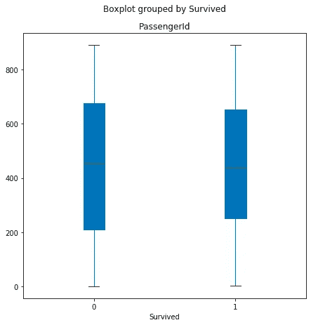
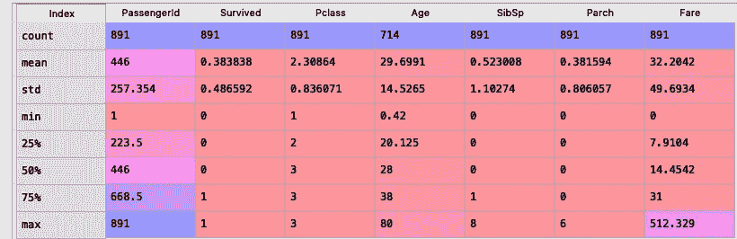
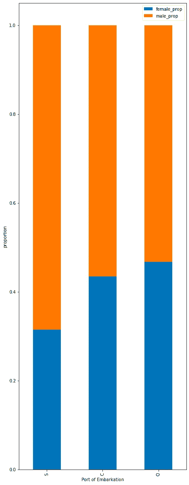

# 利用 Python 熊猫库的全部功能

> 原文：<https://medium.com/analytics-vidhya/utilising-the-full-power-of-python-pandas-library-883e474e6641?source=collection_archive---------21----------------------->

几乎我们所有人都使用过 Pandas，这是一个非常流行的 Python 库，用于将文件导入 Python，但是我们中的许多人(直到几天前，这个团队还包括我)并没有真正利用 Pandas 的价值！我们发现编写自定义函数比使用已经为 Pandas 数据框架定义的函数更容易，因为我们并不知道这样的内置函数是否存在！举个例子，我直到几天前才知道，我可以用熊猫直接读取一个“ **sql 查询**”，而我知道的那一刻，那一刻就是我顿悟了(WHaaaaaatttt！！！！)😂。所以，我想为什么不把熊猫图书馆的所有这些常见和不常见的功能(至少是我所知道的)列一个清单，这样我们就可以一起了解它们了。

因此，让我们从使用 good Ol' alias 'pd '将 good Ol' Pandas 库导入 Python 开始，并使用函数读取一个. CSV 文件。read_csv()并使用 pd 转换为数据帧。DataFrame()函数。(我使用 Spyder 编辑器、Python 3 和臭名昭著的泰坦尼克号数据集)

```
import pandas as pdtitanic_data = pd.read_csv("....//Downloads//train.csv") titanic_data = pd.DataFrame(titanic_data)
```

现在让我们使用属性“. columns”来显示数据帧的列名。head()'并输入行数作为参数。

```
titanic_data.columns
Out[5]: 
Index(['PassengerId', 'Survived', 'Pclass', 'Name', 'Sex', 'Age', 'SibSp',
       'Parch', 'Ticket', 'Fare', 'Cabin', 'Embarked'],
      dtype='object')titanic_data.columns##### displaying first 10 rows #####
titanic_data.head(10)
Out[6]: 
   PassengerId  Survived  Pclass  ...     Fare Cabin  Embarked
0            1         0       3  ...   7.2500   NaN         S
1            2         1       1  ...  71.2833   C85         C
2            3         1       3  ...   7.9250   NaN         S
3            4         1       1  ...  53.1000  C123         S
4            5         0       3  ...   8.0500   NaN         S
5            6         0       3  ...   8.4583   NaN         Q
6            7         0       1  ...  51.8625   E46         S
7            8         0       3  ...  21.0750   NaN         S
8            9         1       3  ...  11.1333   NaN         S
9           10         1       2  ...  30.0708   NaN         C[10 rows x 12 columns]
```

现在，每当有人提到 Python 中的可视化，你会想到什么？我打赌“matplotlib.pyplot as plt”..我不怪你，因为 matplotlib 是一个很棒的库，如果你想让你的视觉效果更美观，绝对应该使用它，但是如果你正在寻找一些简单的视觉效果，只是为了更好地了解你的数据，或者比较两个不同的列，那么就不要再看了..因为熊猫已经把你分类了！！让我们演示一些熊猫的绘图功能..如何绘制一个箱线图，根据乘客的起运港(起运列)来表示平均乘客数量。

```
box = titanic_data.boxplot(column='PassengerId',by='Survived',grid=False,
patch_artist=True,figsize=(7,7)
```



幸存/死亡的乘客人数

所以，这是一个非常简单的方框图，显示了幸存或未幸存的乘客数量，告诉我们幸存与死亡乘客的中位数几乎相同。我已经用过了。' boxplot()'函数进行绘制，也可以使用' . plot.box()'。需要注意的是，这两个函数都将产生一个 matplotlib 对象，因此您可以使用通常在“matplotlib”图中使用的函数来改变视觉效果。现在，让我们继续寻找一些描述性统计数据(平均值、计数等)。)对于数据中的数字列，使用'.“describe()”函数。

```
describe_stats = titanic_data.describe()
```

输出—



在上图中，我们可以看到描述性统计数据包括每个数字列中没有“Nan”的行数、每列的平均值、标准偏差“std”、最小(min)和最大(max)值、每列的不同百分位数(25%、50%、75%)。您可以使用“include”参数选择要包含的百分点。

让我们前进到一个人们通常倾向于与 Microsoft Excel 联系在一起的功能——“数据透视表”。事实上，这是 Excel 的高级功能之一，但它可以通过 Pandas 库非常简单地完成。你所需要做的就是，使用。pivot_table()'函数，真正理解 pivot 的功能。那么当一张桌子旋转时会发生什么呢？如果您的数据集中有一个分类列，例如“性别”，并且您想按每个性别类型查看表中的值，那么您可以按性别列透视数据集，瞧！！您可以根据性别列中的值查看所有其他列。换句话说，性别列的唯一行现在是数据透视表的列。

```
pivoted = titanic_data.pivot_table(columns='Embarked',index='PassengerId',values=['Fare','SibSp'],fill_value=0)pivoted.head(10)
Out[74]: 
                Fare                  SibSp      
Embarked           C       Q        S     C  Q  S
PassengerId                                      
1             0.0000  0.0000   7.2500     0  0  1
2            71.2833  0.0000   0.0000     1  0  0
3             0.0000  0.0000   7.9250     0  0  0
4             0.0000  0.0000  53.1000     0  0  1
5             0.0000  0.0000   8.0500     0  0  0
6             0.0000  8.4583   0.0000     0  0  0
7             0.0000  0.0000  51.8625     0  0  0
8             0.0000  0.0000  21.0750     0  0  3
9             0.0000  0.0000  11.1333     0  0  0
10           30.0708  0.0000   0.0000     1  0  0
```

让我解释一下该函数的参数—“列”是您希望看到您的表按其唯一值排列的列(此处我使用“上船”作为该列，表按值“C”、“Q”和“S”排列)，“索引”是不言自明的，我使用列“PassengerId”作为索引，“值”是您希望根据“列”参数对其值进行分组的列(此处我对“票价”和“SibSp”的值进行分组)，fill_value 正是您想要的值

我们现在将前进到一个更像 SQL 的功能，“GroupBy”。同样，如果理解正确，这个函数可以由 Pandas 库以非常简单的方式实现。它用于按特定列对数据集进行分组，然后对每个组使用聚合函数(平均值、总和、计数)。有几种方法可以做到这一点——a)可以按多个列对数据进行分组 b)可以访问多个分组列的值 c)通过将“as_index”参数设置为“True”或“False ”,可以将分组所依据的列视为索引或不视为索引 d)在按多个列分组的情况下，这就变成了多重索引的情况。

```
###### Grouping by 'Survived' column and applying the aggregate function count #######titanic_data.groupby(by='Survived').count()
Out[75]: 
          PassengerId  Pclass  Name  Sex  ...  Ticket  Fare  Cabin  Embarked
Survived                                  ...                               
0                 549     549   549  549  ...     549   549     68       549
1                 342     342   342  342  ...     342   342    136       340[2 rows x 11 columns] ####### Grouping by 'Survived' column and applying the aggregate function sum() (will consider only continuous fields) #######titanic_data.groupby(by='Survived').sum()
Out[76]: 
          PassengerId  Pclass       Age  SibSp  Parch        Fare
Survived                                                         
0              245412    1390  12985.50    304    181  12142.7199
1              151974     667   8219.67    162    159  16551.2294####### Grouping by 'Survived' column and applying the aggregate function mean() (will consider only continuous fields) #######titanic_data.groupby(by='Survived').mean()
Out[77]: 
          PassengerId    Pclass        Age     SibSp     Parch       Fare
Survived                                                                 
0          447.016393  2.531876  30.626179  0.553734  0.329690  22.117887
1          444.368421  1.950292  28.343690  0.473684  0.464912  48.395408####### Grouping by 'Survived' and 'Embarked' columns and applying the aggregate function mean()#######titanic_data.groupby(by=['Survived','Embarked']).mean()
Out[78]: 
                   PassengerId    Pclass  ...     Parch       Fare
Survived Embarked                         ...                     
0        C          409.853333  2.200000  ...  0.253333  35.443335
         Q          480.404255  2.936170  ...  0.276596  13.335904
         S          449.868852  2.545667  ...  0.348946  20.743987
1        C          473.989247  1.634409  ...  0.451613  79.720926
         Q          319.966667  2.866667  ...  0.000000  13.182227
         S          448.857143  1.967742  ...  0.539171  39.547081[6 rows x 6 columns]####### Grouping by 'Survived' and 'Embarked' columns and applying the aggregate function mean() and accessing the grouped column 'PassengerId' #######titanic_data.groupby(by=['Survived','Embarked']).mean()['PassengerId']
Out[79]: 
Survived  Embarked
0         C           409.853333
          Q           480.404255
          S           449.868852
1         C           473.989247
          Q           319.966667
          S           448.857143
Name: PassengerId, dtype: float64####### Grouping by 'Survived' and 'Embarked' columns and applying the aggregate function mean() and accessing the grouped columns 'PassengerId' and ' SibSp' #######titanic_data.groupby(by=['Survived','Embarked']).mean()[['PassengerId','SibSp']]
Out[80]: 
                   PassengerId     SibSp
Survived Embarked                       
0        C          409.853333  0.253333
         Q          480.404255  0.510638
         S          449.868852  0.611241
1        C          473.989247  0.494624
         Q          319.966667  0.300000
         S          448.857143  0.493088##### Setting the as_index parameter to 'False'titanic_data.groupby(by=['Survived','Embarked'], as_index=False ).mean()[['PassengerId','SibSp']]
Out[81]: 
   PassengerId     SibSp
0   409.853333  0.253333
1   480.404255  0.510638
2   449.868852  0.611241
3   473.989247  0.494624
4   319.966667  0.300000
5   448.857143  0.493088
```

接下来，我们可以讨论如何根据一列或多列轻松过滤数据帧。虽然开始时过滤数据帧的语法可能有点难记，但是谷歌一下不会伤害任何人！！

如果有人让我过滤数据集，找出那些在泰坦尼克号灾难中幸存的乘客的乘客等级(Pclass 列),我会这么做。

```
# displaying only the first 10 rows #
titanic_data[titanic_data['Survived']==1]['Pclass'].head(10)
Out[85]: 
1     1
2     3
3     1
8     3
9     2
10    3
11    1
15    2
17    2
19    3
Name: Pclass, dtype: int64
```

现在，如何找到幸存乘客的最高和最低票价。

```
max(titanic_data[titanic_data['Survived']==1]['Fare'])
Out[87]: 512.3292min(titanic_data[titanic_data['Survived']==1]['Fare'])
Out[88]: 0.0
```

最大值似乎是可信的，但让我感到奇怪的是，有人为了免费的🧐而乘坐泰坦尼克号，所以数据可能没有关于乘客票价的所有信息。

现在，我希望看到男性乘客与女性乘客的比例，在每个港口登机，也许我会绘制一个堆叠的条形图来显示结果。

```
proportion_male = []
proportion_female = []
for i in port:
    male_pass =  titanic_data[(titanic_data['Sex'] == 'male') & (titanic_data['Embarked'] == i)]['PassengerId'].count()
    female_pass =  titanic_data[(titanic_data['Sex'] == 'female') & (titanic_data['Embarked'] == i)]['PassengerId'].count()
    total_pass = titanic_data[(titanic_data['Embarked'] == i)]['PassengerId'].count()
    proportion_male.append(male_pass/total_pass)
    proportion_female.append(female_pass/total_pass)# creating a new DataFrame with the 'Embarked' values as the indices and the proportion values as columns #temp_df= pd.DataFrame()temp_df= pd.DataFrame(index=port)temp_df['female_prop'] = proportion_femaletemp_df['male_prop'] = proportion_male# Now plotting a stacked bar #stacked_bar = temp_df.plot(kind='bar',stacked=True, figsize =(7,20))
stacked_bar.set_ylabel('proportion')
stacked_bar.set_xlabel('Port of Embarkation')
```



正如我们所看到的，女性乘客的比例在港口“S”中较低，但在港口“C”中几乎与男性乘客相等，而在港口“q”中高于男性乘客。

这是一个关于熊猫如何帮助我们获得更广泛的数据集视图，并对数据进行一些快速而有趣的分析的简介。如果这篇文章对你有所帮助，请告诉我，并留下你的反馈。再见！😀