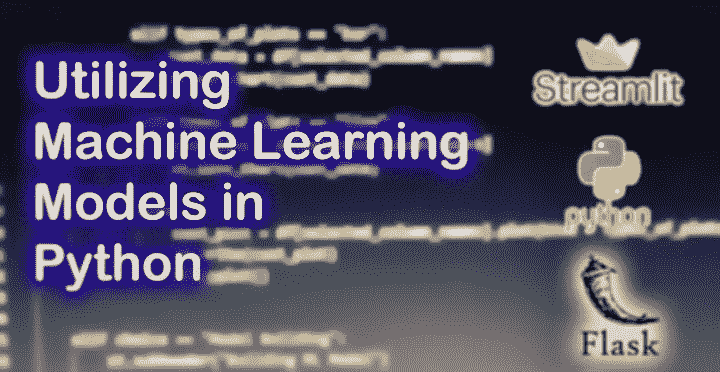

# 在 Python 中利用机器学习模型

> 原文：<https://medium.com/analytics-vidhya/utilizing-machine-learning-models-in-python-9d57b7ea12c?source=collection_archive---------25----------------------->



好的到目前为止，我们已经看到了如何制作[机器学习模型](https://github.com/umairk83/hands_on_stuff)，我们探索了许多数据集，也从这些数据集中获得了有价值的见解。这很有价值，它展示了如何进行**探索性数据分析**。但是我们还没有完成，直到我们在任何应用中使用这些模型。让我们用例子来看看这一点:

1.  假设您正在构建基于 ML 的推荐系统。你问终端用户他们的喜好，并根据他们的喜好向他们推荐电影等。虽然基本分析可以在 **Jupyter Notebook** … 上完成，但当您必须根据最终用户的输入来预测值时，这将失败。
2.  假设你是一名医生。你想知道这个人是否患有慢性肝炎，根据病人的医疗状况，你想知道这个病人是否会活下来。现在这是经典的**分类**问题。作为一名医生，你的时间有限，笔记本电脑对你来说不是一个可行的选择。因此，拥有一个与这个模型交互的界面是至关重要的。
3.  假设你是一个企业主。您希望看到您的销售人员在下一季度的表现。您将需要一些应用程序来预测这些值。

从上面的例子我们可以看到，我们需要有效地公开这些模型，以使它们有用。在这篇文章中，让我们探索如何在应用程序中共享这些模型。

# **交付机器学习网络应用的方法**

> 如今，软件应用程序通常是在线交付的。我们用技术术语称之为“软件即服务”。你可以浏览一个 web 应用程序，输入你的输入(机器学习语言的特性)并得到你的结果。您还可以获得关于预测的不同统计信息的报告。同样，也可能出现没有互联网的情况。例如，银行是互联网接入受限的典型工作场所。或者可能是作为一个实验或测试的目的，我们可能需要有我们的模型使用没有建立网站。

因此，为了迎合所有这些场景，可以使用三个想法来构建机器学习应用程序:

## **作为 Web 应用程序公开**

web 应用程序需要托管在某个服务器/云上。结构可以非常简单。假设您的前端应用程序可以构建在 react JS/Angular JS/Angular/vue JS/或任何其他 web 框架上。现在，您可以接受来自前端应用程序的输入，这些输入作为表单数据可以在服务器上处理，并且可以检索结果。

> 为此， **Streamlit** 和 **Flask** 是 Python 中非常广泛使用的框架。Streamlit 非常适合那些没有软件开发背景的人。这样的人可能想快速建立一个 web 应用程序。

## **曝光为 API**

假设你已经有了一个产品和它的 web 应用程序。或者您有一个智能手机应用程序(Android / iOS ),并且希望将 ML 功能集成到其中。现在你不能改变应用程序的整个结构，因此最快的方法是设置 API 并公开端点来交付结果。例如，RestFul API 可以接受参数并返回结果。

> 在 Python“Hug 框架”中，“Flask 框架”和“FastAPI”被广泛用于此目的。

## 为 CLI /脚本创建 ML 包

当不需要 web 应用程序或者互联网访问受到限制时，这是最好的选择。对于这种情况，我们可以将我们的机器学习模型打包。包的意思是可以使用命令行界面(cli)或终端/ bash 脚本来访问它们。

> 如果你想知道世界上哪里不能上网；仅仅是 Fintech 的一个软件项目就足够了。

# 把你的超赞 ML 模型打包

是的，你的模型可能很棒，但需要利用新数据或使用新观察结果的反馈来开发和更新。更新模型超出了本文的范围，但是让我们看看如何快速地将 ML 模型作为包转储。

```
**import** joblib
**from** sklearn.linear_model **import** LogisticRegression...logisticRegression = LogisticRegression()# Your magic here
...model_file = open('logistic_reg_model.pkl', 'wb')
joblib.dump(logisticRegression, model_file)
model_file.close()
```

暂时就这么多。如果你正在寻找利用机器学习模型，我希望这篇文章能给你一些有价值的想法。

> 感谢您的阅读，敬请关注更多关于机器学习的帖子。请随意使用我的 [Github](https://github.com/umairk83/hands_on_stuff) 库中的任何代码。