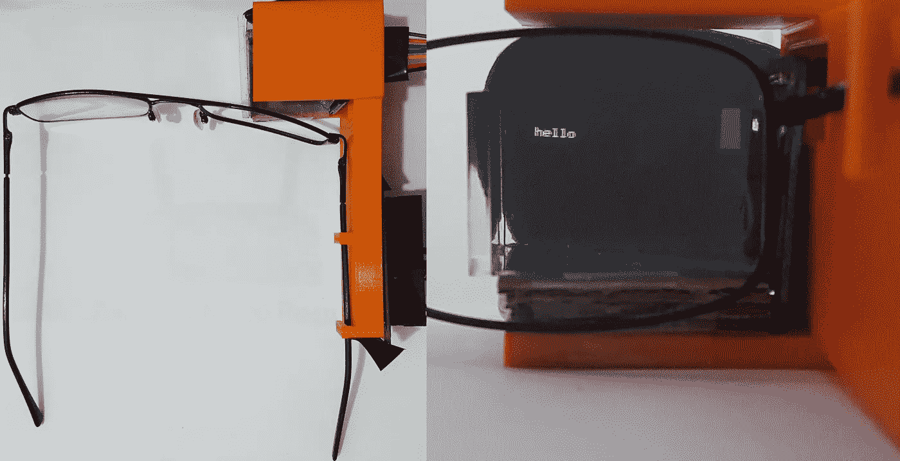
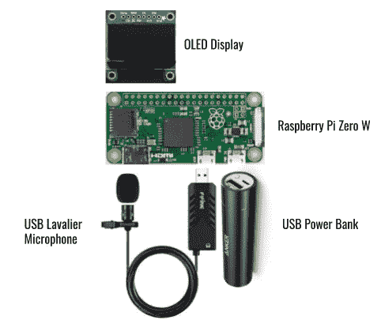
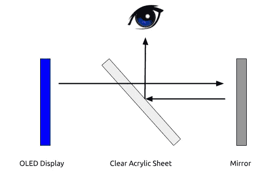
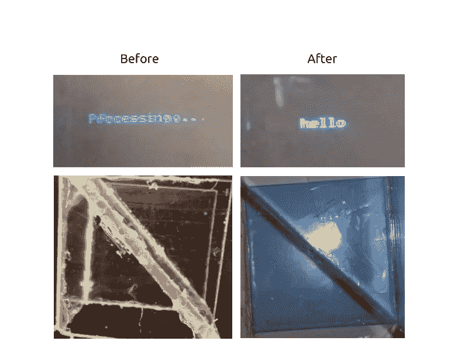
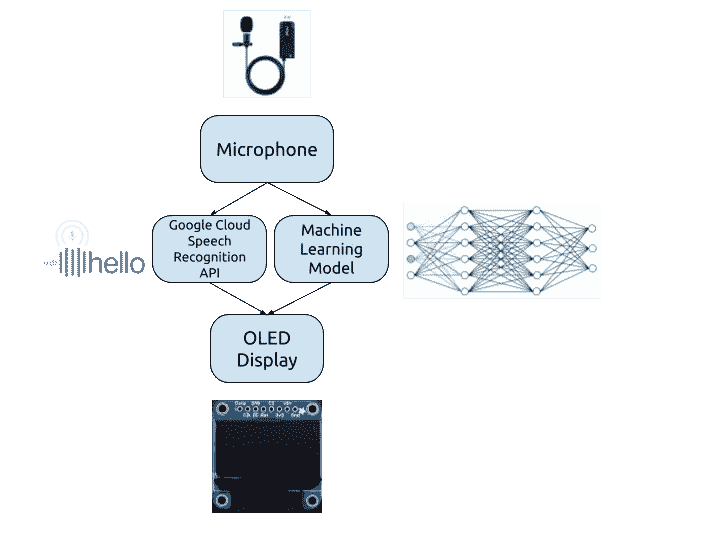
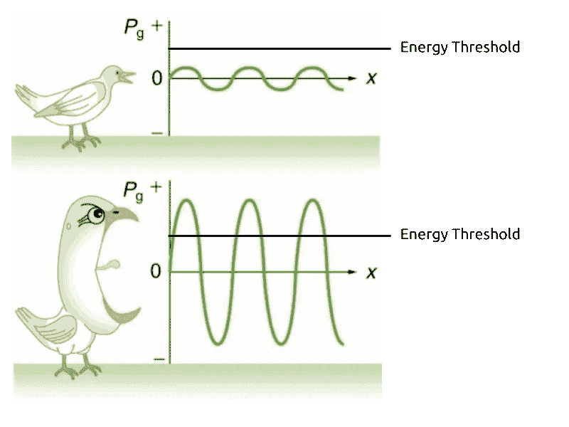
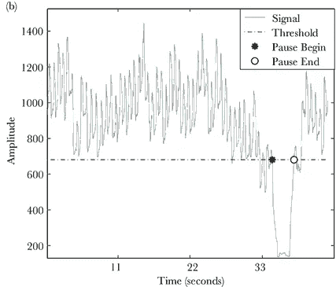
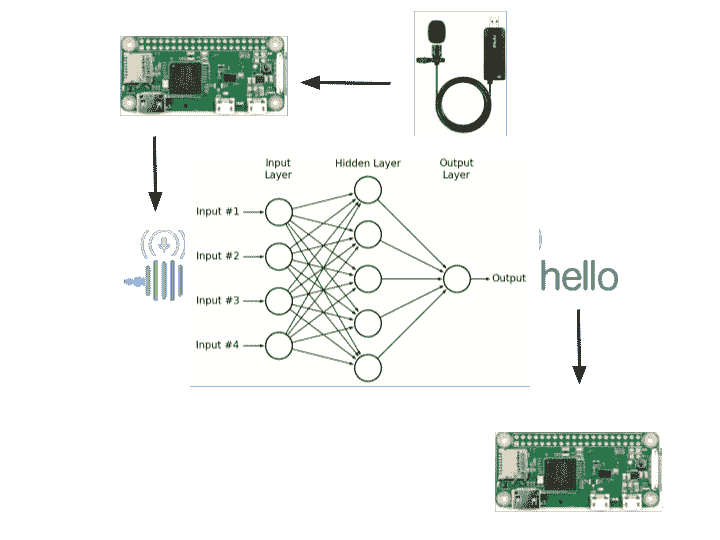
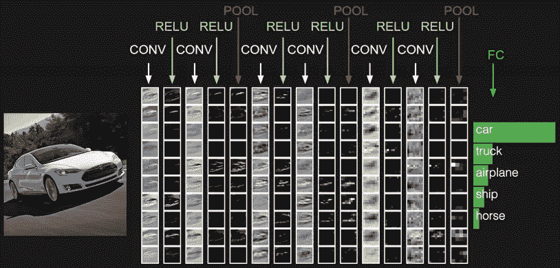

# VADAR——面向聋人和重听人的创新解决方案

> 原文：<https://medium.com/analytics-vidhya/vadar-an-innovative-solution-for-the-deaf-and-hard-of-hearing-91b2bc6390f6?source=collection_archive---------5----------------------->

[点击此处](https://youtu.be/nj-_K6WwBSc)观看 VADAR 演示

## 问题是:

耳聋或重听的人在完成基本的日常任务如与他人交流时会有困难。虽然有解决方案被用来处理这个问题，但是当前的方法有缺陷；唇读只能用于理解大约 30%的话语，并且缺少手语翻译，随着这些人更频繁地出现在公共场合，预计这种情况将会恶化。这些问题在一定程度上解释了聋人群体的高失业率和诸如抑郁和焦虑等问题的存在。

## 解决方案是:

作为解决方案，我在一副眼镜上开发了一个附件，它可以实时转录对眼镜佩戴者说的话，并在附近有指示危险的声音时向佩戴者发出警告(例如，如果有汽车喇叭声或狗叫声)。该设备使用 **Python 编程语言**结合**谷歌语音识别 API** 来转录语音。Keras 内置的定制**卷积神经网络**用于识别其他重要的声音。这些信息显示在设备的镜片上，佩戴者可以看到。由于镜片是透明的，它允许佩戴者在理解他们在说什么的同时与他们说话的人进行目光接触，并且不会干扰他们的日常生活。

这款眼镜能够提供**准确的实时语音转录**，并将其正确格式化到显示器上。佩戴时，它们被连接到一副普通的眼镜上，这意味着它们与佩戴者可能有的任何眼镜处方都是兼容的。总的来说，该设备非常有效，能够实现其目的。你可以在这里观看这个装置的演示。

## 在这篇文章中，我将解释:

1.  硬件如何工作
2.  软件如何工作
3.  我计划把这个项目带到哪里

# **第 1 部分:硬件**

## **设计**

该设备的设计基于其他在线智能眼镜的设计，并对其进行了改进，以适应项目的要求。

该设备的主要组件如下所示:

*   树莓派零度 W
*   单色 128x64 有机发光二极管显示器
*   USB 领夹式麦克风
*   USB 电源组
*   透明丙烯酸制成的透镜

Raspberry Pi Zero W 由 USB 电源组供电，控制有机发光二极管显示屏，光线从显示屏反射到镜头上，进入佩戴者的眼睛。USB 领夹式话筒向 Raspberry Pi 发送实时声音信息，Raspberry Pi 对其进行处理，并将语音转录发送至有机发光二极管显示器。与大多数其他智能眼镜使用的 Arduino 微控制器不同，使用 Raspberry Pi Zero W 是因为它的计算能力更强，能够完成语音识别等复杂任务。

所用组件的概述

对其他智能眼镜的设计进行的另一个修改是在连接到眼镜的平台和单独佩戴的另一个平台之间分配组件；这样，眼镜对佩戴者来说不会太重。直接附在眼镜旁边的组件是树莓皮、有机发光二极管显示器和透镜；USB 电源组和麦克风连接到另一个平台。上面的平台是 3D 打印的，有两个夹子，与佩戴的眼镜连接在一起；这允许通过将眼镜从设备中切换出来来使用不同的眼镜。

设备中使用的材料的完整列表如下所示:

*   树莓派零度 W
*   40 针 GPIO 连接器接头
*   USB 领夹式麦克风
*   迷你 3350mAh 口红大小的便携式充电器(USB 电源库)
*   8 根母到母跳线电缆— 20 厘米
*   OTG 微型 USB 电缆— 6 英寸
*   MicroSD 卡(10 类)— 16GB
*   单色 1.3 英寸 128x64 有机发光二极管图形显示屏
*   透明亚克力(镜头用)
*   小镜子(镜头用)
*   3D 打印机和细丝(用于上层平台)

## **镜头**

这种眼镜使用棱镜将来自显示器的光反射到佩戴者的眼睛中。而不是将本身不透明的显示器保持在佩戴者眼睛的正前方，这样，佩戴者可以选择是关注显示器上的内容还是关注他们面前的内容。显示器的输出被反射到镜子上，镜子又将光线反射到斜放在佩戴者眼睛前方的透明丙烯酸板上。这个过程如下图所示。

镜头的鸟瞰图

这些零件用一种高性能工业粘合剂 E6000 粘合在一起。之所以选择 E6000 作为粘合剂，是因为它的强度高，能够附着在无孔物质上，如所用的丙烯酸板。

用于制造棱镜的零件尺寸如下所示:

*   **镜子**—2.3 厘米 x 3.7cm 厘米
*   **透明亚克力**—4.8 厘米 x 2.1cm 厘米
*   **透明亚克力**—3.5 厘米 x 3.5cm 厘米

在温哥华的 MakerLabs，使用激光切割机切割透明和镜面丙烯酸板。激光切割的工作原理是通过计算机将高功率激光的输出对准要切割的材料。

第一次使用的棱镜中心的透明丙烯酸板的厚度为 2.4 毫米。然而，当使用这种板时，显示器的输出被视为两个彼此重叠的图像。这个问题很可能是由于使用的丙烯酸板太厚。

为了解决这个问题，使用了一种更薄的丙烯酸板，这种板只有 1 毫米厚。如下图所示，这大大减少了中心材料的厚度，解决了这个问题。

在替换中间的透明丙烯酸材料时，仍然有两个文本图像相互重叠；然而，从左图中可以看出，这两幅图像彼此距离很近，足以被感知为一幅图像。出现两个图像的原因很可能是光线穿过中间的丙烯酸片时发生了折射。当丙烯酸树脂的厚度减少时，它导致光线以比以前更小的角度折射，从而导致两幅图像彼此偏离更少。

# 第 2 部分:软件

这个设备完全是用 Python 编程的。程序中使用了一些外部库，最重要的是 adafruit_ssd1306 来控制显示，SpeechRecognition 来执行语音识别，librosa 来处理音频并生成 MFCCs，Keras 来训练卷积神经网络来识别其他声音。主控制程序分为四个部分。首先，麦克风开始录制音频，直到它检测到有人说出一个短语。然后，音频被发送到 Google 语音识别 API，从那里以字符串(字符序列)的形式接收所说的单词。捕获的音频也由卷积神经网络处理，该网络确定是否出现了任何可能指示危险的额外声音。这些单词显示在显示器上，这使得眼镜的佩戴者可以看到它们。

所用方法概述

## 单词检测

必须调整几个变量来提高单词检测的质量和速度，包括能量阈值、动态能量调整比率、暂停阈值和短语时间限制。该程序通过分析来自麦克风的音频流的能量水平(声音强度)来检测一个人何时说话。声音越大，能量水平越高。如果能量水平低于某个阈值，即所谓的*能量阈值*，则认为存在静默；如果它们高于能量阈值，则音频被认为是语音。

在麦克风打开之前，能量阈值被初始化为某个值。当程序分析来自麦克风的音频时，它会根据当前的环境噪声水平而改变。这使得程序能够适应眼镜佩戴者所处的环境。动态能量调节比决定了语音必须被感知为比无声更响的因子。较低的值会使说出的单词更容易被检测到(真阳性)，而较高的值会减少被错误解释为语音的环境噪声量(假阳性)。

当已经过了一定量的时间时，检测到短语的结束，在该时间期间存在沉默；这个量被称为*暂停阈值*。虽然暂停阈值的较低值导致检测更快地完成，但是太低的值可能导致识别在说话者完成他们的短语之前就开始了。

如果暂停阈值太高，程序会将下一个说出的短语视为当前短语的一部分，并且不会开始处理当前短语的音频。

*短语时间限制*在上述方法不能将说话者的声音从环境背景噪声中分离出来的情况下起到自动防故障的作用。在任何时候，如果麦克风检测到同一短语的时间超过了设定的短语时间限制，该短语将被切断，只有切断之前的音频将被处理。这可以防止程序由于背景噪音异常大而停留在一个短语上。

## 语音识别

一旦检测到一个短语，Google 语音识别 API 就用于确定所说的单词。谷歌语音识别 API 使用被称为*人工神经网络* (ANNs)的机器学习模型将语音转换为文本。

人工神经网络是数据分析中常用的系统，在高层次上，通过分析许多成功和不成功完成任务的例子来学习完成任务。在语音识别的情况下，可以给 ANN 不同人说话的例子以及与这些例子相关联的正确转写。然后，人工神经网络将通过一个称为*训练的迭代过程，*根据哪些变化将有助于产生期望的结果来改变自己。

具体来说，人工神经网络充当数学函数；它被给予输入(例如，语音)并产生输出(例如，文本)。在训练过程中，人工神经网络根据给定示例显示的正确输出来计算自己的误差水平；然后，它计算应该如何改变其参数，以使该误差最小化。

Google 语音识别 API 使用已经被 Google 训练过的人工神经网络来为它接收到的语音生成转录。

## 其他声音的识别

虽然捕获的音频被发送到 Google 语音识别 API 进行处理，但它也在本地进行处理，以提供其他可能对佩戴者有帮助的声音相关信息。具体来说，当设备识别出汽车在鸣笛或狗在叫时，佩戴者就会收到通知。首先对音频进行预处理，然后使用卷积神经网络(CNN)对其进行分类。

卷积神经网络是受视觉皮层启发的人工神经网络的子集，通常用于对图像进行分类。

作为输入，它们被给予诸如图像之类的数据，作为输出，它们返回输入内容可能是什么的一系列概率。该设备中使用的 CNN 将眼镜佩戴者周围的音频作为输入，并输出是否有任何重要的声音，如汽车喇叭声。

传送到 CNN 的音频首先通过一种叫做预处理的技术进行改变。这实质上是从音频中提取对模型有用的信息。例如，对于预测从一个地方旅行到另一个地方所需时间的模型，而不是将原始坐标提供给模型，可以首先计算两个地方之间的距离。

用于处理音频的预处理步骤如下:在被称为*归一化*的过程中，数据被缩放到-1 和 1 之间的范围；然后，计算归一化音频的*梅尔频率倒谱系数(MFCC)*。MFCCs 意在表示说话时人类声道形成的形状；然而，它们也可以用来区分除了人声以外的声音。

# 第三部分:未来

## 丰富

我的项目是成功的，因为我能够实现我的目标:为聋人或听力受损者开发一副智能眼镜，它可以将他们周围的声音，即他们正在说话的人的声音，转录到眼镜的镜片上。尽管如此，该设备仍有一些改进。

我希望将来对设备进行的一些更改包括增加设备功能的更改。具体来说，我想使用一个更强大的麦克风，具有更高的范围，这样该设备将能够从比目前更远的地方通知佩戴者扬声器。

如果 Raspberry Pi 3 模型 B+与当前的 Raspberry Pi Zero W 一起使用，则音频的处理时间可以显著减少，因为计算将在多个 CPU 内核之间分配。

可以使用更轻的电源组和麦克风，以便允许所有的部件都连接到眼镜旁边的单个平台上。通过用锂聚合物(LiPo)电池取代目前为 Raspberry Pi 供电的电源组，也可以减轻设备的重量，这种电池比任何电源组都更小更轻。

最后，我想改进设备的用户界面，让眼镜的佩戴者可以轻松地更改任何设置。该设备当前正在运行；然而，用户可能会发现操作该设备有困难，因为其用户界面尚未完成。用户界面将被设计成适应眼镜佩戴者由于他们的听力残疾而可能具有的任何需求。

## 这是什么意思？

以前，解释如此重要的感觉的丧失是不可想象的；然而，现代技术可以用来增强聋人和重听人的能力。机器学习的最新进展允许通过让每个人都可以访问从声音中收集的信息来实现民主化，而增强现实提供了一个平台，以视觉方式将这些信息传回给这些人。我相信，这些技术的结合对于继续让世界成为一个接纳所有人的地方至关重要，尽管人们可能存在差异。

我很幸运地在伍德布法罗地区科学博览会(铜牌)和国际发明 2019 美元学生沥青比赛上展示了 VADAR，获得了第三名。我非常热衷于机器学习将如何与其他颠覆性技术相结合，让世界变得更美好，并计划在未来追求这一主题。

感谢您阅读我的文章。如果有任何问题，请随时与我在 bhat.bab@gmail.com 联系。

## **参考文献**

*【精神健康】Signhealth。*

“怎么做一个 DIY 智能玻璃！” *Youtube，*由 Technowright 上传。

" Raspberry Pi 基础知识:安装 Raspbian 并启动和运行它."*如何伪造，*白著。

“焊接一个 PiZero”Youtube，由 Richard Hayler 上传。

“如何切割亚克力板材。” *wikiHow。*

“CircuitPython 和 Python 布线。”*阿达果，*作者:伦博尔，卡特尼。

"用 Python 进行语音识别的终极指南——真正的 Python . "*真正的 Python* ，作者阿莫斯，大卫。

"语音识别库参考。" *GitHub，*由 Uberi。

“E6000 工业粘合胶是做什么用的？—优点、缺点、用途、说明、干燥时间”Youtube，由 MakerHigh 上传。

“E6000 飞行器。”*在家用&在工作产品上，*在兼收并蓄的产品上。

“云语音转文本—语音识别|云语音转文本 API”*谷歌。*

“人工神经网络。”维基百科。

"人工神经网络图."*乳胶堆叠交换，*Phuong 4062616。

“有机发光二极管是什么？显示技术的完整指南。”*可信评论*，作者:Keach，Sean。

"对手语翻译的需求预计将增长近 50% . "WQAD.com。

"关于聋人的神话和误解。" *CPUT，*开普半岛理工大学。

“深度学习#3:更多关于 CNN 和处理过度拟合”*走向数据科学，*rut ger Ruizendaal。

"好的谷歌:如何进行语音识别？"*走向数据科学，*jaye sh Saita 著。

《梅尔频率倒谱系数(MFCC)教程》*实用密码学，*作者 James Lyons。

《音频的增强方法》 *Kaggle，*作者祁申哈。

*制造商实验室。*

【激光切割好处】 *WEC 激光*。

## 形象

*从网上下载的图片。*

[https://images-na . SSL-images-Amazon . com/images/I/61 qhgfxnxkl。_SL1491_。jpg](https://images-na.ssl-images-amazon.com/images/I/61QHGfXNXKL._SL1491_.jpg)

[https://cloud . Google . com/images/products/speech/speech-API-lead . png](https://cloud.google.com/images/products/speech/speech-api-lead.png)

[https://PVS mt 99345 . I . lithium . com/t5/image/server page/image-id/42339 I 8 ba 3 F2 cc cede 7458/image-size/large？v=1.0 & px=999](https://pvsmt99345.i.lithium.com/t5/image/serverpage/image-id/42339i8BA3F2CCCEDE7458/image-size/large?v=1.0&px=999)

[https://cdn-shop.adafruit.com/1200x900/938-12.jpg](https://cdn-shop.adafruit.com/1200x900/938-12.jpg)

[https://S3-us-west-2 . Amazon AWS . com/courses-images-archive-read-only/WP-content/uploads/sites/222/2014/12/2010 5 352/Figure _ 18 _ 03 _ 01ab . jpg](https://s3-us-west-2.amazonaws.com/courses-images-archive-read-only/wp-content/uploads/sites/222/2014/12/20105352/Figure_18_03_01ab.jpg)

[https://www . research gate . net/profile/Megan _ McKenna/publication/273560917/figure/fig 1/AS:613956574007314 @ 1523390062496/Example-of-automatic-pause-detection-Begin-and-end-times-of-a-single-pause-are . png](https://www.researchgate.net/profile/Megan_McKenna/publication/273560917/figure/fig1/AS:613956574007314@1523390062496/Example-of-automatic-pause-detection-Begin-and-end-times-of-a-single-pause-are.png)

[http://www.astroml.org/_images/fig_neural_network_1.png](http://www.astroml.org/_images/fig_neural_network_1.png)

[http://cs231n.github.io/assets/cnn/convnet.jpeg](http://cs231n.github.io/assets/cnn/convnet.jpeg)

[https://www . LG . com/us/experience-TVs/OLED-TV/OLED-vs-led/images/oledvsled-feat 2 . png](https://www.lg.com/us/experience-tvs/oled-tv/oled-vs-led/images/oledvsled-feat2.png)

[http://slide player . com/slide/1443320/4/images/59/k-fold+Cross-validation . jpg](http://slideplayer.com/slide/1443320/4/images/59/k-fold+Cross-Validation.jpg)

## **数据集**

J.Salamon，C. Jacoby 和 J. P. Bello，“城市声音研究的数据集和分类法”，第 22 届 ACM 多媒体国际会议，美国奥兰多，2014 年 11 月。