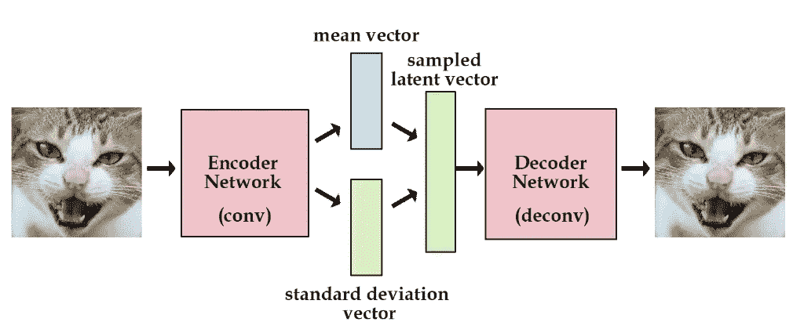
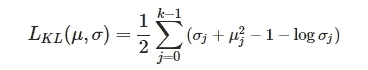
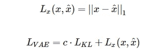
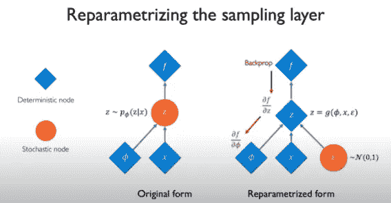
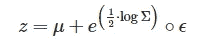
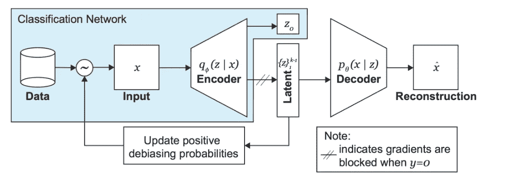
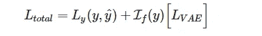
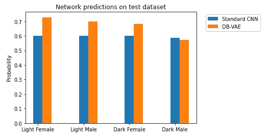

# 用于人脸识别的 VAE 生成模型

> 原文：<https://medium.com/analytics-vidhya/vae-generative-modelling-for-face-recognition-71e8ba16950c?source=collection_archive---------21----------------------->


凯利·西克玛在 [Unsplash](https://unsplash.com?utm_source=medium&utm_medium=referral) 上的照片

# **简介:**

生成模型是最近发展起来的另一种有趣的深度学习机制，用于无监督学习问题，如密度估计、图像样本生成、去偏差等。这种类型的建模通过对训练集中的所有特征给予不偏不倚的重要性，将面部识别带到了下一个级别，并且可以从中获得最大的准确性。在本文中，我们将简要了解人脸识别应用的 VAE 生成模型所涉及的过程。那么，让我们开始吧…

# **背景:**

生成模型通常用于根据训练数据生成新的数据实例，而判别模型有助于区分数据实例。与判别模型相比，生成模型很难建模，并且处理更困难的任务。它捕捉图像的许多相关性，如“船之类的东西会出现在靠近水的地方”和“驾驶汽车与道路和信号相关的东西”。生成模型有不同的类型，即自动编码器、变分自动编码器和生成对抗网络。

在我们深入研究 VAE 之前，让我们简要地看看什么是潜在变量。

什么是潜在变量？*在统计学中，这些变量不是直接观察到的，而是通过数学模型推断出来的。在我们的生成模型中，我们通过将输入值训练成由潜在空间给出的压缩格式来创建变量的抽象。列表中的每个变量都包含图像的一个独特特征。

# **VAE 及其建筑:**



图一。VAE 建筑

一般来说，VAE 架构包括一个编码器网络，用于使用我们的 ConvNets 训练输入图像，该 ConvNets 输出压缩的潜在空间，解码器试图从该压缩的潜在空间解码回相应的图像。与传统的自动编码器相比，VAE 对每个潜在向量都有一个均值和标准差的随机层，如图所示。这意味着(管理部门)和标准偏差。(sigma)描述潜在变量的概率分布。因此编码器和解码器不再是确定性的，而是本质上是概率性的。

比方说，编码器生成 p(z|x)的概率分布，解码器生成 q(x|z)的概率分布。现在我们在这个潜在空间上增加一个先验，这将是一个高斯单位。这将强制编码器在高斯中心周围平滑地分布编码，如果它试图在曲线的特定区域分组，则会受到惩罚。通过这样做，我们可以避免编码过度适应特定的特征表示。现在带先验的 pdf 变成 p(x|z || p(z))，p(z)就是我们带单位高斯的先验。

**VAEs 损失:**

由于我们已将均值和标准差限制为遵循单位高斯分布，因此现在有了一个可学习的参数，解码器重构输出时也应该学习损失函数。因此，我们通常会有两个损失函数。

1.  **潜在损失:**它衡量潜在变量与单位高斯的匹配程度。它由一个著名的散度函数定义，称为 [**kullback-leibler**](https://en.wikipedia.org/wiki/Kullback%E2%80%93Leibler_divergence) 散度函数，它显示了一个概率分布如何不同于另一个。为了与高斯单位进行比较，其形式如下:



KL 损失函数

2.**重建损失:**它衡量输入图像与 L1 范数提供的解码器输出重建图像的匹配程度。最终的完整损失函数由下式给出，其中 c 为加权系数。



VAE 总损失函数

下面是这个函数的代码片段:

```
def vae_loss_function(x, x_recon, mu, logsigma, kl_weight=0.0005):

  latent_loss = 0.5 * tf.reduce_sum(tf.exp(logsigma) + tf.square(mu) - 1.0 - logsigma, axis=1)

  reconstruction_loss = tf.reduce_mean(tf.abs(x-x_recon), axis=(1,2,3))

  vae_loss = kl_weight * latent_loss + reconstruction_loss

  return vae_loss
```

现在我们有了这个损失函数，我们还需要另一个度量来处理反向传播。这是因为我们目前拥有的 z 仍然具有随机抽样的随机性。因此，为了避免这种情况，我们将使用εϵ∼n(0,(i 来重新参数化)，这是标准的常态。这使得 z 具有确定性，因此可以在反向传播过程中进行区分，如图所示。



重新参数化潜在空间



重新参数化后的 z 方程

*   σ是协方差矩阵

潜在向量是从高斯采样的固定平均值和标准差以及来自标准正态的随机ε的组合。

现在我们可以反向探测并训练我们的网络，我们将看看如何在面部识别过程中**消除**网络的偏差，因为这将大大提高对具有罕见特征的面部的测试准确性。因此，在面部识别 CelebA 标记的数据集中，我们将有不同种类的脸，其中包括一些罕见的特征，如太阳镜、帽子等。主要思想是使用通过 VAE 学习的潜在变量在训练期间自适应地重新采样 CelebA 数据。准确地说，我们将根据图像的潜在特征在数据集中出现的频率来更新图像在训练过程中被使用的概率。因此，具有稀有特征的面部图像将更有可能被采样，而过度表现的特征将在采样期间减少。我们称这种架构为 DB-VAE(去偏变分自动编码器)。

**DB-VAE 建筑:**



VAE 模式图

在这个 DB-VAE 中，我们还可以看到一个 Zo，它给出了有脸或无脸的编码器分类，这是 DB-VAE 和 VAE 之间的另一个区别。对于有人脸的标签，我们将更新去偏概率，对于没有人脸的标签，我们将只有 Zo 类预测。

## **DB-VAE 损失函数:**

1.  VAE 损失:如前所述，它包括潜在损失和重建损失。
2.  **分类损失:**这是二进制分类问题的标准交叉熵损失。

一般来说，对于非人脸标签只会有分类。下面的等式中，I(y)对于人脸标注为 1，对于非人脸标注为 0。



DB-VAE 的总损失函数

下面是这个损失函数的代码片段:

```
def db_vae_loss_function(x, x_pred, y, y_logit, mu, logsigma):vae_loss = vae_loss_function(x, x_pred, mu, logsigma)classification_loss=tf.nn.sigmoid_cross_entropy_with_logits(labels=y, logits=y_logit)face_indicator = tf.cast(tf.equal(y, 1), tf.float32)total_loss = tf.reduce_mean(classification_loss +face_indicator*vae_loss)return total_loss, classification_loss
```

下面是根据数据集中的要素表示可用性为每个训练图像生成样本概率的代码片段。

```
def get_latent_mu(images, dbvae, batch_size=1024):
  N = images.shape[0]
  mu = np.zeros((N, latent_dim))
  for start_ind in range(0, N, batch_size):
    end_ind = min(start_ind+batch_size, N+1)
    batch = (images[start_ind:end_ind]).astype(np.float32)/255.
    _, batch_mu, _ = dbvae.encode(batch)
    mu[start_ind:end_ind] = batch_mu
  return mudef get_training_sample_probabilities(images, dbvae, bins=10, smoothing_fac=0.001): 
    print("Recomputing the sampling probabilities")

    mu = get_latent_mu(images, dbvae)# sampling probabilities for the images
    training_sample_p = np.zeros(mu.shape[0])

    # consider the distribution for each latent variable 
    for i in range(latent_dim):

        latent_distribution = mu[:,i]
        # generate a histogram of the latent distribution
        hist_density, bin_edges =  np.histogram(latent_distribution, density=True, bins=bins)# find which latent bin every data sample falls in 
        bin_edges[0] = -float('inf')
        bin_edges[-1] = float('inf')

        bin_idx = np.digitize(latent_distribution, bin_edges)# smooth the density function
        hist_smoothed_density = hist_density + smoothing_fac
        hist_smoothed_density = hist_smoothed_density /  np.sum(hist_smoothed_density)# invert the density function 
        p = 1.0/(hist_smoothed_density[bin_idx-1])

        # normalize all probabilities
        p = p / np.sum(p)

        training_sample_p = np.maximum(p, training_sample_p)

    # final normalization
    training_sample_p /= np.sum(training_sample_p)return training_sample_p
```

dbvae.encode 函数使用编码器 CNN 来训练网络，以便将输入图像压缩到潜在分布中，从而为每个图像生成训练样本概率值。我们将压缩分布转换为直方图，并基于其针对每个潜在变量(特征)的密度值来更新概率值。理想情况下，因为我们将密度反转 1.0，密度越小，概率越大。换句话说，代表性不足的特征可能会得到更多的概率值。

然后，我们可以使用这个概率值对每个图像进行训练，并在我们的 CNN 编码器中继续下面的步骤。我们可以看到，在测试阶段，精确度有了相当大的提高。下面的条形图显示了在基于肤色的几个类别中，与我们的标准 CNN 网络相比，DB-VAE 如何提高面部识别的性能。



正常 CNN 精确度与 DB-VAE 精确度的比较

**结论:**

我们已经看到了一种使用这种生成模型的方法，通过调整训练时使用每个图像的概率来提高面部识别的准确性。我们还可以使用该模型，基于输入图像的分布，在解码器之外生成一些输入图像的假样本。生成模型在一个不断发展的领域，这些天有令人印象深刻的用例。期待更多这方面的出版。

**参考文献:**

麻省理工学院生成模型文件