# VAE 迷你教程

> 原文：<https://medium.com/analytics-vidhya/vae-mini-tutorial-f6c3043c85c3?source=collection_archive---------19----------------------->

# 介绍

变分自动编码器是一个深度生成模型，明确地与密度函数一起工作。假设我们在 *X* 上有一个名为 *p_D(x)* 的分布。我们希望用神经网络( *θ* )来模拟这种分布，以便能够从中获取新的样本。训练网络和学习 *θ* 的普通方法是什么？
学习 *θ* 的一个自然训练目标是最大可能性:

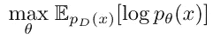

假设每个数据点都是从一个潜在的表示 *z* 中生成的，我们可以将 *p_θ(x)* 写成 *p_θ(x，z)* 在 *z* 上被边缘化。因此，我们可以将前一个等式改写如下:

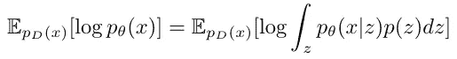

这个方程是棘手的，不能有效地优化。

# 如何克服顽固性？

到目前为止，我们有一个网络( *θ* )从 *z* 映射到 *x* 。这个网络为我们提供了在 *X* 和 *Z* 上的联合分布(称为生成分布):

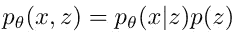

我们创建另一个网络( *φ* )来映射从 *x* 到 *z* 。这个网络也模拟了在 *X* 和 *Z* 上的联合分布(称为推理分布):

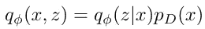

辅助的 *q_φ(z|x)* 分布可以帮助我们克服困难。
我们现在可以将我们目标的棘手整合改写为:

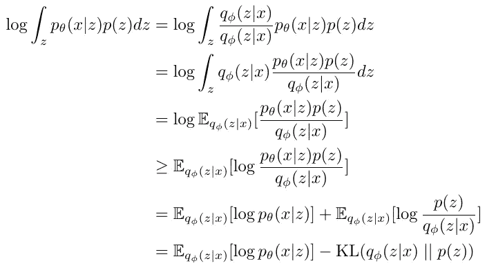

(在第 4 行，应用了[詹森不等式](https://en.wikipedia.org/wiki/Jensen%27s_inequality)。)

# VAE 目标函数

我们将特定 *x* 的目标函数定义为

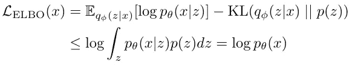

如等式所示，这是可能性对数的下限。我们还将 VAE 的最终目标函数定义为:

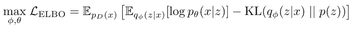

# 我们如何优化目标？

在前一个等式中，我们有 3 种不同的元素，我们依次重写。

## 预期

我们知道，如果我们有来自 *f(u)* 分布的 *N* 个样本，我们可以如下估计期望值:

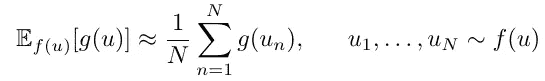

由于我们可以从 *p_D(x)* 和 *q_φ(z|x)* 中提取样本，因此我们可以计算等式中的两个期望值。

## 解码器分发的日志

我们可以解析地计算 *log(p_θ(x|z))* ，因为分布被设置为多元伯努利或多元高斯。

*   **多元伯努利情形**:解码器的输出(在一个 sigmoid 层之后)表示为 *a* 。我们有:

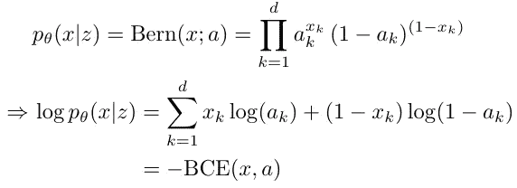

*   **多元高斯情况**:解码器的输出表示为 *μ* 。 *σ，*太，在方程中使用，但在实际中，通常设置为 1。我们有:

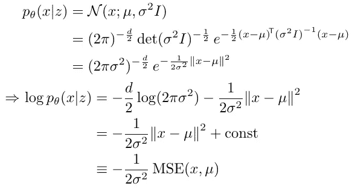

## KL 术语

*KL(q_φ (z|x) || p(z))* 也可以解析地计算，因为
两种分布都被设置为高斯分布。
我们知道对于两个多元高斯分布为

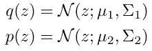

它们的 KL 散度可以计算为:

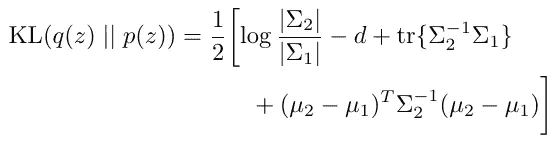

因此，我们的目标中的 KL 散度可以计算如下:

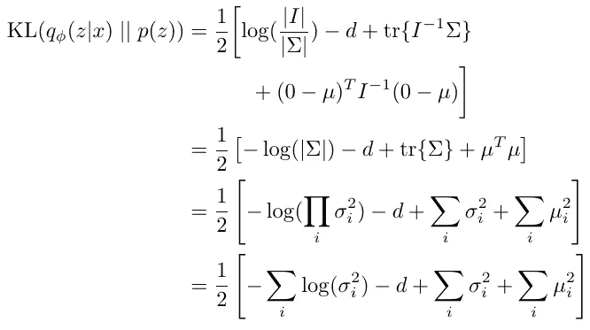

因此，我们的目标函数中的所有项都可以有效地计算，我们可以优化 *φ* 和 *θ* 以最大化该方程。

# ELBO 的等效形式

VAE 目标函数有不同的形式，可能不能直接优化，但在理论分析中是有用的。你可以在扩展 VAE 框架的论文中看到这些替代形式。

这里提供了第一个的证明，其他的更容易导出:

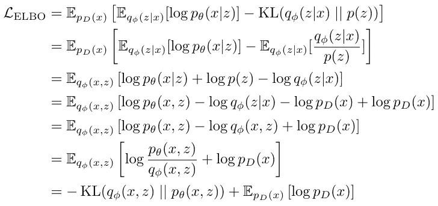

前一个方程的最后一项是一个常数，因为它等于固定分布的负熵；所以在优化过程中可以忽略。

# 参考

1.  D.P. Kingma 和 M. Welling，“自动编码变分贝叶斯”，CoRR，第 abs/1312.6114 卷，2014 年。
2.  南赵，J. Song 和 S. Ermon，“Infovae:在变分自动编码器中平衡学习和推理”，《人工智能会议论文集》，第 33 卷，第 5885-5892 页，2019 年。
3.  米（meter 的缩写））Soleymani，“深度学习课程幻灯片。”大学讲座，2020 年 5 月。谢里夫理工大学计算机工程系。