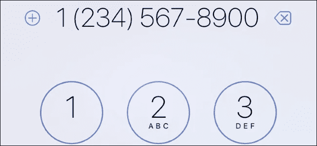

# 用 Python 验证电话号码

> 原文：<https://medium.com/analytics-vidhya/validating-phone-number-with-python-17f5040d0443?source=collection_archive---------7----------------------->

这个故事帮助你通过一些简单的方法来验证一个电话号码。

[来源](https://www.howtogeek.com/318937/how-to-find-someones-phone-number-online/)

您可能已经尝试过使用正则表达式为 NLP 任务提取电话号码。和我一样，你也知道在提取电话号码时，一些无效的电话号码会给你带来麻烦。

这里有一些方法可以帮助你从一个非结构化的文本文件中提取电话号码。