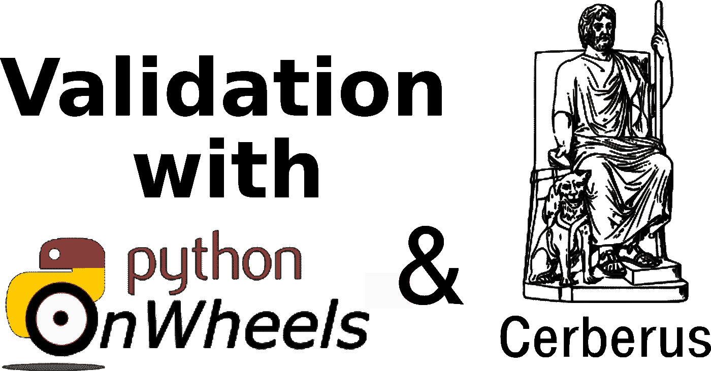
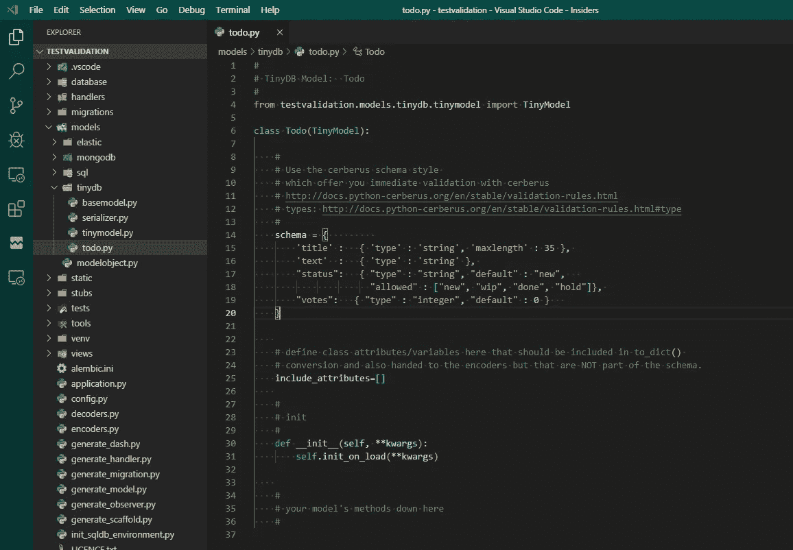

# 用 python 和 Cerberus 验证 SQL 和 NoSQL 数据模型。

> 原文：<https://medium.com/analytics-vidhya/validating-sql-and-nosql-data-models-with-python-and-cerberus-for-a-tornado-pythononwheels-web-6fa9c7d9991d?source=collection_archive---------9----------------------->



在这个简短的(动手)教程中，我将向您简单介绍如何使用伟大的 C [erberus](https://docs.python-cerberus.org/en/stable/index.html) 库来定义和验证 python 中的数据模型。我将使用[python wheels](https://www.pythononwheels.org/)框架来轻松生成模型，但是 Cerberus 模式和验证也可以在没有 python wheels 的情况下工作。

## 这个地狱犬是什么东西？

> [Cerberus](https://docs.python-cerberus.org/en/stable/index.html) 是一个轻量级和可扩展的 Python 数据验证库

它非常方便和有用，使得定义模式(包括属性名、数据类型和验证规则)变得非常简单。因为这是在应用程序中处理数据的一种非常方便的方式:

## 这是什么东西？

> PythonOnWheels 是围绕一些现有的伟大的库/模块和工具的一层胶水，使您的 python 生活对于枯燥的任务来说更加容易。

因为它是 pythonic 语言，超级容易使用并且非常有用

> PythonOnWheels 对所有模型定义都使用 Cerberus 模式，不管是 SQL 还是 NoSQL

这不仅为您带来了对 NoSQL 和所有 SQL 数据库使用相同模型定义模式的好处，还意味着您可以对每个模型进行验证，并且您可以轻松地从 SQL 转换到 NoSQL

## 要完成动手部分，您可以使用 PythonOnWheels

如果您不知道如何:

*   安装 PythonOnWheels 阅读超短[入门](https://www.pythononwheels.org/gettingstarted)
*   生成一个新的应用程序(在本教程中，我将我的应用程序称为 testapp)

## 没有 PythonOnWheels 也可以跟着教程走。

在这种情况下，您需要安装 Cerberus(并创建一个验证程序，见下文)

```
$ pip install cerberus
```

然后，您可以像这样验证模式(只需剪切并粘贴到您的 python 解释器中)

```
>>> schema={ .... take some sample schema from below ... }
>>> d={}                  # create a dict (instead of a real model)
>>> d["title"] = "test"   # set some attribures
>>> from cerberus import Validator
>>> v=Validator()
>>> v.schema=schema
>>> v.validate(d)
True
>>>
```

## 让我们从行动开始:

对于本教程，我生成了一个[*tiny DB*](https://tinydb.readthedocs.io/en/latest/)(NoSQL DB)模型，如下所示:

```
python generate_model.py -n todo -t tinydb
```

TinyDB 是一个超小的基于文件的文档数据库(NoSQL)。你可以把它想象成 NoSQL 的 SQlite).

这是生成的模型模式的样子:

```
# 
# TinyDB Model:  Todo 
# 
from testapp.models.tinydb.tinymodel import TinyModel 
class Todo(TinyModel): 
    # 
    # Use the cerberus schema style  
    # 
    schema = { 
        'title' :   { 'type' : 'string', 'maxlength' : 35 }, 
        'text'  :   { 'type' : 'string' }, 
        'tags'  :   { 'type' : 'list', "default" : [] }, 
        "votes" :   { "type" : "integer", "default" : 0 }    
        }
```

> 备注:PythonOnWheels SQL 模型将使用完全相同的定义语法。

因此，使用我们的 cerberus 模式，我们可以:

*   定义您的属性及其数据类型(例如“标题”、“类型”:“字符串”)
*   定义属性约束和验证规则(" maxlength"=35)
*   所有这些都是使用广泛使用的 python 库以简洁和成熟的方式完成的。
*   并对 SQL 和 NoSQL 模型使用相同的模型定义模式。

# PythonOnWheels 在幕后做什么

基于 Cerberus 模式，PythonOnWheels 为您生成不同数据库所需的实际模型表示。所以当你像上面那样定义一个模型的时候。PoW 在后台生成正确的 mongoDB、tinyDB、SQL (sqlalchemy)或弹性模式，这些模式实际上是用来与您选择的数据库一起工作的。

> 但是因为这都是关于验证的，所以我们不关心下面的内容。

# 所以让我们使用验证

让我们再次看看我们的模型的模式定义，因为验证使用我们的定义来检查一个实际的模型实例是否正确。

# 修改模式，如下所示:

```
schema = {         
        'title' :   { 'type' : 'string', 'maxlength' : 35 }, 
        'text'  :   { 'type' : 'string' }, 
        "status":   { "type" : "string", "default" : "new",   
                      "allowed" : ["new", "wip", "done", "hold"]}, 
        "votes":   { "type" : "integer", "default" : 0 }   
    }
```

为了简化这一点，只需复制并替换整个模式。

但我们只是将*标签*重命名为*状态*，并添加了“允许”:[“新”、“在制品”、“完成”、“暂挂”]定义。

它看起来是这样的:(在浏览器中，您可以看到 models/tinydb/todo.py 的路径)



# 属性名称和类型

可以看到我们定义了四个属性 ***，分别命名为:标题*** 、 ***文本*** 、 ***状态*** 和 ***票数。*** 另外我们还定义了他们的类型。其中三个是 ***字符串*** ，只有 ***分*** 属性是 ***整型*** 。

# 属性约束

对于一些属性，在本例中 ***标题*** 和 ***状态*** 我们还定义了**约束**。约束基本上只是缩小了属性类型的允许值。

对于**标题属性**,类型必须是一个字符串，约束条件是它不能超过 35 个字符。

**状态属性**也必须是字符串类型，但它也只验证字符串是否是允许的类型之一:“新”、“wip”、“完成”或“保持”。

由于我们使用 Cerberus，您可以依赖更多可能的约束定义。只需[阅读完整的验证规则文档](http://docs.python-cerberus.org/en/stable/validation-rules.html)。

# 让我们测试一个真实的模型实例

启动 python 解释器并导入模型。如果你不知道如何生成 PythonOnWheels 应用程序[，请阅读 2 分钟简介](https://www.pythononwheels.org/article/7de74cc6-8af2-45ac-b619-eea61e4da44f)。参见上文如何生成模型。

```
>>> from testapp.models.tinydb.todo import Todo
```

## 创建实例

```
>>> t=Todo()
```

## 让我们回顾一下状态属性的模式:

```
"status":   { "type" : "string", "default" : "new", "allowed" : ["new", "wip", "done", "hold"]},
```

如你所知，这将 ***状态*** 定义为类型*字符串***只接受允许的值，在这种情况下:*新，wip* ，*完成*和*保持*。任何其他值都将被验证为假。**

## **让我们展示一下 t 实例的样子:(默认情况下)**

```
>>> t 
{ '_uuid': '', 
 'created_at': datetime.datetime(2019, 9, 4, 21, 25, 10, 6827), 
 'id': '', 
 'last_updated': datetime.datetime(2019, 9, 4, 21, 25, 10, 6827), 
 'status': 'new', 
 'text': '', 
 'title': '', 
 'votes': 0}
```

**您可以看到 PythonOnWheel 添加了一些额外的参数(created_at、last_updated 和 _ uuid ), status 的默认值是“new ”, votes 的默认值是 0。正如定义的那样。**

## **所以让我们验证一下这个模型，看看它是否被接受**

```
>>> t.validate()
True
```

**模型的 validate()方法返回 True，表示验证成功，否则返回 False。**

## **让我们改变一些属性**

```
>>> t.title="123456789012345678901234567890123456"
>>> t.status="yihaa"
```

## **再次验证模型，看看它是否被接受**

```
>>> t.validate()
False
```

**好吧，这次验证失败。那么，我们如何才能发现到底哪里出了问题呢？**

## **检查验证结果**

```
>>> t.validator.errors
{'status': ['unallowed value yihaa'], 'title': ['max length is 35']}
```

**只需访问模型验证器的 ***errors*** 属性，查看哪些验证规则失败了。这也是自动返回简单错误消息的一种非常好的方式，例如对于 web 表单或 JSON 响应。**

## **现在让我们修复错误，看看我们是否可以验证为真**

*   **将**状态**更改为*允许的*，例如“完成”**
*   **将**标题**改为少于 35 个字符的内容。**

```
>>> t.title="test"
>>> t.status="done"
```

## **让我们再检查一遍**

```
>>> t.validate() 
True
```

## **太好了，现在我们的 todo 通过了验证。**

**这就是了。我们定义了模型、属性类型和验证规则(约束)，并对它们进行了验证。我们还学习了如何发现我们犯的具体错误。**

**你可以用地狱犬做更多的事情。你可以用 PythonOnWheels 做更多的事情。但是对于我的用例，我主要需要基本的东西，这已经很有帮助了。**

## **摘要**

**我希望您同意，使用 Cerberus 模式使以优雅的方式定义数据库模型变得非常容易，而且也给我们带来了很多验证方面的好处。**

**模式语法非常简单，使用 python 中可用的数据类型，并且容易记住诸如“allowed”、“maxlength”、“anyof”等约束。[参见此处的 Cerberus 验证规则文档](https://docs.python-cerberus.org/en/stable/validation-rules.html)。**

## **因此，现在我们终于可以将模型安全地保存到数据库中了**

**这在穿 PythonOnWheels 的时候相当容易。做个 upsert()就行了。**

```
>>> t.upsert()
insert, new eid: 1
```

**搞定了。；)**

**如果您想阅读更多关于数据、数据库和 PythonOnWheels 中的模型处理的内容，我推荐您阅读这些简短的实践教程。(大约 5-10 分钟)**

*   **[生成模型(SQL，NoSQL)](https://www.pythononwheels.org/article/c925b701-b965-461a-ab51-672dfc08aef6#generatingmodels)**
*   **或者查看[文档](https://www.pythononwheels.org/documentation)中的型号部分**

**希望你喜欢教程和 PythonOnWheels。如果你有任何问题或评论或错误，你可以在 [github](https://github.com/pythononwheels/pow_devel) 上提出问题，或者发推特到 [@pythononwheels](https://twitter.com/pythononwheels) 。**