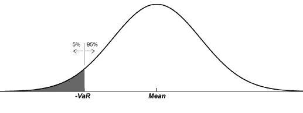

# Python 的风险价值

> 原文：<https://medium.com/analytics-vidhya/value-at-risk-with-python-4e3409e1c23d?source=collection_archive---------3----------------------->

无论你是一名有抱负的日内交易者、金融市场专业人士，还是刚刚涉足金融领域的数据科学家，你都可能遇到过风险价值的概念，通常被称为 VaR。

它能变得多糟糕？

不管你投资的目标是什么，与之相关的风险总是你最关心的问题。VaR 是衡量风险大小的方法之一。

风险值衡量的是给定投资中的糟糕程度。给定投资的 1%风险值告诉你你可以预期的 1%最坏结果。



让我们想象一下，你正在考虑投资 XPTO 股票，在你的研究中，你偶然发现一份报告说这只股票的 1% VaR 是 5%。这是什么意思？我的意思是，在所有可能的回报中，最差的 1%是-5%的回报。

> **你怎么知道所有可能的结果？**不能。没有人确切知道资产的价格在未来会如何变化，这就是为什么没有确定的方法来计算它。相反，VaR 有多种类型。

## 历史 VaR

尽管过去并不代表未来的表现，但这仍然是一个需要牢记的深刻的负面迹象。

历史风险值包括从历史样本中计算出第 n 个最坏的结果。下面你可以看到用 Python 计算它的一种可能的方法:

```
def var_historic(r, level=1):
    """
    Takes in a series of returns (r), and the percentage level
(level)
    Returns the historic Value at Risk at a specified level
    i.e. returns the number such that "level" percent of the returns
    fall below that number, and the (100-level) percent are above
    """
    if isinstance(r, pd.DataFrame):
        return r.aggregate(var_historic, level=level)
    elif isinstance(r, pd.Series):
        return -np.percentile(r, level)
    else:
        raise TypeError("Expected r to be a Series or DataFrame")
```

## **参数和半参数 VaR**

另一种计算 VaR 的方法是假设一组可能的结果表现为正态(高斯)分布。

正态分布不一定是描述收益的最佳方式。然而，这是描绘概念的一个非常好的方式，并且它是我们阐述更复杂和更现实的场景的一个好的起点。

参数方法的主要缺点是现实世界的回报通常具有“厚尾”(高峰值)分布。


为了说明这一点的重要性，假设您使用参数方法计算 1%的 VAR，结果是 6%。然后，你看真实的历史数据，你会发现-6%的回报率比 1%的时候更常见:这是厚尾的迹象。

以下是参数和半参数 VaR 的一些代码:

```
from scipy.stats import norm
def var_gaussian(r, level=5, modified=False):
    """
    Returns the Parametric Gauuian VaR of a Series or DataFrame
    If "modified" is True, then the modified VaR is returned,
    using the Cornish-Fisher modification
    """
    # compute the Z score assuming it was Gaussian
    z = norm.ppf(level/100)
    if modified:
        # modify the Z score based on observed skewness and kurtosis
        s = skewness(r)
        k = kurtosis(r)
        z = (z +
                (z**2 - 1)*s/6 +
                (z**3 -3*z)*(k-3)/24 -
                (2*z**3 - 5*z)*(s**2)/36
            )
    return -(r.mean() + z*r.std(ddof=0))
```

最后，计算 VaR 的另一种方法是模拟可能的随机结果，并将其用作计算的分布。这是一个非常有趣的话题，我将在未来的[帖子](https://felipeczar.medium.com/var-with-monte-carlo-de20500b1640)中讨论。

*如果你有兴趣了解更多关于这个话题的知识，我强烈推荐肯尼斯·阿博特关于 VaR 模型的* [*讲座*](https://www.youtube.com/watch?v=92WaNz9mPeY) *，可以在麻省理工学院的 YouTube 频道上免费获得。*