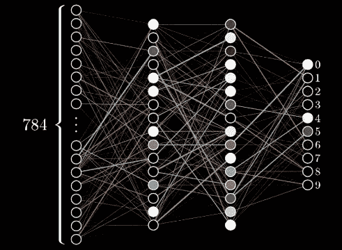
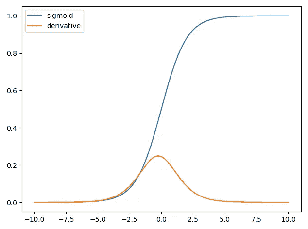
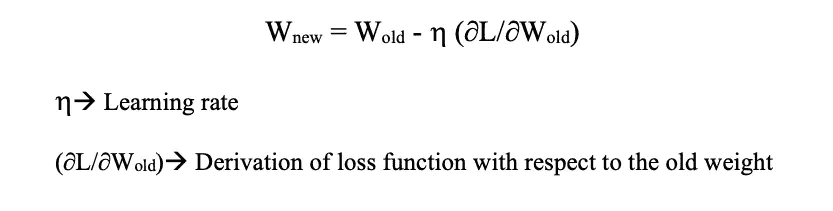

# 消失和爆炸梯度问题

> 原文：<https://medium.com/analytics-vidhya/vanishing-and-exploding-gradient-problems-c94087c2e911?source=collection_archive---------9----------------------->

训练超深层神经网络的一个问题是，梯度会消失，呈爆炸式增长。(即，当训练非常深的神经网络时，有时导数变得非常非常小或非常非常大，这使得训练困难)。在这个博客中，我们将通过两个消失和爆炸梯度的细节。

# **消失梯度问题:**

> 当损耗函数相对于网络的早期层中的参数的梯度非常小时，它学习慢，并且由于许多梯度非常小，它们对学习贡献不大，并且可能导致较差的性能。

在神经网络中，权重在输入层随机初始化。将输入要素的总和乘以权重以及偏差传递到隐藏层。它与输出权重相乘，并被传递到激活函数，以输出它给出预测输出的层。然后，计算成本函数(即实际输出和预测输出之间的差异)。

为了最小化这种损失，我们向网络反向传播并更新新的权重。

在早期，最常用的激活函数是 sigmoid 激活函数。

在 sigmoid 中，值在 0 和 1 之间转换，它们的导数在 0 和 0.25 之间。权重上升的公式是，

学习率必须非常小，以使模型逐渐学习并最终收敛到全局最小值。

随着神经网络层数的增加，导数不断减少。因此，更多层的加入将导致几乎为零的导数

如果旧权重近似等于新权重，则不能进一步反向传播，因为导数为 0。这就是为什么 sigmoid 不再用作隐藏层中的激活函数的原因。激活函数 tanh 也没有被使用，因为它的导数介于 0 和 1 之间。因此，这也导致了消失梯度问题。

# **消失梯度问题的解:**

*   最简单的解决方案是使用其他激活函数，如 ReLU、leakerrelu。这种激活仅在一个方向上饱和，因此对梯度的消失更有弹性。

其他解决办法是，

*   使用多层层次结构
*   使用长期短期记忆(LSTM)网络
*   使用更快的硬件
*   使用剩余网络(ResNets)
*   权重搜索的遗传算法

# **爆发梯度问题:**

> 当大的误差梯度累积并在训练期间导致神经网络模型权重的非常大的更新时，爆发梯度是一个问题。梯度计算训练神经网络期间的方向和幅度，并用于以正确的量在正确的方向上教导网络权重。当存在误差梯度时，部件的爆炸可能呈指数增长。

当较大的误差梯度累积时，模型可能变得不稳定，并且无法从训练数据中学习。在极端情况下，权重值可能变得过大，以至于溢出并导致 NaN 值。

# **怎么知道？**

在网络训练期间，您可以使用一些细微的迹象来确定模型是否遭受爆炸梯度

*   该模型在训练数据上学习不多，因此导致了较差的损失。
*   该模型不稳定，导致每次更新的损失变化很大。
*   过了一段时间，南在训练中失去了模型。

有一些迹象可以用来确认你有爆炸梯度，

*   模型重量在训练期间去 NaN。
*   在训练期间，模型权重呈指数增长，变得非常大。
*   误差梯度值总是大于 1。

# **如何解决这个问题？**

有许多方法可以修复爆炸渐变，但是一些最好的方法是，

*   使用 LSTM 网络
*   使用渐变剪辑
*   使用正则化(如 L2 范数)
*   重新设计神经网络

# **结论:**

在这篇文章中，我们讨论了在深度神经网络的训练过程中出现的消失和爆炸梯度问题，并且还公开了一些以有效方式解决这些问题的方法。

# **参考文献:**

*   [https://en.wikipedia.org/wiki/Vanishing_gradient_problem](https://en.wikipedia.org/wiki/Vanishing_gradient_problem)
*   [http://www . cs . Toronto . edu/~ rgrosse/courses/CSC 321 _ 2017/readings/L15 % 20 expanding % 20 and % 20 vanishing % 20 gradients . pdf](http://www.cs.toronto.edu/~rgrosse/courses/csc321_2017/readings/L15%20Exploding%20and%20Vanishing%20Gradients.pdf)
*   [https://web . Stanford . edu/class/archive/cs/cs 224n/cs 224n . 1194/slides/cs 224n-2019-lecture 07-fancy-rnn . pdf](https://web.stanford.edu/class/archive/cs/cs224n/cs224n.1194/slides/cs224n-2019-lecture07-fancy-rnn.pdf)
*   [https://machine learning mastery . com/expanding-gradients-in-neural-networks/](https://machinelearningmastery.com/exploding-gradients-in-neural-networks/)
*   [https://Neptune . ai/blog/understanding-gradient-clipping-and-how-it-can-fix-explosing-gradients-problem](https://neptune.ai/blog/understanding-gradient-clipping-and-how-it-can-fix-exploding-gradients-problem)