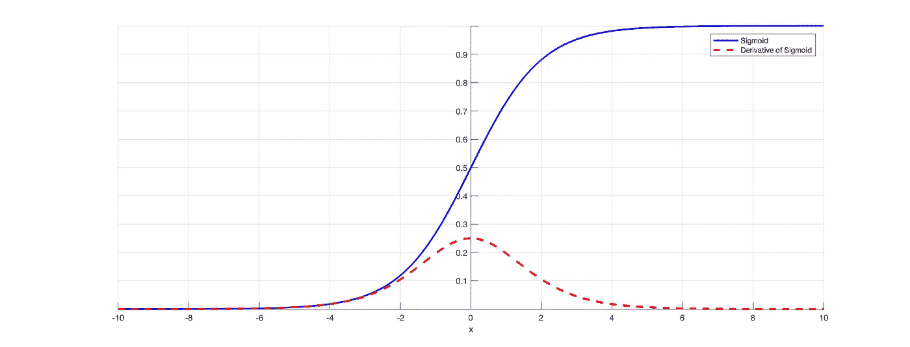

# 消失梯度问题

> 原文：<https://medium.com/analytics-vidhya/vanishing-gradient-problem-in-deep-learning-dafb9caf2f3a?source=collection_archive---------16----------------------->

在 20 世纪 80 年代，当时的研究人员无法在 ANN 中找到深度神经网络，因为我们必须在每个神经元中使用 sigmoid，因为 ReLU 尚未发明。由于 sigmoid 激活函数，我们面临着一个被称为消失梯度问题的问题。

让我们来理解它实际上是什么。

简单的安

设输入为 X1、X2 和 X3，输出为 Yp，输入和输出的权重分别为{W11，W12，W13}、{W21，W22，W23}和{W31，W32，W33}。

现在，对于第二层到第三层，权重分别为{O1，O2}。

计算 W11 新公式是 W11 新=W11 旧-n(L·w·r·t·W11 旧的导数)，其中

即损耗，Y 是实际输出。

sigmoid 函数由下式给出

并且 sigmoid 函数的值在 0 到 1 之间。当我们对函数求导时，值在 0 到 0.25 之间。

怎么会？？

它的导数 w . r . t . x 是

如果我们取 x 的值为 0，那么 f'(x)为 0.25，当我们取 x 的值为无穷大时，那么 f'(x)为 0。这可以使用下图进行分析，其中蓝线代表 sigmoid 函数，红线代表 sigmoid 函数的导数。

Sigmoid 函数及其导数的图形。

这意味着随着层数的增加，该导数的值变得越来越小，直到旧权重的值近似等于新权重的点。

例如，如果我们想找到新 W11 和旧 W11 是 5，n 是 0.01，那么我们需要 W11 的导数等于 W11 的导数。

假设 O1 的导数的值是 0.25，O1 的 W11 的导数是 0.02。那么 W11 的导数是 0.05，这使得新值是 4.9995，大约是 5。

深度学习中的这类问题被认为是消失梯度下降。