# 使用 SAS 和 Python 从头开始进行变量聚类

> 原文：<https://medium.com/analytics-vidhya/variable-clustering-from-scratch-using-sas-and-python-4e21c7505cab?source=collection_archive---------3----------------------->

大家好，

在本文中，我试图展示我对变量聚类算法(最流行的降维技术)的理解。

**免责声明**:本文旨在分享我的变量聚类知识。这不包括任何与项目相关的数据、代码等。本文中使用的 SAS/Python 代码完全基于公开可用的数据集，与任何公司项目无关。本文的读者必须具备统计学、SAS 和 Python 方面的背景知识

数据集的复杂性随着维度的增加而迅速增加。它增加了计算时间，影响了探索模型关系、模型评分的能力，增加了数据集中的冗余，等等。

补救措施之一可以是可变聚类。它找出一组变量，这些变量在一个聚类中相互之间尽可能相关，而与其他聚类中的变量尽可能不相关。

好的。现在，让我们了解它是如何完成的。

PCA——主成分分析是算法的核心。让我们了解一下它是如何工作的。

假设我们有 10 个变量，它们之间的相关性如下:

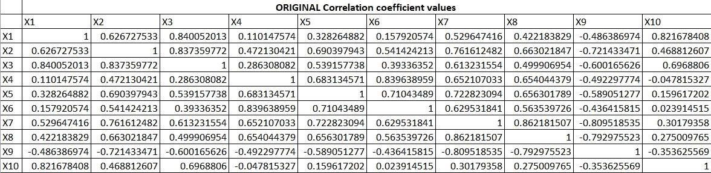

表 1

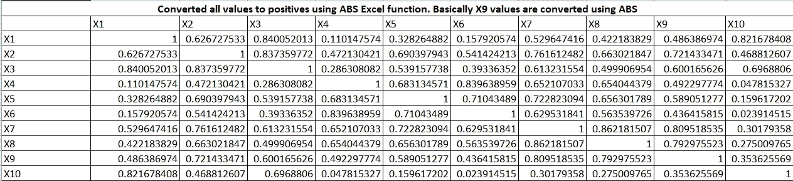

表 2

现在，我们将为第一个主成分或因子创建一个系数。主成分是预测变量的加权线性组合。其计算如下:

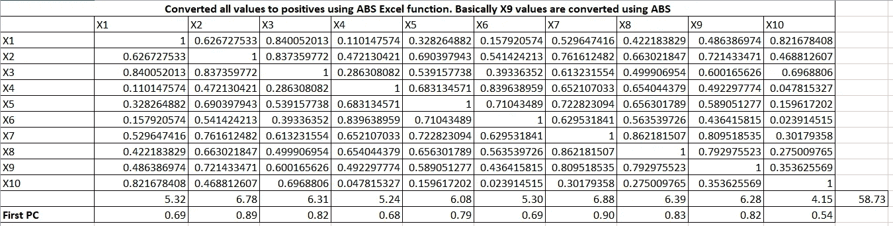

表 3

让我扩展一下公式。它接受列总计和行总计，然后第一个 PC = column_total / sqrt(row_total)

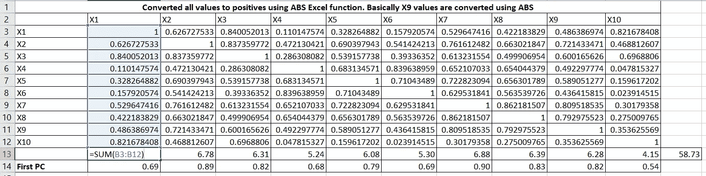

表 4

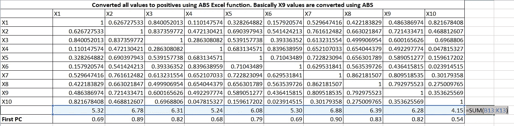

表 5

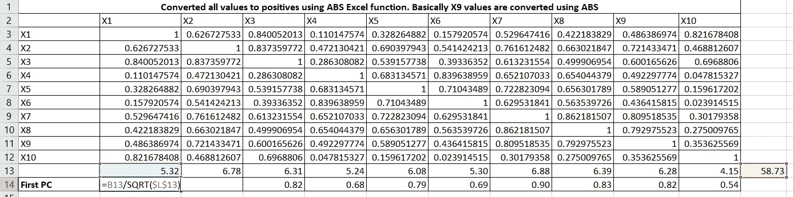

表 6

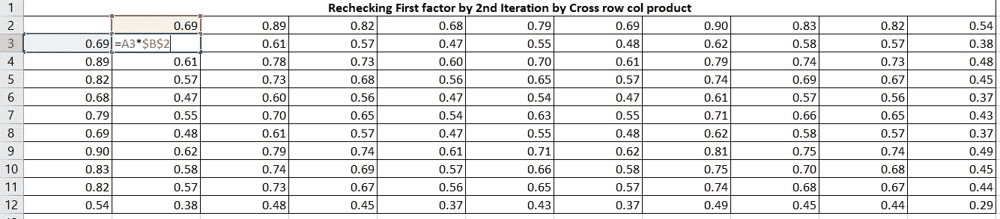

表 7

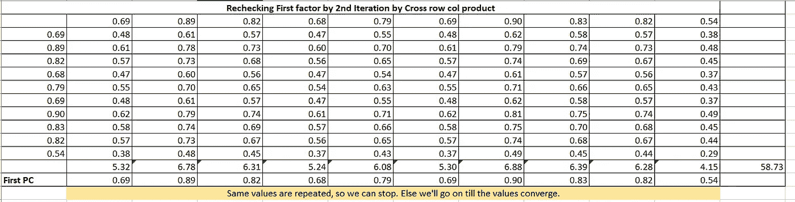

表 8

现在，由表 7 的值到表 2 的(R)值获得残差系数矩阵(R1)。

表 9

现在，在这个剩余矩阵上，我们将执行相同的计算来得到第二个 PC2。

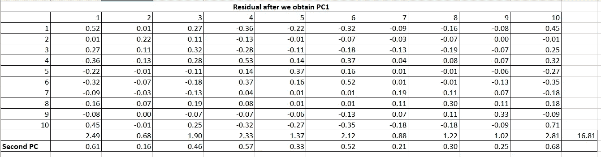

表 10

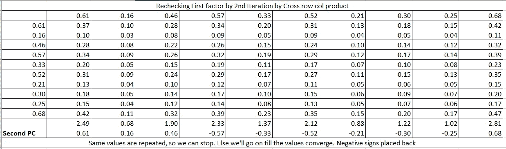

表 11

对于所有的因子/PCs，将遵循相同的过程。因为我们有 10 个变量，所以将会计算 10 个。到目前为止，我们得到的 PCs 系数如下:

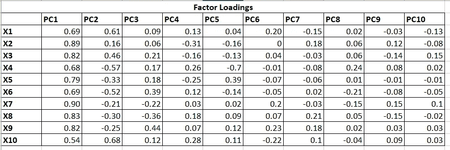

表 12(成分矩阵)

表 12 表示 ***因素负荷*** ，这是每个 PCs 和变量之间的相关性。如果我们简单地平方这些值，我们将得到 R2 如下:

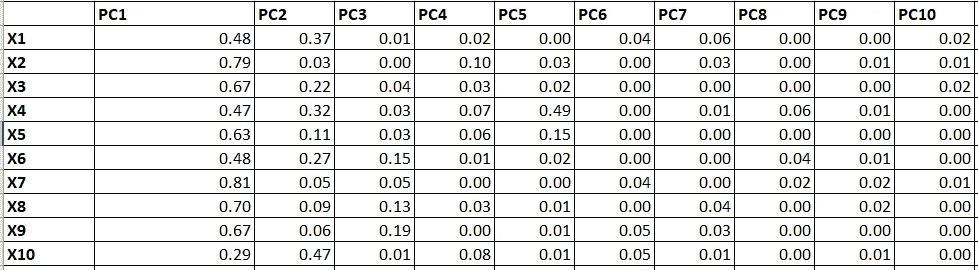

表 13 (R2)

我们可以使用表 13 计算不同的度量。

**特征值:**各 PC 对所有变量解释的方差(各 PC 的列合计)。

**公度:**由单个变量的所有 PC 解释的方差(行总计)。对于单个变量，所有 PCs 解释的 100%方差的总和始终为 1。

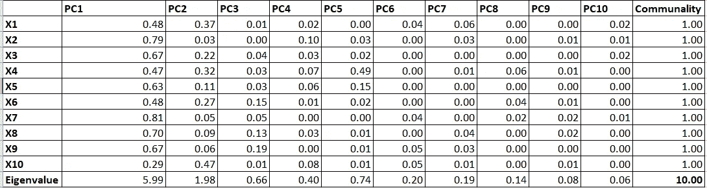

表 14(公度和特征值)

理想情况下，将保留前几个 PC(例如本例中的前两个 PC ),因为它们解释了数据中的大多数变化。这个缩减的 PC 集将用于创建分数，该分数将用于代替最初的 10 个变量。

好的。现在，我们清楚了 PC，特征值，公度等等。变量聚类使用相同的算法，但不是使用 PC 分数，我们将从每个聚类中选取一个变量。所有的变量都集中在一个簇中。对聚类中的变量进行主成分分析。如果 PC 的 ***第二特征值大于指定阈值，则该簇被分裂。***

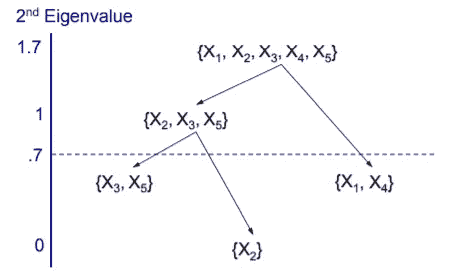

问题是从每个聚类中挑选哪个变量？人们应该选择与自己的类相关度最高而与其他类相关度最低的变量。

因此，具有最低 1-R2 比率的变量可以很好地代表聚类，该变量将被使用，而来自该聚类的其他变量将被丢弃。这就是我们如何实现降维。

让我们用 SAS 和 Python 来实现。SAS 和 Python 之间的集群总数不匹配。在 SAS 中，总共有 35 个集群，而在 Python 中有 40 个。然而，在大多数集群中的可变分配和它们的 1-R2 比率是匹配的。

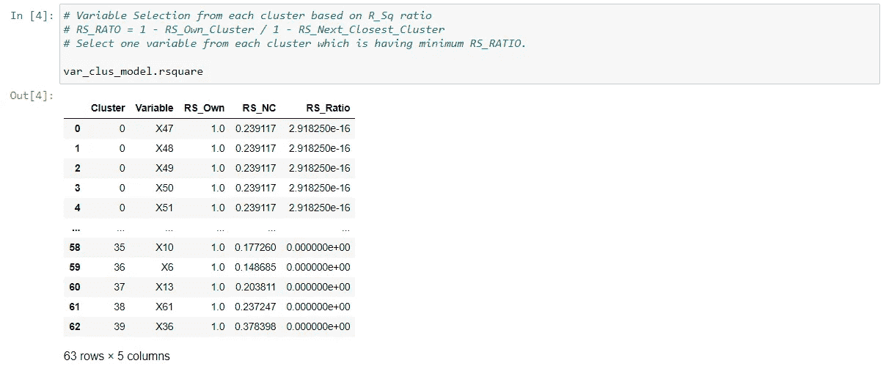

输入数据集包含 63 个变量，包括哑变量、缺失指标变量等。在最后的输出中，它给出了包含不同变量的聚类，我们将基于 1-R2 比率选择一个变量。

因为有 40 个集群，所以将有 40 个变量而不是 63 个变量。

我用的是 maxeigval = 0.7。这意味着如果第二特征值大于 0.7，簇将分裂。该参数值越大，给出的聚类越少，所解释的变化也越少。较小的值给出更多的聚类和更多的变化解释。通常选择 1，因为它代表特征值的平均大小。

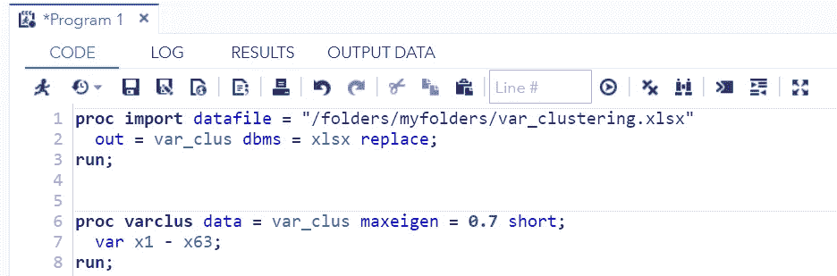

SAS 代码

前 10 个集群的 SAS 输出:

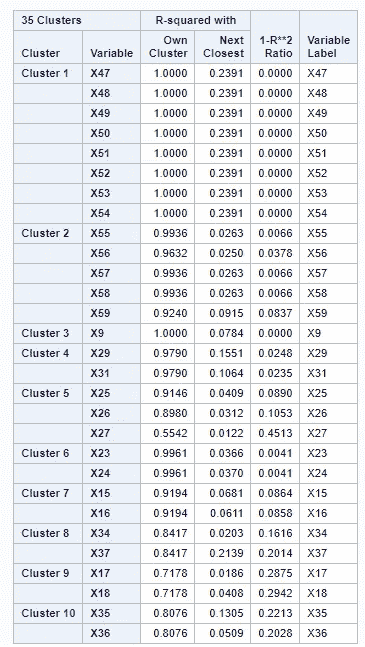

谢谢，

乌尔维什·沙阿