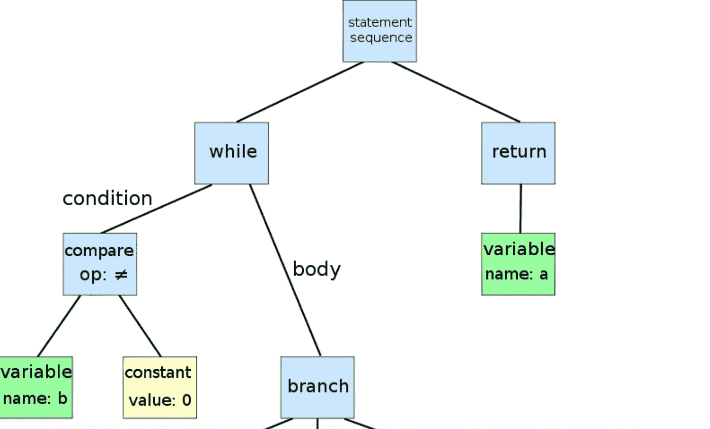
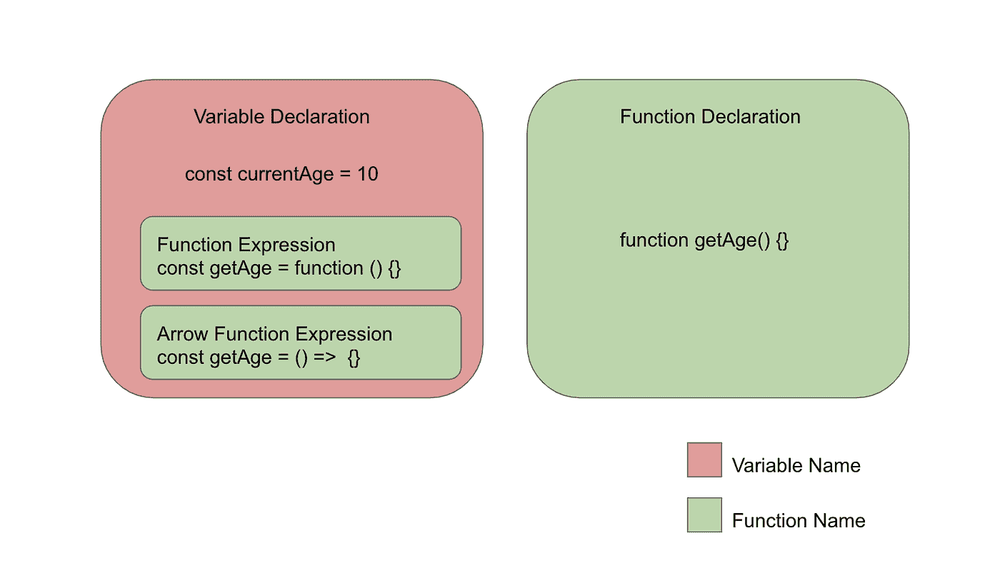
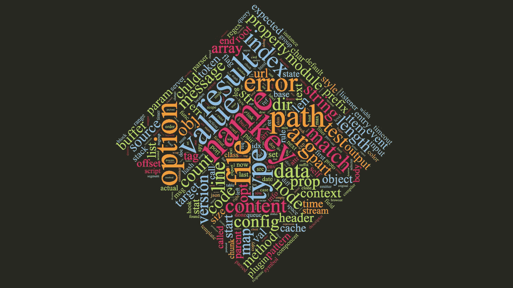
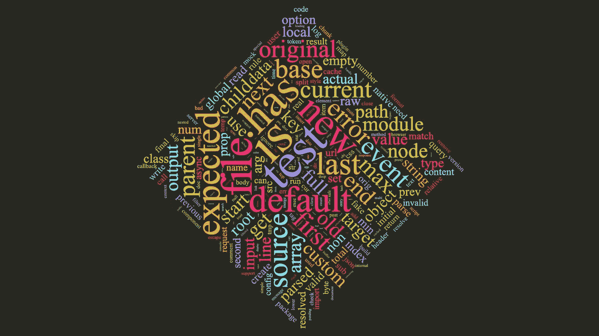
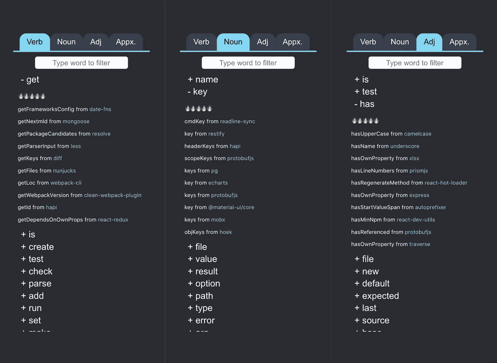

# 变量名—从顶级 Javascript 库中解析的动词和名词

> 原文：<https://medium.com/analytics-vidhya/variable-names-verbs-and-nouns-parsed-from-top-javascript-libraries-e50dbbbdd2db?source=collection_archive---------10----------------------->

## 通过解析 React、Angular、Express 等 JS 库构建变量名字典

由解析的动词生成的词云

# 问题是

当错误日志中抛出错误信息或者寻找“按关键 python 排序 json 数组”的解决方案时，很可能我在网上就能找到答案或者至少是一些提示。但是在给一个变量命名的时候，它告诉我要给一个有意义的，有表现力的，自我描述的变量命名。变量名需要遵循惯例。在 Javascript 中，变量名和函数名应该用 camelCase 编写。我应该用名词作为变量名，用动词作为函数名。永远不要使用无意义的名字，比如 foo 和 bar(事实证明，许多 JS 库都在使用它们，但只是用于单元测试或基准测试)

我知道这些规则。但问题不在于我的变量名违反了这些规则。问题是我不能想出一个令我满意的变量名。而我觉得是因为我脑子里没有足够的“编码词汇”。因此，我决定从其他开发人员那里学习更多的词汇，并尝试将它们分为动词、名词和形容词。

> 如果说我看得更远，那是因为我站在了巨人的肩膀上——艾萨克·牛顿

在 Javascript 世界中，巨头是 React、Angular、Express 和许多其他在 NPM 出版的顶级库。

# **方法**

**第一步。克隆流行的 NPM 图书馆**

基于这个列出顶级 Javascript 库的[列表](https://gist.github.com/anvaka/8e8fa57c7ee1350e3491)，390 个库被克隆到本地机器。

**第二步。解析源代码并将其转换为抽象语法树(AST)**

来自关于 AST 的 [Wiki](https://en.wikipedia.org/wiki/Abstract_syntax_tree) 的截图

使用 [Acorn](https://www.npmjs.com/package/acorn) ( *一个用 JavaScript* 编写的小型快速 JavaScript 解析器)，我解析了。js 和。ts 文件并得到一个抽象语法树对象。从 Wiki 来看，抽象语法树*是源代码*的抽象语法结构的树表示。对于这个任务，最重要的事情是从树中检索变量名和函数名。添加了一条规则来排除/build、/node_modules、/dist 下的文件，以避免分析精简代码。

**第三步。查找函数名和变量名**

抽象语法树中有许多节点类型。提取了两种节点类型，即*变量声明*和*函数声明*。在*变量声明*中，两个特殊的初始化类型 *FunctionExpression* 和 *ArrowFunctionExpression* 被识别并被视为函数名而不是变量名。下图说明了我对“函数名”和“变量名”的分类方式。

**第四步。提取动词/名词/形容词(带假设)**

在获得变量名和函数名之后，我将名字拆分成单词，并根据以下假设确定动词、名词和形容词

1.  动词—函数名中的第一个词，例如**获取**年龄，**检查**是否成年，**恢复**
2.  名词—变量名中的最后一个词。例如解析**值**，**数据**
3.  形容词——变量名中的第一个词，可以分成多个词，例如**是**成人，**预期** Json

在处理名词时，我将单词单数化，并将所有字符转换为小写，以便将“name”、“names”、“Name”和“Names”视为同一个单词。

# **结果**

由解析的动词生成的词云

由解析的名词生成的词云

由解析的形容词生成的词云

不出所料，“得到”是使用最多的动词。我还得到了一些其他熟悉的动词，如创建、读取、更新、删除和提取、转换、加载。

基于结果数据，我构建了一个名为[变量名字典](https://jack-siu.github.io/varnamedict/)的小型 web 应用程序，通过从库中解析的变量名示例来显示最常用的单词。json 格式的原始数据可以在那里下载。

# 下一步是什么

拥有一个单词列表可以扩展我的“编码词汇量”，这在我没有任何想法给变量命名的时候很有帮助。但是更多的时候，我已经对变量名应该是什么有了一个模糊的想法。比如，我可能已经想到一个函数名为“getTotalPrice”，但后来发现，也许 calculateTotalPrice 能更准确地描述这个函数。

如果我能计算不同动词和形容词的相似度，有助于提炼函数名。我正在检查一些 Python 库，如 Gensim 和 NLTK，看看我是否能获得两个动词之间的语义相似性(在编码上下文中)。如果你有任何获得语义相似度的建议或想法，请留下评论。