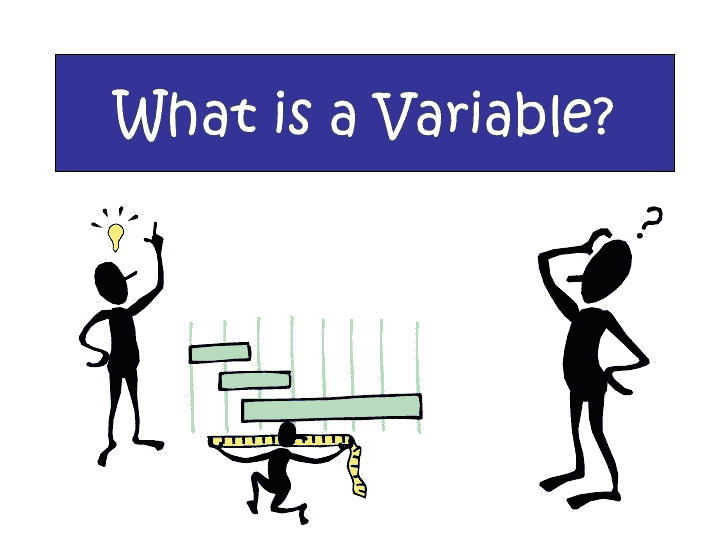

# 机器学习中的变量类型

> 原文：<https://medium.com/analytics-vidhya/variable-types-in-machine-learning-cdf458787754?source=collection_archive---------16----------------------->

**变量**:变量是可以测量或计数的任何特性、数字或数量。在机器学习中，我们需要了解所有类型的变量，以便我们可以在机器学习的前处理步骤中相应地处理它们。

**变量类型:**

1.  数字变量。
2.  分类变量。
3.  混合变量。

## **1。数值变量:**

显然数字变量会存储数值。基于数值类型进一步分为 2 类的数值变量被存储。

*   **连续变量:**该变量存储连续的数值。比如薪水(10000 美元)，身高(5.8 英尺)，价格(10.50 美元)
*   **离散变量**:该变量存储整数或计数。这不存储浮点数。例如:苹果的数量，物品的数量。

## 2.分类变量:

它存储分类值或字符串值。它进一步分为 3 类。

*   **顺序变量**:存储在其中的值有一定的顺序。示例:等级(A，B，C)等级有一些相关的顺序 A > B > C .大小(S，M，L) S < M < L
*   **名义变量:**在此所有值都相等。例如:城市(孟买、德里、浦那)
*   **日期时间变量:**这些变量仅存储日期、时间或日期和时间。

## 3.混合变量:

此变量存储数值和分类值的组合数据。例如:座位号(A10)，邮政编码(XX123)。

基于数据集中的变量类型，我们必须在机器学习中使用不同的预处理技术。