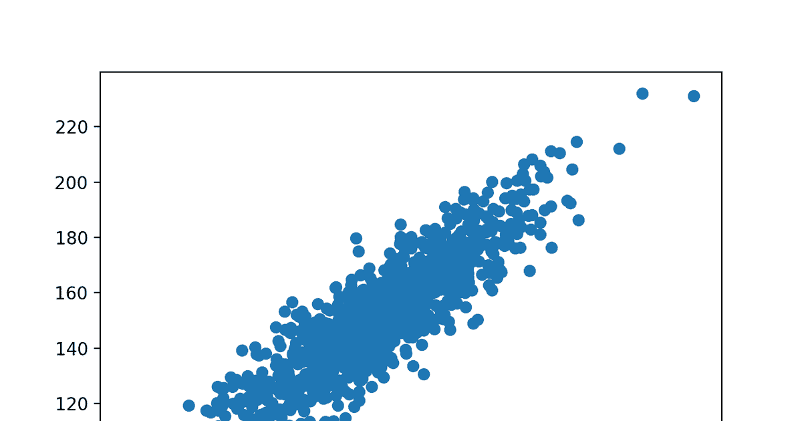

# 变量和相关性

> 原文：<https://medium.com/analytics-vidhya/variables-and-correlation-a66b5007b83f?source=collection_archive---------14----------------------->

# 什么是变量？？

变量是变化的东西，与常数相对。
例如，当前温度是变量温度 27、30、19、29 的值。与恒定的冰点温度相反，它总是不变的。

一件事、一件事或一个人的任何变化都可能是一个变量。变量以某种方式分布。它们最常见的分布方式之一是正态分布模式。
在这种分布中，均值是最常见的值，也就是中间的那个。当你离均值越来越远时，案例变得越来越少。

考虑烹饪能力分布的例子。想想那些厨艺不怎么样的人，也许是你的朋友。然后，想一想谁是一个伟大的厨师，也许是你的祖母。然后想想处于平均值的人。比起老奶奶的厨艺和你可怜的朋友的厨艺，还有很多普通人。随着你越来越远离均值，案例越来越少。

关于正态分布的重要一点是，它可以用均值的标准差来描述。这几乎和平均偏差一样，但不完全一样。

美国男性的平均身高略低于 5 英尺 10 英寸。平均偏差略小于 3”，标准偏差也是如此。

*   标准偏差第一个事实是，除了男性身高，68%的情况都在-1 标准偏差和+1 标准偏差之内。因此，略多于三分之二的美国男性身高在 5 英尺 7 英寸到 6 英尺 1 英寸之间。
*   标准偏差的第二个事实是，84%的情况是在，分布的底部到 1 的标准偏差之间，你会发现 84%的情况。因此，84%的男性身高低于 6 英尺 1 英寸，大约 16%的美国男性身高高于 6 英尺 1 英寸。
*   标准偏差第三个事实是，96%的案例位于-2 标准偏差和+2 标准偏差之间。所以 96%的美国男性都高于 5 英尺 4 英寸，低于 6 英尺 4 英寸。
*   标准差第四个事实是，你可以把标准差转换成百分位数。平均值总是在第 50 百分位。1 标准偏差始终位于第 84 百分位。83%的病例低于第 84 百分位。16%的病例在 84%以上。

例如，假设你设计了一种新的代数教学方法。用老方法教的孩子考试得 72 分，用新方法教的孩子考试得 78 分。这有什么大不了的？

这完全取决于标准差。所以平均值是 72，如果标准差是 6，那就是 78。这是一个很大的进步，因为这将普通孩子从第 50 百分位提升到了第 84 百分位，这可不是闹着玩的。

另一方面，假设标准差为 18。如果有，也没什么大不了的。因为收益只有标准偏差的三分之一，相当于从第 50 个百分位数到第 64 个百分位数，这没什么大不了的。如果这是你得到的全部收益，你可能要考虑是否有额外的成本。

# 什么是相关性？？

相关性衡量变量之间的关联。

举一些例子，让我们考虑一下我们之前看到的烹饪能力的例子。我们会把它和年龄联系起来。我们已经知道了两点。你的朋友很年轻，不是一个很好的厨师，而奶奶老了，她是一个很棒的厨师。如果你收集额外的数据，你会发现不太会做饭的人的倾向。会更年轻，比平均水平更好的人会相对更老。这给了我们相关性。

相关性介于负一和正一之间。负一相关性意味着存在完美的相关性，x 变量越高，y 变量越低。
在另一端，相关性为+1.0 表示变量 x 越高，变量 y 越高。
相关性为-1 等于相关性为+1，只是方向不同

看待相关性有两种基本方式。

**等级顺序关联**。
秩序相关是值为秩的两个变量之间的相关。
当变量至少在顺序尺度上被测量时，观察单位(例如，个人、国家、组织、价值观)可以被分级。

等级是关于感兴趣的属性的观察单元的排序。例如，可以根据生活质量、自由度等对国家进行排名。等级是观察单位(例如，国家)在等级中的位置。等级越高的观察单元越能显示出感兴趣的属性。
如果对两个排名之间的关联感兴趣(例如，生活质量和国家自由)，可以计算排名顺序相关性。

相关性是我们评估**度量**可靠性的方式。

有两种不同的方法来定义可靠性，一种是某一特定变量的测量值在不同场合下给出相同值的程度。或者度量与自身相关的程度。
举个例子，你可以得到在不同场合测量的身高之间的相关性，你会期望得到这种相关性。

相关性也是我们衡量**措施**有效性的方式。有效性是变量衡量的程度。关于**效度和信度的关系**有两点非常重要。

*   第一点是，如果没有可靠性，就不可能有有效性。如果你的测量每次给你一个不同的分数，它们或多或少是随机的，所以你在一次测量中得到高分，在另一次测量中得到低分。你的朋友在一项上得了高分，在另一项上得了低分，没有任何关系，那么你就不能有任何有效性。必须有一定的稳定性，在某种程度上，两次得到相同的答案，你才能对这个方法有任何有效性。
*   第二点是，可靠性几乎不意味着有效性。现在，如果可靠性为零，就不可能有任何有效性。但在另一个极端，信度可以绝对完美，但可能没有效度。

鸣谢:感谢 Richard E. Nisbett 为 Coursera 上的 Mindware:信息时代的批判性思维课程所做的贡献。

*原载于*[*https://kirankamath . hash node . dev*](https://kirankamath.hashnode.dev/variables-and-correlation)*。*