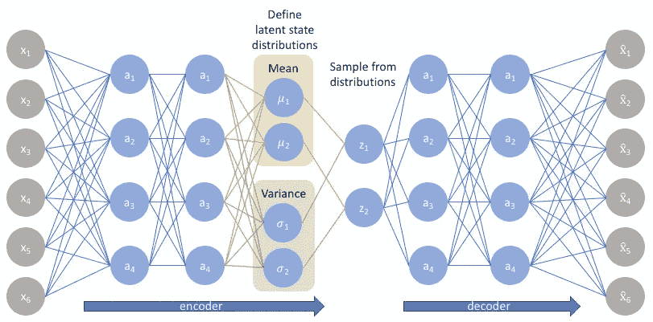

# 变分自动编码器:一个生成模型

> 原文：<https://medium.com/analytics-vidhya/variational-autoencoders-a-generative-model-df3b420c774a?source=collection_archive---------20----------------------->

来源—[https://www.jeremyjordan.me/variational-autoencoders/](https://www.jeremyjordan.me/variational-autoencoders/)

在我的上一篇文章中，我谈到了不同类型的自动编码器，它们的损失函数。在这篇文章中，我将谈论变分自动编码器。它们作为**强大的生成模型**。

同样，只学习输入特征而不学习有用特征的好处是什么？变分自动编码器的好处是，它们作为一个生成模型，这意味着它们可以用来生成具有轻微变化的相似特征的特征。例如，具有人脸的图像可以通过输入图像的面部特征的微小变化来生成。这在用于克服机器学习问题中的小数据集量问题的数据扩充步骤中非常有用。

# 可变自动编码器

变型自动编码器在某种程度上不同于普通的自动编码器，它们通过设计代表其潜在空间*，*连续，允许简单的随机采样和插值，因此有助于数据生成任务。

他们不将编码输出表示为单个向量，而是将编码输出表示为两个向量:一个均值向量**、μ** ，另一个标准差向量**、σ** 。

然后，通过这两个向量对解码器的输入向量进行采样，一个是均值 **μ** ，另一个是标准差 **σ** 。对于从编码器输出生成的任何采样，期望解码器学习这些特征，并且能够生成与输入图像相似的特征，但具有所需的变化。

变分自动编码器通过在其编码器和解码器中输出概率来生成概率分布，并试图通过最小化 KL 散度损失来最小化这两个概率分布之间的差异，KL 散度损失是两个概率分布之间差异的度量。

来源—[https://lilian Weng . github . io/lil-log/2018/08/12/from-auto encoder-to-beta-vae . html](https://lilianweng.github.io/lil-log/2018/08/12/from-autoencoder-to-beta-vae.html)

# 损失函数

假设输入特征是 **x** ，编码输出是 z，那么条件概率可以写成

> **p(z | x)=(p(x | z)* p(z))/p(x)**

还有另一个类似于 p(z|x)的概率分布，比如说 q(z|x)。如果它可以被定义为与 p(z|x)具有相似的分布。那么这两个概率分布之间的差异可以通过 KL 发散损失来测量和最小化。

> **minKL(q(z|x)||p(z|x))**

上述损失函数可以最小化为-

> **E(log p(x | z))—KL(q(z | x)| | p(z))**

这次都是我这边的。你可以通过下面的链接阅读我之前关于自动编码器的文章

 [## 自动编码器:正式介绍

### 自动编码器是神经网络，应该学会复制模型的输入。我知道你一定在想…

medium.com](/@taunkdhaval08/auto-encoders-a-formal-introduction-524ba5a60cd6) 

更多关于 KL 散度的信息可以在这里阅读—

 [## 库尔贝克-莱布勒散度

### 在数理统计中，Kullback-Leibler 散度(也称为相对熵)是衡量一个人如何…

en.wikipedia.org](https://en.wikipedia.org/wiki/Kullback%E2%80%93Leibler_divergence)