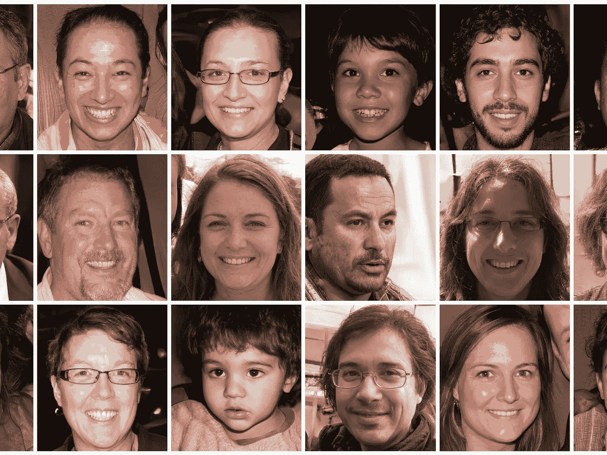
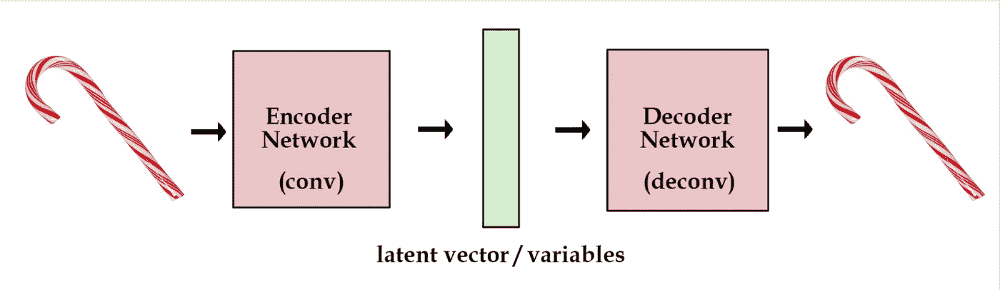
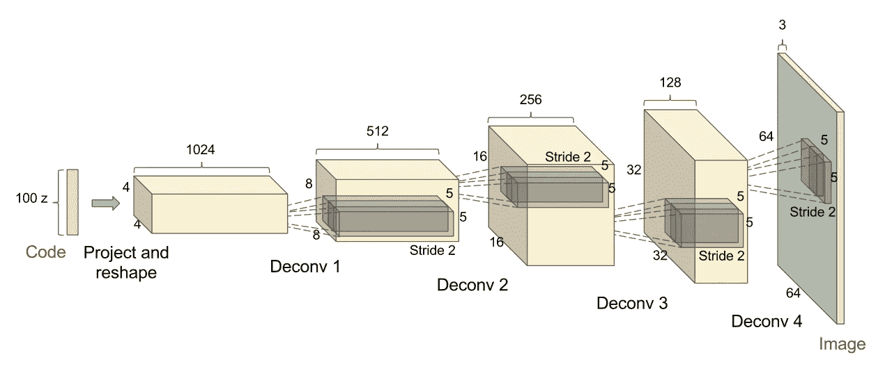
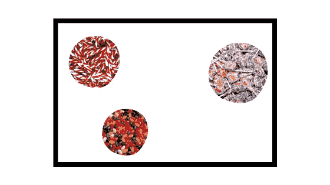

# 变型自动编码器-解释

> 原文：<https://medium.com/analytics-vidhya/variational-autoencoders-explained-bce87e31e43e?source=collection_archive---------9----------------------->

看到下面这些脸了吗？

看起来真的对吗？如果我告诉你这些人都不存在呢？

我会让你有你的**🤯**瞬间。

你看到的是一个生成式深度学习模型的结果。**没错，这些是电脑做的！**这些模特是你看到的奥巴马和特朗普的假视频的罪魁祸首。然而，生成模型也用于非常酷的应用，例如创作音乐、给黑白照片重新着色、创作艺术，甚至用于药物发现。有许多模型属于生成模型的范畴，最流行的两个是生成对抗网络(GANs)和变分自动编码器(VAEs)。

# “有志者，事竟成”

可变自动编码器是一种流行的、较老的生成模型，它基于标准自动编码器的结构。它由编码器、解码器和损失函数组成。VAEs 让我们学习输入的潜在表现。使用它们，我们能够在简单模型的环境中表示甚至合成复杂的模型。VAEs 已经显示出在生成许多类型的复杂数据方面的前景，例如手写数字、面孔和合成新分子。

# 🤖自动编码器

在了解可变自动编码器如何工作之前，让我们先了解标准自动编码器如何工作。自动编码器是一种学习将其输入复制到其输出的神经网络，是一种无监督的学习技术，这意味着网络只接收输入，而不是输入标签。

自动编码器有 3 个部分:

*   编码器
*   潜在空间
*   解码器

编码器网络压缩输入，解码器网络解压缩输入以产生输出。

编码器网络由卷积层组成。如果您熟悉 CNN，您会知道它使用卷积压缩输入，并通过合并层来创建更加紧凑和密集的输入表示。然后，完全连接的层使用它来进行预测。编码器网络以同样的方式工作，并输出输入的密集表示，称为*编码*。解码器网络使用解卷积层，这与卷积层非常相反。

解卷积层[【源】](https://openai.com/blog/generative-models/)

## “哎呀糟了，亏大了！”

当数据被压缩时，可能会有信息丢失，这意味着信息在解码过程中无法恢复。这被称为有损编码。如果它没有丢失任何信息，那么它就是一种无损编码。编码器学习将数据缩减为仅重要的信息，解码器学习获取压缩的数据，并对其进行解码以获得最终输出。

自动编码器的目标是使其输出与输入相似。通过对样本库进行训练并调整模型参数，它能够产生与输入相似的样本。

听起来很简单，对吗？

难的是通过瓶颈压缩所有信息。想象一下，试着把一个枕头塞进钱包。你得把它压进去。根据钱包的大小，你挤压枕头的力度就越小，因此枕头的形状不会有太大变化。同样，瓶颈用来表示信息的变量越多，输出就越接近输入。

由于自动编码器能够高效地编码和解码数据，因此非常适合:

*   降维
*   数据去噪
*   水印去除
*   特征变化
*   图象分割法

## 标准自动编码器的问题是

尽管自动编码器可能有许多应用，但它仍然有局限性。Autoendcoders 只能生成输入的紧凑表示，并重建输入，这对于数据去噪和降维非常好，但对于生成则不行。当生成新图像时，我们不想复制图像，而是希望生成输入的变体。

这是因为压缩输入或编码所在的潜在空间不是连续的，并且不容易被内插。自动编码器的潜在空间将编码分组为离散的簇，这是有意义的，因为它使解码器更容易解码。

为了说明这一点，假设我们有一个盒子，里面有三堆不同的糖果，糖果棒、棒棒糖和软糖。

这些成堆的糖果代表了潜在空间中的编码簇。现在你被告知蒙上眼睛选择你喜欢的糖果！你看不到糖果组在哪里，而且糖果组也很小。你很有可能什么也得不到，而不是真的得到一颗糖。

同样，很难生成新数据，因为不同群体之间存在巨大差距。这意味着空间中的每个输入都有一个向量，但空间中的每个向量都没有输入。解码器不知道该做什么，因为在训练过程中，它从未见过来自这些间隙的编码向量。尽管它会为每个矢量创建一个输出，但大多数矢量是不可识别的。

# "提示变化的自动编码器"

变型自动编码器非常适合生成全新的数据，就像我们一开始看到的那些面孔一样。它之所以能够做到这一点，是因为其架构发生了根本性的变化。

1.  编码器

2.潜在分布，包括:

*   均值向量
*   标准偏差向量

3.抽样潜在表征

4.解码器

## 差别

自动编码器和可变自动编码器之间的主要区别在于，自动编码器将编码聚类到不同的组中，而 VAEs 的编码聚类不是不同的，而是更连续的。它们被映射到一个分布，使得从潜在空间采样和生成新图像变得更加容易。

它能够做到这一点，因为编码器输出 2 个向量，一个均值向量和一个标准差向量。通过使用 2 个向量输出，变分自动编码器能够基于其从输入数据中学习到的内容在连续空间中进行采样。

直观上，均值是编码应该在潜在空间的位置，标准差是点周围的面积。训练时，解码器不仅学习潜在空间中的单个点，还学习该点周围的向量。

## “只是一个普通人”

仅将向量映射到分布并不足以生成新数据。由于对平均值和标准偏差向量的取值没有限制，编码器可以为不同的类或聚类返回具有不同平均值的分布，这些分布与平均值的差异很小，因此编码与同一样本的差异不会很大。导致编码的分布彼此远离。这只是允许解码器重新创建输入，听起来熟悉吗？

我们希望所有的集群都是连续的，并且有点重叠。所以为了确保我们的 VAE 不会变成标准的自动编码器，我们需要一个正则项。我们可以将 Kullback-Leibler 散度(KL 散度)引入我们的损失函数。

正则项迫使编码器接近标准正态分布(平均值为 0，标准偏差为 1)。通过这样做，可以确保分布更加接近，并且实际上是重叠的。这在某种程度上确定了编码是真正连续的。

通过仅优化 KL 散度，编码器将随机绘制靠近中心的点。不会有什么集群，只是一堆乱七八糟的点。我们希望它更有组织性，所以我们也必须使用重建损失。这两项构成了变分自动编码器的损失函数。

# 虚拟企业的未来(尤其是在医疗保健领域)

当然，生成人脸和手写数字令人兴奋，但最让我兴奋的是医疗保健和药物发现中使用的生成模型。

生物技术公司 Insilicco Medicine 已经能够在 21 天内合成一种新分子，并在 25 天内验证它，而制药行业需要 2-3 年！太疯狂了。这仅仅是开始，生成模型是创新的前沿。快速的发现将使世界各地的人们更容易接触到。利用我们的基因组数据，我们可以有更有效的个性化药物。想象一下，如果我们能在你做一个汉堡的时间内合成新的药物。可能性真的是无穷无尽！

# 承认

*   [https://en.wikipedia.org/wiki/Autoencoder](https://en.wikipedia.org/wiki/Autoencoder)
*   https://www.jeremyjordan.me/autoencoders/
*   [https://jaan . io/what-is-variable-auto encoder-vae-tutorial/](https://jaan.io/what-is-variational-autoencoder-vae-tutorial/)
*   [https://arxiv.org/pdf/1606.05908.pdf](https://arxiv.org/pdf/1606.05908.pdf)
*   [https://www.jeremyjordan.me/variational-autoencoders/](https://www.jeremyjordan.me/variational-autoencoders/)
*   [http://cs 231n . Stanford . edu/slides/2017/cs 231n _ 2017 _ lecture 13 . pdf](http://cs231n.stanford.edu/slides/2017/cs231n_2017_lecture13.pdf)

嘿嘿嘿！如果你正在读这封信，谢谢你🙏 🙏为了坚持到最后！

我很乐意通过 [LinkedIn](https://www.linkedin.com/in/shivang-mistry-1119b818b) 联系，并了解您对生成模型未来的想法！