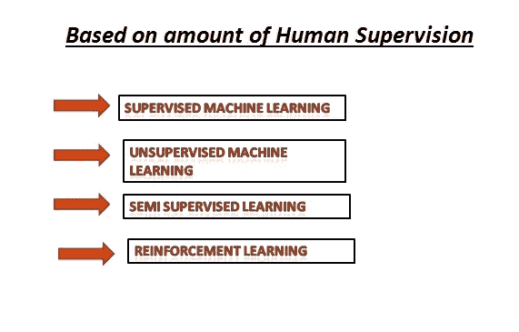
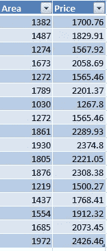
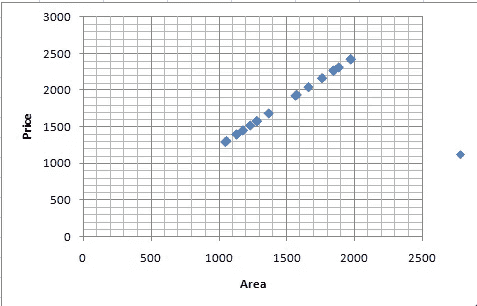
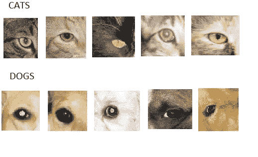
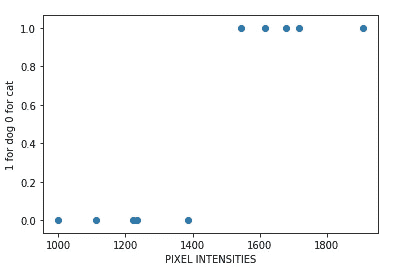
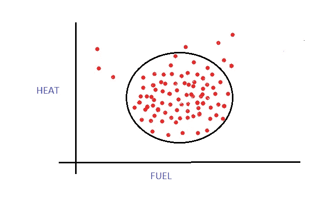
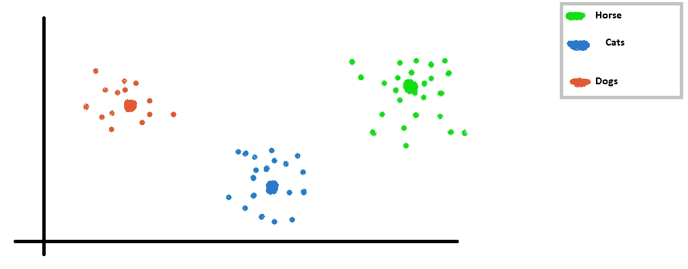
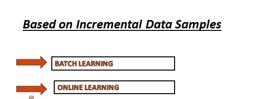
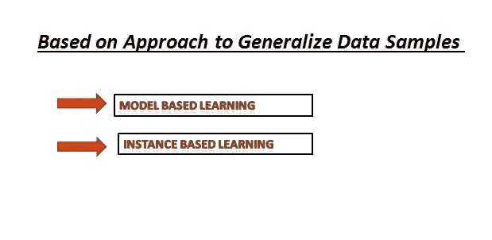

# 各种机器学习

> 原文：<https://medium.com/analytics-vidhya/varieties-of-machine-learning-b7a59dc082ed?source=collection_archive---------32----------------------->

机器学习本身是一个非常广泛的话题，在本文中，我们将机器学习的任务分为三类。这三大类被进一步划分。在本节的后面，我们还将在继续讨论的同时，看看每个类别的一些实际应用。

在继续之前，让我们以一种比我们在上一篇文章(机器学习定义的游戏化)中讨论的更正式的方式来定义机器学习的定义

1.  **" *一个计算机程序被认为从经验 E 中学习了一些任务 T 和一些性能测量 P，如果它在 T 上的性能，如 P 所测量的，随着经验 E 而提高*** *"*

汤姆·米切尔，1997 年

现在，让我们根据以下类别对机器学习进行分类:-

1.  基于学习过程中涉及的人工监督的数量。
2.  基于从增量数据样本中学习的能力。
3.  基于从数据样本中归纳的方法。

以上三个类别相当不直观，但这些类别的进一步细分，让一切都变得清晰直观。所以，我们来逐一讨论一下这几类是什么。

***基于学习过程中涉及的人工监督量:——***

## 一、监督机器学习:—

这是我们进入机器学习世界时看到的最常见的机器学习算法。这种类型的机器学习采用数据样本以及相应的输出/结果，然后试图找到关系。通常，它完成映射工作，即通过查看数据特征和相应的输出，ML 模型调整其权重，以便它可以预测未知数据样本的正确答案。例如，一个州的房价取决于土地面积(假设的数据集)。

如果我们画出上面的数据集，它看起来会像，

这种类型的问题称为回归问题。

在这里，我们可以看到，所有地区的相应房价都已给出，因此这是一个受监督的机器学习示例。

另一种监督机器学习算法是分类算法。让我们来看一个例子。

在这里，模型通过分析输入样本来预测特定类别的概率。

假设我们正在构建一个猫和狗分类器，它将分析猫和狗的眼睛，并根据像素强度的平均值将其分类为猫或狗(注意这是一个单一类别分类问题)。

假设数据集

假设我们的模型计算图像的像素强度，并基于此将其分类为狗或猫(1 表示狗，0 表示猫)。

因此，上述类型的问题被称为分类问题。

到目前为止，我们已经看到了有监督的机器学习及其子类化，如回归和分类。在继续之前，我将以更一般的方式描述回归和分类。

回归:当输入的标签或输出是连续的真实值时，如“价格”、“工资”、“年龄”等。这就是所谓的回归问题。

分类:当输出是特定输入样本成为特定类别的概率时，称为分类问题。

**二。无监督学习:——**顾名思义，无监督机器学习是一种训练数据没有标签的机器学习。在这种类型的机器学习中，我们为模型提供训练示例，并要求模型找到训练示例的各种特征之间的内部结构。无监督学习算法类型的几种算法是:-

1.  k 均值聚类
2.  隔离森林
3.  主成分分析

现在让我们看一些例子来深入理解无监督学习。假设我们给定了一个数据集，其中包含数千名客户的购买历史，这些客户要么是不同年龄的学生，要么是工薪阶层，我们要求 ML 模型(比如 K-means 聚类)找出数据中的结构。它处理数据集，并表示某一年龄的学生倾向于喜欢特定类型的文具(铅笔、橡皮等。)而高于某一特定的学生更喜欢另一种文具(钢笔、项目文件、档案纸等)。另一方面，一定年龄的工人阶级倾向于购买更多的垃圾食品，而过了一定年龄后，他们会购买更多的食品杂货。

另一个例子是，假设我们经营一家发动机工厂，我们根据发动机在特定时间段内的发热量和油耗来测试发动机。在这里，我们提供了大量的引擎数据，我们的 ML 模型(异常检测)将了解正常引擎如何产生热量以及它将消耗多少燃料。

现在，如果任何引擎在这两个参数中的任何一个出现问题，它都会立即发出警告(注意:橙色点是异常情况，模型会发出警告)。

**三世。半监督学习:——**这种类型的学习需要不同类别的标记数据，但并不是所有的数据都需要标记。

比方说，我们想象猫、马、狗的形象。我们给出每个类的一些标记数据，以便我们的模型将它们作为单独的类来学习，然后当传递未标记的数据时，根据特定训练示例与类的相似程度，它会相应地自动对它们进行分组。

当我们标记特定图片中的人时，使用这种类型的学习，然后使用半监督学习自动标记所有其他图片。

**四。强化学习:——**这种类型的学习有一点不同，这里模型根据它采用的策略被惩罚或奖励。例如，考虑一个机器下棋的例子，在这里，模型不是在每一步棋后得到惩罚或奖励，而是在两步棋后，根据最终发生的情况，模型的策略得到反馈。

现在让我们转到机器学习的第二个分类类别，即基于从增量数据中学习的能力的**。**

**一、批量学习:——**这是一种不能从流动数据即连续数据流中学习的学习。整个训练集正在被加载，然后输入到模型中。

因此，如果数据不断变化，我们希望我们的模型适应这些变化，我们需要从头开始训练。

**二。** **在线学习:——**考虑亚马逊、Flipkart 等公司。其每天产生数百万 GB 的数据，因此为了更新其 ML 模型，使用批量学习变得不可能。

因此，在在线学习中，该模型能够从连续的数据流中学习，因此，我们不需要在每次想要改变其适应性时从头开始训练 ML 模型。

现在是我们的第三类，即**基于概括数据样本的方法。**

**i .基于实例的学习:——**在这种类型的学习中，ML 模型使用与一类训练数据的相似性来对未知数据点进行分类。

**二。基于模型的学习:——**这种类型的 ML 从给定的数据中建立模型，然后对未知的数据点进行归纳。