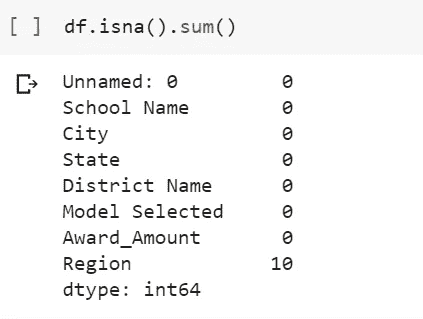

# Seaborn 的各种地块类型

> 原文：<https://medium.com/analytics-vidhya/various-plot-types-in-seaborn-88368e9b08cf?source=collection_archive---------19----------------------->

## 分类数据

*   具有有限和固定数量的值的数据。
*   通常与数字数据相结合
*   例子包括:

1.  地理(国家、州、地区)
2.  性别
3.  伦理性
4.  血型
5.  眼睛颜色

## 地块类型

*   显示每个观察值包括**剥离图**和**群集图**。
*   显示抽象表示包括**盒图**、 **violenplot** 和 **lvplot** (也称为**盒图**)。
*   显示统计估计包括**条形图**、**计数图**和**点图**。

## 让我们开始使用 Seaborn 可视化

## 1.导入所需的库

## 2.加载数据集

使用熊猫库的 *pd.read_csv()* 函数导入 *csv* 数据。

## **3。探索性数据分析**

了解数据的基本信息。

***. df . head()****-给出数据集的前 5 行作为输出。*

熊猫图书馆的 df.head()函数

***df . shape****——顾名思义，这个函数给出了输出中数据的形状。*

***【df . info()****-该函数打印数据帧的信息，包括索引数据类型和列数据类型、非空值和内存使用情况。*

***【df . describe()****——这个函数用来查看一些基本的统计细节，如百分位数、平均值、标准差等。一个数据帧或一系列数值。*

数据的统计分析

***df.isna()。sum()*** *-统计数据帧中 NaN 值的个数。*

数据集每列中缺失值的数量

## 4.数据可视化部分

> 每次观察的图—剥离图

a)使用 Seaborn 的内置 strip lot()函数创建一个 strip lot

脱衣舞场

b)定制剥离地块

定制的脱衣舞场

> 每次观察的图——群集图

使用 Seaborn 内置的 swarmplot()函数创建一个 swarmplot。

群集图

> 表现抽象表象的图——箱线图、紫线图和吕线图

a)为所有抽象表现情节创建支线情节

箱线图、紫线图和 LV 图

b)通过将第三个参数和不同的调色板传递给所有的函数来定制所有的支线剧情

密码

输出

> 统计估计图—柱状图

使用 Seaborn 的 catplot()函数创建一个简单的条形图，传递“kind”参数等于“bar ”,传递数据、x 和 y 输入以及第三个参数等于“hue”。

水平条形图

> 统计估计图—点状图

使用 Seaborn 库的 catplot()函数创建点图。将“kind”参数传递给“point”会创建一个点图。同样，传递数据，x 和 y 输入。通过在函数中传递“col”参数，可以在列中创建支线剧情。

点图

> 统计估计图—计数图

使用 Seaborn 库的 catplot()函数创建计数图。Countplot 可以通过传递等于“计数”的“种类”参数来形成。传递所有其他参数，如数据和 x 输入，将创建我们的点图。我们还可以通过向函数中的“hue”传递另一个参数来自定义计数图。

计数图

这就把我们带到了本文的结尾。我希望你已经清楚地理解了所有的可视化。 ***确保你尽可能多地练习*** 。

你可以从[这里](https://github.com/Ravjot03/Data-Visualization-with-Seaborn/blob/master/Additional%20Plots/schoolimprovement2010grants.csv)下载数据集。

如果你想查看更多与数据科学和机器学习相关的资源，你可以参考我的 [Github 账户](https://github.com/Ravjot03)。

请留意本系列中的其他 [Jupyter 笔记本](https://github.com/Ravjot03/Data-Visualization-with-Python)，它们将解释用 Python 实现 Seaborn 数据可视化的各个方面。

你也可以在 Github 账号上查看我的[数据科学作品集](https://github.com/Ravjot03/Data-Science-Portfolio)。

希望你喜欢这个帖子。