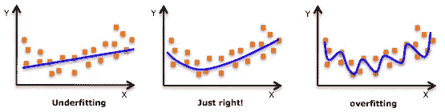

# 线性回归

> 原文：<https://medium.com/analytics-vidhya/various-types-of-linear-regression-937f3c9dda9?source=collection_archive---------19----------------------->

线性和逻辑回归通常是人们在数据科学中学习的第一个算法。由于它们的流行，许多分析家甚至认为它们是回归的唯一形式。稍微参与的人认为他们是所有回归分析形式中最重要的。

事实是，回归有无数种形式，可以被执行。每种形式都有自己的重要性和最适合应用的特定条件。

# 线性回归

这是最广为人知的建模技术之一。线性回归通常是人们在学习预测建模时首先选择的几个主题之一。在这种技术中，因变量是连续的，自变量可以是连续的[或离散的](https://en.wikipedia.org/wiki/Continuous_and_discrete_variables)，回归线的性质是线性的。

线性回归使用一条**最佳拟合直线**(也称为回归线)在**因变量(Y)** 和一个或多个**自变量(X)** 之间建立关系。

用公式 **Y=a+b*X + e** 表示，其中 a 为截距，b 为直线斜率，e 为误差项。该方程可用于根据给定的预测变量预测目标变量的值。


简单线性回归和多元线性回归的区别在于，多元线性回归有(> 1)个自变量，而简单线性回归只有 1 个自变量。现在，问题是“我们如何获得最佳拟合线？”。

## 如何获得最佳拟合线(a 和 b 的值)？

这个任务可以用最小二乘法很容易地完成。这是拟合回归线最常用的方法。它通过最小化从每个数据点到线的垂直偏差的平方和来计算观察数据的最佳拟合线。因为偏差首先被平方，当相加时，正值和负值之间没有抵消。


我们可以使用度量标准 **R 平方**来评估模型性能。要了解这些指标的更多细节，您可以阅读:模型性能指标[第 1 部分](https://www.analyticsvidhya.com/blog/2015/01/model-performance-metrics-classification/)、[第 2 部分](https://www.analyticsvidhya.com/blog/2015/01/model-perform-part-2/)。

## 要点:

*   自变量和因变量之间必须有线性关系
*   多元回归遭受**多重共线性、自相关、异方差**。
*   线性回归对**异常值**非常敏感。它会严重影响回归线，并最终影响预测值。
*   多重共线性会增加系数估计值的方差，并使估计值对模型中的微小变化非常敏感。结果是系数估计不稳定
*   在多个自变量的情况下，我们可以用**前向选择**、**后向淘汰**和**逐步逼近**来选择最重要的自变量。

# 多项式回归

如果自变量的幂大于 1，则回归方程是多项式回归方程。下面的等式代表一个多项式等式:

```
y=a+b*x^2
```

在这种回归技术中，最佳拟合线不是直线。而是一条符合数据点的曲线。


## 要点:

*   虽然可能有拟合更高次多项式以获得更低误差的诱惑，但这可能导致过度拟合。始终绘制关系图，以查看拟合情况，并重点确保曲线符合问题的性质。下面是一个关于绘图如何有所帮助的示例:



*   特别是要注意末端的曲线，看看这些形状和趋势是否有意义。更高阶的多项式可能会在外推时产生奇怪的结果。

# 结论

线性回归是每个机器学习爱好者都必须知道的算法，也是想学习机器学习的人的正确起点。这确实是一个简单但有用的算法。我希望这篇文章对你有帮助。