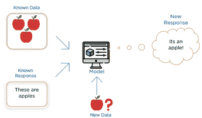
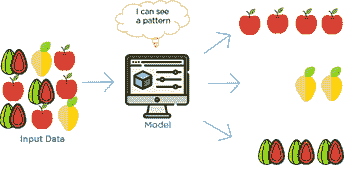

# 各种类型的训练使机器变得智能

> 原文：<https://medium.com/analytics-vidhya/various-types-training-a-machine-to-become-intelligence-9808e068bb40?source=collection_archive---------25----------------------->

机器学习领域根据学习的条件分为三种类型。

1 .监督学习

2 .无监督学习

3 .强化学习

在进入学习类型之前，让我们了解一下培训阶段和测试阶段:

培训阶段:

在这一阶段，我们使用数据即信息来教导或训练机器，这些信息被很好地标记，这意味着一些数据已经有了正确的答案。

测试阶段:

在这一阶段，向机器提供新的一组示例 ie:数据，以便机器分析训练数据(一组训练示例)并从标记的数据中产生正确的结果。

监督学习:

在这里，这个名字本身就表明了主管作为教师的存在。

这里有一些容易理解的技术参数。

*目标:像人类一样出色地完成任务程序。

*任务:明确定义(目标功能)。

*经验:由人类提供的训练数据

*绩效:任务的误差/准确性。

示例:

记得当我们在 KG 学生的时候，老师曾经教我们苹果的 A，我们从老师那里学习苹果的样子。

过了一会儿，老师展示了一个苹果的图片，让我们去辨认。因为我们是由老师训练的。

这正是监督学习的工作原理。如下图所示

监督学习中的培训阶段:

我们向系统提供包含苹果照片的数据，并让它知道这些是苹果。这称为标记数据。

监督学习中的测试阶段:

该模型从标记的数据中学习，当你下次要求它识别一个苹果时，它可以很容易地做到。

无监督学习:

在无监督学习中，这里没有训练员或老师来训练机器。相反，机器将数据分成类似的组。

这里某些容易理解的技术参数

*目标:在数据中找到某种结构。

*任务:数据定义不清

*经验:没有人类提供的训练数据

*性能:没有性能来衡量模型的准确性。

示例:

如果有人给你一个装满不同水果的篮子，并要求你将它们分开，你可能会根据它们的图案，即颜色、形状和大小来分开。

无监督学习是可行的。如下图所示

无监督学习中的算法；

第一步:我们向系统提供一个包含不同种类水果照片的数据，并要求它将这些水果分开。在无监督学习的情况下，您不需要提供带标签的数据。

第二步:系统将在数据中寻找模式。形状、颜色和大小等模式根据这些属性对水果进行分组。