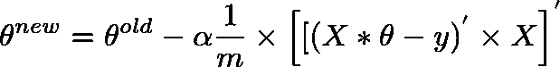

# 线性回归中梯度下降的矢量化实现

> 原文：<https://medium.com/analytics-vidhya/vectorized-implementation-of-gradient-descent-in-linear-regression-12a10ea37210?source=collection_archive---------2----------------------->

梯度下降算法:

这是梯度下降算法，用于确定θ的最佳值，使得成本函数 J(θ)最小。

假设给定了以下 X、y 和θ值:

m =训练样本的数量
n =特征的数量+ 1

m = 5(训练样本总数)
n = 4(特征数+1)
x = m×n 矩阵
y = m×1 向量
θ= n×1 向量
xᶦ是第 I 个训练样本
xj 是给定训练样本中的第 j 个特征

使用矩阵查找错误:

h(x) = ([X] * [θ])(我们训练集的 m x 1 个预测值矩阵)
h(x)-y = ([X] * [θ] — [y])(我们预测中的 m x 1 个误差矩阵)

机器学习的全部目标是最小化预测中的错误。

误差矩阵是 m×1 向量矩阵，如下所示:

为了计算θj 的新值，我们找到所有误差(m 行)的总和乘以训练集 x 的第 j 个特征值

即取 E 中的所有值，分别乘以对应训练样本的第 j 个特征，按照梯度下降算法全部相加。

我们可以进一步简化为:

[E]' x [X]会给我们一个行向量矩阵，因为 E '是 1×m 矩阵，X 是 m×n 矩阵。

但是我们感兴趣的是得到一个列矩阵，因此我们转置得到的矩阵。

最终矢量化方程:

