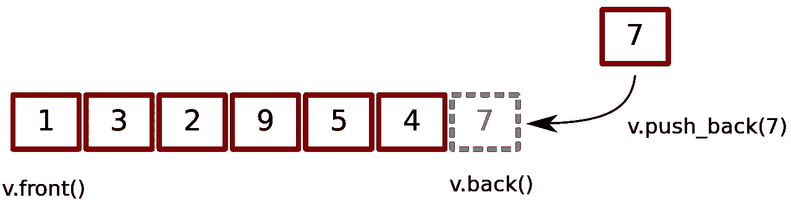

# C++ STL 中的向量:初学者指南

> 原文：<https://medium.com/analytics-vidhya/vectors-in-c-a-beginners-guide-51ec40e641c3?source=collection_archive---------23----------------------->

嘿，朋友们，在这个博客中，我将向你们介绍矢量及其基本功能和矢量的能力。


你可能会用到数组和向量，它们没有什么不同，但是它们有额外的特性、功能和许多强大的内置函数和方法。

向量是动态数组，可以在运行时动态改变它们的大小。连续空间被分配，这使得在向量上迭代更容易，并且在除了端点的位置之外的位置插入或移除元素花费线性时间，从最后位置插入或移除元素花费恒定时间。一般来说，元素是在末尾插入的。

与其他动态序列容器相比，vectors 可以非常高效地访问其元素，并且相对高效地从其末尾添加或删除元素。对于涉及在非结尾位置插入或移除元素的操作，它们的性能比其他操作差。

# 入门指南

*   要使用 vectors，您必须首先包含 vector 库:

```
**#include<vector>**
```

*   你可以定义任何类型的向量，不管是整型还是浮点型，字符型，字符串型，或者是成对向量或者向量中的向量

```
**vector<int> v;    //vector of integers
vector<float> v;  //vector of floating point numbers
vector<char> v;   //vector of characters
vector<string> v; //vector of string
vector< pair<int, int> > v; //vector of pairs of integers
vector< vector<int> > v;    //vector of vectors**
```

*   你甚至可以预先指定矢量的大小。

```
**vector<int > v(n);** 
```

*   为了在 vector 中插入元素，我们通常使用内置的 push_back 方法。



```
**for(i=0; i<n; i++){
    cin>>x;
    v.push_back(x);
}**
```

*   你可以像数组一样迭代向量，这样更容易操作，也可以像数组一样使用索引引用特定的元素。

```
**for(i=0 ; i<n ; i++){
    cout<<a[i]; // indexing same as array
}**
```

*   你也可以使用内置的向量排序函数。

```
**sort(v.begin(), v.end());**
```

现在，我们已经看到了向量与数组在实现上有一点点不同，从这里我们将看到所有内置的方法和函数，与简单的数组相比，这些方法和函数使向量成为一种更强大的数据结构。

# 迭代器

*   **begin()**→返回指向向量中第一个元素的迭代器。
*   **end()**→返回一个迭代器，指向向量中最后一个元素之后的理论元素。
*   **rbegin()** (反向开始)→返回一个反向迭代器，指向向量中的最后一个元素。它从最后一个元素移动到第一个元素。
*   **rend()** (反向结束)→返回一个反向迭代器，指向 vector 中第一个元素之前的理论元素。
*   **c begin()**→返回指向向量中第一个元素的常量迭代器。
*   **cend()**→返回一个常量迭代器，指向 vector 中最后一个元素之后的理论元素。
*   **Cr begin()**→返回指向向量中最后一个元素的常量反向迭代器。它从最后一个元素移动到第一个元素。
*   **crend()**→返回一个常量反向迭代器，指向向量中第一个元素之前的理论元素。

# 容量

*   **size()** →返回向量中元素的个数。
*   **max_size()** →返回向量所能容纳的最大元素数。
*   **capacity()** →返回当前分配给 vector 的存储空间大小，以元素数表示。
*   **resize(n)** →调整容器大小，使其包含“n”个元素。
*   **empty()** →返回容器是否为空。
*   **shrink_to_fit()** →减少容器的容量以适合其大小，并销毁超出容量的所有元素。
*   **reserve()** →要求向量容量至少足以包含 n 个元素。

# 修饰语

*   **assign()** →通过替换旧值，为矢量元素分配新值。
*   **push_back()** →它从后面把元素推入一个向量。
*   **pop_back()** →用于从后面弹出或删除向量中的元素。
*   **insert()** →在指定位置的元素前插入新元素。
*   **erase()** →用于从指定位置或范围删除容器中的元素。
*   **swap()** →用于将一个向量的内容与同类型的另一个向量进行交换。尺寸可能不同。
*   **clear()** →用于删除 vector 容器的所有元素。
*   **就位()** →通过在位置上插入新元素来扩展容器。
*   **launte _ back()**→用于向向量容器中插入一个新元素，新元素被添加到向量的末尾。

# 元素访问

*   **引用运算符[g]** →返回对向量中位置“g”处元素的引用。
*   **at(g)** →返回对向量中位置‘g’处元素的引用。
*   **front()** →返回对 vector 中第一个元素的引用。
*   **back()** →返回对 vector 中最后一个元素的引用。
*   **data()** →返回一个直接指针，指向 vector 内部使用的内存数组，用于存储其拥有的元素。

# 结束来了…

就这样，我的博客到此结束，我希望你喜欢它，你已经学习了向量的一些基本概念，现在去玩你所学的概念，试着通过写一些代码来弄脏你的手，你可以通过像 cppreference.com 这样的网站阅读更多关于向量的内容，那里有很多资源。

坚持学习，快乐编程:-)