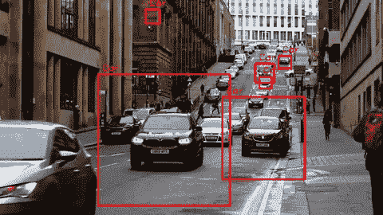

# Python 中的实时车辆(汽车)检测和录制视频— Windows 和 macOS

> 原文：<https://medium.com/analytics-vidhya/vehicle-car-detection-in-real-time-and-recorded-videos-in-python-windows-and-macos-c5548b243b18?source=collection_archive---------5----------------------->



视频源—链接于此

车辆检测是目前公司和组织广泛使用的功能之一。这项技术使用计算机视觉通过摄像机在视频或实时中检测不同类型的车辆。它在交通控制、汽车跟踪、创建停车传感器等许多方面都有应用。

在这个项目中，我们将学习如何用 python 为录制的和直播的 cam 流视频构建一个汽车跟踪系统。

在开始之前，我们需要安装 OpenCV(开源计算机视觉)库，该库旨在帮助开发人员执行与计算机视觉相关的任务。我们需要为 OpenCV 库做一个 pip 安装。

```
install opencv-python
```

# **现在让我们用 Python 构建系统**

我们已经安装了所需的库。该技术的工作方式是，我们在要检测的对象(本例中为汽车)的各种图像参数上训练模型，用于识别我们目标中的对象。

可以把它想象成任何机器学习模型的训练和测试数据集。

在这种情况下:

**训练数据集:**。捕获目标对象图像细节的 xml 文件

**测试数据集:**直播流视频/录制视频

完整代码的链接可以在本文末尾找到。我将分步分块地解释代码，以帮助您理解它是如何工作的:

**第一步:**打开 Spyder

**第二步:**导入库

```
import cv2
```

**步骤 3:** 将输入引用到您的网络摄像头或保存在硬盘上的视频文件(mp4 格式)

```
**Webcam:** cap = cv2.VideoCapture(0)
**Video:** cap = cv2.VideoCapture(**<enter file path.mp4>**)
```

**第 4 步:**我们将使用一个预先训练好的。xml 文件，其中包含使用单个图像构建的汽车数据。你可以在这里下载文件

```
car_cascade = cv2.CascadeClassifier(**<enter file path>**/cars.xml’)
```

**第五步:**视频分帧，代码一次读取一帧。在每一帧中，我们使用上面导入的 API 来检测汽车在帧中的位置。对于检测到的每辆车，我们定位坐标并在它周围画一个矩形，然后向观众发布视频。

完整的代码如下所示——代码下面有解释

```
while True:
 # reads frames from a video
 ret, frames = cap.read()
 # convert to gray scale of each frames
 gray = cv2.cvtColor(frames, cv2.COLOR_BGR2GRAY)
 # Detects cars of different sizes in the input image
 cars = car_cascade.detectMultiScale( gray, 1.1, 1)
 # To draw a rectangle in each cars
 for (x,y,w,h) in cars:
 cv2.rectangle(frames,(x,y),(x+w,y+h),(0,0,255),2)
 font = cv2.FONT_HERSHEY_DUPLEX
 cv2.putText(frames, ‘Car’, (x + 6, y — 6), font, 0.5, (0, 0, 255), 1)
 # Display frames in a window
 cv2.imshow(‘Car Detection’, frames)
 # Wait for Enter key to stop
 if cv2.waitKey(33) == 13:
 break
```

**模块 1:**

```
# reads frames from a video
 ret, frames = cap.read()
 # convert to gray scale of each frames
 gray = cv2.cvtColor(frames, cv2.COLOR_BGR2GRAY)
```

视频是按单个帧读取的。接下来，帧被转换为灰度，这有助于快速检测汽车。图像转换为灰度的原因是，训练数据集是以灰度构建的，以减小文件的大小。

第二区:

```
# Detects cars of different sizes in the input image
 cars = car_cascade.detectMultiScale( gray, 1.1, 1) # To draw a rectangle in each cars
 for (x,y,w,h) in cars:
 cv2.rectangle(frames,(x,y),(x+w,y+h),(0,0,255),2)
 font = cv2.FONT_HERSHEY_DUPLEX
 cv2.putText(frames, ‘Car’, (x + 6, y — 6), font, 0.5, (0, 0, 255), 
 1)
```

代码的第一部分检测帧中的汽车，并存储它们的坐标(x、y 轴以及汽车的宽度和高度)。第二部分围绕检测到汽车的区域绘制一个矩形，并在矩形上方显示文本“car”。您可以更改文本的字体，代码(0，0，255)是 B-G-R 序列中矩形和文本的颜色代码。

**第三块:**

```
# Display frames in a window
 cv2.imshow(‘Car Detection’, frames)
# Wait for Enter key to stop
 if cv2.waitKey(33) == 13:
 break
```

结果图像(帧)被释放给查看者，并且循环继续运行，直到用户按下键盘上的回车键。

**第六步:**所有拍摄的视频必须发布。

```
cap.release()
cv2.destroyAllWindows()
```

# 在命令行中运行程序

下一步是[保存](/@venkatesh.chandra_75550/saving-output-of-object-recognition-in-macos-opencv-python-5914bb5d9ca8)文件。py 格式并在命令行/Anaconda 提示符下运行它。

我在 Anaconda 提示符下运行它，首先使用命令 cd 导航到该文件夹。

我在 Anaconda 提示符下运行它，首先使用命令 cd 导航到该文件夹。

```
cd <folder path>
```

运行 python 文件

```
python filename.py
```

您将看到一个弹出窗口，视频正在播放。视频可能会很慢，这是因为 OpenCV 中的帧数通常很大。但是，如果将视频保存在硬盘上，写入的视频速度并不慢，并且与输入视频的 fps(每秒帧数)相匹配。

你可以在这里下载更多免费视频。

**找到了！您已经成功地建立了一个实时和视频记录的汽车检测系统。**

**播放老爷车或概念车的视频，并在下面的评论区分享你的故事。**

面对问题？发布您的查询。

# **用例**

*   停车场的传感器可以识别违规者
*   检测汽车的速度
*   识别行人过马路时加速行驶的违规者

# 编码

[](https://github.com/chandravenky/Computer-Vision---Object-Detection-in-Python/tree/master) [## chandravenky/Python 中的计算机视觉对象检测

### 此时您不能执行该操作。您已使用另一个标签页或窗口登录。您已在另一个选项卡中注销，或者…

github.com](https://github.com/chandravenky/Computer-Vision---Object-Detection-in-Python/tree/master) 

# 相关链接

[**使用 OpenCV 的 Python 中的行人检测— Windows 和 macOS**](/@venkatesh.chandra_75550/person-pedestrian-detection-in-real-time-and-recorded-videos-in-python-windows-and-macos-4c81142f5f59)

[**Python 中的实时人脸检测系统——Windows 和 macOS**](/@venkatesh.chandra_75550/real-time-webcam-face-detection-system-using-opencv-in-python-windows-and-macos-86c31fddd2bc)

[**Python 中录制视频的人脸检测— Windows 和 macOS**](/@venkatesh.chandra_75550/face-detection-on-recorded-videos-using-opencv-in-python-windows-and-macos-407635c699)

[**在 macOS 中保存物体识别输出**](/@venkatesh.chandra_75550/saving-output-of-object-recognition-in-macos-opencv-python-5914bb5d9ca8)

# 去哪里找我🤓

1.  在[LinkedIn](https://www.linkedin.com/in/venkateshchandra/)/[GitHub](https://github.com/chandravenky)/[我的网站](http://chatraja.com/)上与我联系
2.  感觉大方？在这里给我买杯[咖啡](https://www.buymeacoffee.com/chandravenky) ☕️