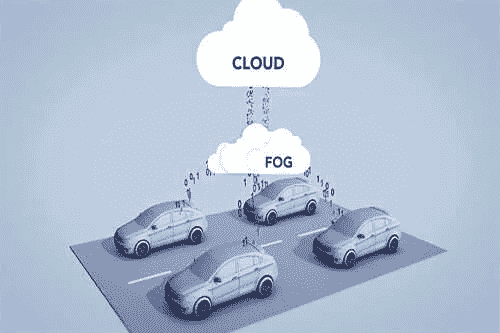

# 车载雾计算——无延迟通信

> 原文：<https://medium.com/analytics-vidhya/vehicular-fog-computing-communication-without-lag-3c2452f4885b?source=collection_archive---------4----------------------->

*我们期待已久的车对车通信网络。*

[无人驾驶汽车](https://towardsdatascience.com/an-introduction-to-autonomous-vehicles-91d61ff81a40) (SDC)的市场价值正呈指数增长，预计到 2026 年**的价值将超过 5570 亿美元**！

随着市场的增长，阻碍该行业发展的一个缺点是与无人驾驶汽车相关的耻辱。