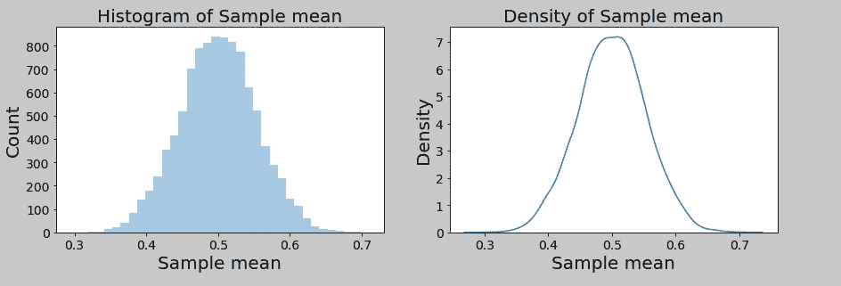

# 用 Python 验证中心极限定理

> 原文：<https://medium.com/analytics-vidhya/verifying-central-limit-theorem-using-python-f57cf4691e8c?source=collection_archive---------9----------------------->


卢克·切瑟在 [Unsplash](https://unsplash.com?utm_source=medium&utm_medium=referral) 上的照片

让我们先来看看维基百科是怎么说中心极限定理的。*中心极限定理指出，在某些情况下，当添加独立的随机变量时，即使原始变量本身不是正态分布，它们的正常归一化和也趋向于正态分布*。听起来很困惑？

让我们用简单的话来说。如果我们用替换从总体中重复取样(替换确保样本相互独立)，样本均值的分布(也称为样本均值的抽样分布)接近正态分布，因为样本大小变得更大，而不考虑总体分布的性质。难以置信？我们试试用 Python 验证中心极限定理。

我们导入必要的包，并定义一个由随机数组成的 1000000 人的群体。人口是完全随机的，就像在现实生活中一样。

```
**import numpy.random as np
import seaborn as sns
import matplotlib.pyplot as plt
population_size = 1000000
population = np.rand(1000000)**
```

我们将重采样次数或从替换总体中抽取的样本数定义为 10000。现在'*sample _ means*'被随机初始化。稍后，它将用于存储从总体中抽取的样本的平均值。我们将“样本大小”定义为 1。稍后，我们将使用不同的“样本大小”值进行实验。

```
**number_of_samples = 10000
sample_means = np.rand(number_of_samples)
sample_size = 1**
```

我们运行“for 循环”10000 次。每次“c”占用 1 和 population_size 之间的整数值，并且“c”的大小与“sample_size”相同。样本从总体中抽取，其平均值存储在' sample_mean '中。

```
**c = np.rand(number_of_samples)
for i in range(0,number_of_samples):
 c = np.randint(1,population_size,sample_size)
 sample_means[i] = population[c].mean()**
```

下面几行代码用于绘制样本均值的直方图和密度。

```
**plt.subplot(1,2,1)
plt.xticks(fontsize=14)
plt.yticks(fontsize=14)
sns.distplot(sample_means,bins=int(180/5),hist = True,kde = False)
plt.title(‘Histogram of Sample mean’,fontsize=20)
plt.xlabel(‘Sample mean’,fontsize=20)
plt.ylabel(‘Count’,fontsize=20)
plt.subplot(1,2,2)
plt.xticks(fontsize=14)
plt.yticks(fontsize=14)
sns.distplot(sample_means,hist = False,kde = True)
plt.title(‘Density of Sample mean’,fontsize=20)
plt.xlabel(‘Sample mean’,fontsize=20)
plt.ylabel(‘Density’,fontsize=20)
plt.subplots_adjust(bottom=0.1, right=2, top=0.9)**
```

现在我们已经理解了代码，让我们来看看不同样本量的“样本均值的抽样分布”图。

样本量= 1


样本量= 2


样本量= 5


样本量= 10


样本量= 30



我们可以看到，随着样本量的增加，分布越来越接近正态分布。理论上，只有当样本量趋于无穷大时，分布才是完全正态的。但实际上，当样本量大于或等于 30 时，我们可以假设该分布是正态分布。