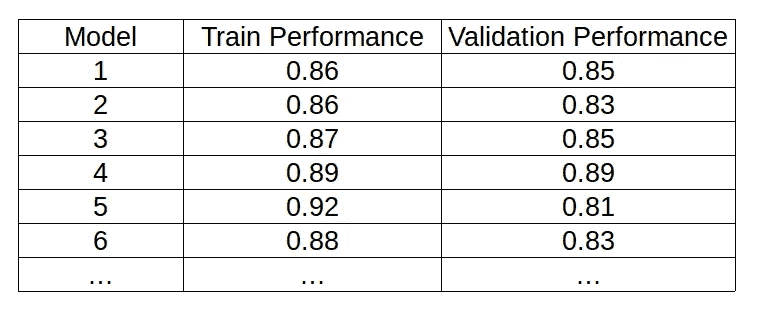
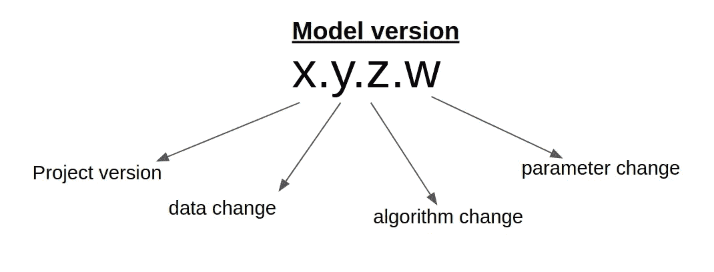

# 版本控制你的机器学习实验

> 原文：<https://medium.com/analytics-vidhya/version-control-machine-learning-experiments-cf52d092e468?source=collection_archive---------16----------------------->

在 [Unsplash](https://unsplash.com?utm_source=medium&utm_medium=referral) 上由 [Hani Bdran](https://unsplash.com/@hania09?utm_source=medium&utm_medium=referral) 拍摄的照片

如今，从数据中学习以获得商业洞察力在几乎每个行业都很常见。这些见解包括—可预测性、客户流失行为、预测等..机器学习是产生这些见解的关键因素。

构建一个好的 ML 模型需要大量的实验，包括对数据进行不同算法的多次迭代，创建新的变量，添加更多的数据等等..随着迭代次数的增加，跟踪这些实验变得更加困难。

在这篇文章中我将谈论一个系统，以有效地版本控制机器学习项目。我还会分享一些工具，帮助你轻松实现这个系统。

# 在什么情况下你会得到一个新版本？

## **1。数据更改**

每当建模数据发生变化时，您就创建一个新版本的模型。基于建模数据训练 ML 模型。随着建模数据的改变，模型参数也将改变。当您执行以下操作时，可以更改数据:

*   当你获取更多数据时。
*   当您规范化/标准化数据时。
*   当您创建新变量时——变量组合、虚拟变量、趋势等..
*   当删除现有变量时。
*   当您填充缺失数据或删除缺失数据时。
*   、或任何其他方式，其中数据发生一些变化。

## 2.模型变化

不同的建模算法对相同的训练数据有不同的性能。你每应用一个新算法，你就做一个新实验。这个新实验是这个模型的新版本。

另一种情况是创建新版本，保持数据和算法不变，但模型超参数发生变化。

# 为什么需要跟踪模型版本？

在建模阶段，训练数据和算法的独特组合将导致单个实验。当您运行不同的实验时，每个实验对验证数据都有不同的表现。对于每个实验，模型性能可能会提高或降低。考虑下表:

模型实验结果

假设，你做了 50+个实验，意识到之前的一个实验比现在的有更好的泛化能力。在上表中，我们看到模型 4 具有更好的训练和验证数据性能。因为你做了很多实验，你不记得那个模型到底用了什么数据，什么算法。在这种情况下，很难重现完全相同的结果。这就是为什么你需要一个版本控制系统，用它你可以很容易地跟踪所有的实验，而不会丢失你以前的工作。

# 模型版本控制

模型版本化是一种系统化的方法，用来跟踪所有的建模实验，这样，当你需要它的时候，你就可以检索它。

## 版本命名

正如您在前面章节中看到的，当数据或算法发生变化时，模型也会发生变化。考虑到所有这些变化，有一个有意义的和一致的版本命名系统是很重要的，这样，你就可以在一个高层次上知道一个版本发生了什么。

我使用四位数字系统来指定型号。

*   第一个数字告诉我项目版本。如果我第一次处理它，我会指定 x=1。
*   第二个数字告诉我用于建模的数据版本。最初，我设置 y=1。在建模过程中，我们可能需要多次修改数据。每修改一次数据，我就增加数字 y。
*   我用于建模算法的第三个数字。对于每个数据版本，我从 1 开始。例如，对于数据版本 y，对于我应用的第一个算法，我设置 z=1，对于第二个算法，z=2，等等。
*   第四个数字用于模型的微小变化，例如当算法超参数改变时，它会产生不同的结果，因此在这种情况下 w 的数字也不同。

例如，如果我第一次做一个 ML 项目。我创建了一个版本的建模数据，并对该数据应用了逻辑回归算法。在这种情况下，我的完整版本号将变为 1.1.1.0。现在，如果我将相同数据的算法更改为随机森林，我将调用我的版本 1.1.2.0。如果我发现随机森林有更好的参数设置，我会称之为 1.1.2.1 版本。这样，我可以很容易地跟踪我的模型。

## 版本控制工具

前述版本系统可以使用常规文件系统来实现。因为如果您的数据是 CSV 格式的，您可以将文件命名为 <filename>_ <version>.csv。</version></filename>

但是当你处理大量文件时，上述方法就开始失效了。处理版本控制的一个有效方法是使用专用软件。有两个版本控制软件，我们可以用于这个目的——

*   [git](https://git-scm.com/) —用于代码版本控制。
*   [dvc](https://dvc.org/) —用于数据版本控制。

git 和 dvc 都是开源软件。有关完整的使用信息，请查阅他们的文档。有关如何使用这些工具的示例，请查看以下文章—

 [## 开始版本控制您的机器学习数据集

### 使用开源工具使您的机器学习和数据科学项目具有可重复性。

towardsdatascience.com](https://towardsdatascience.com/start-version-controlling-your-machine-learning-datasets-2b872e109856)  [## 版本控制 ML 模型

### 机器学习操作(姑且称之为当前流行词模式 xxOps 下的 MLOps)与…

towardsdatascience.com](https://towardsdatascience.com/version-control-ml-model-4adb2db5f87c) 

# 结论

您可以使用上述系统来使用模型版本控制，也可以定义您自己的系统。重要的是在做实验的时候遵循一个系统的方法，这样当你需要的时候就很容易复制结果。

在 Quora 上关注我。我写的是数据科学和机器学习相关的答案。