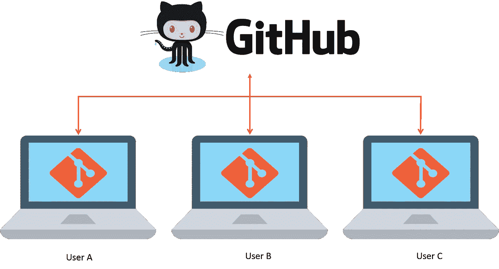
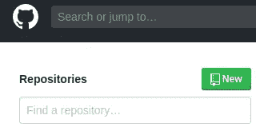

# 使用 Git & Github 进行版本控制

> 原文：<https://medium.com/analytics-vidhya/version-control-using-git-github-ff4c3f7c752e?source=collection_archive---------22----------------------->

我是一名程序员，如果你不知道如何控制程序的版本，编写程序已经成为一项艰巨的任务，在 6 个月之前，我正在开发我的网站，当时我只有 3 个月的编程经验，对版本控制有点了解，这就是为什么我花了很多时间来编写网站代码，并从头开始。但是现在我知道如何控制你项目的版本，远离我犯过的错误。因此，我写这篇博客是关于如何在 Linux 和 Windows 平台上使用 git 控制你的项目版本。

我们走吧，

# 窗子

对于 windows 平台上的版本控制，您应该在您的 pc 上下载 git，请点击下面的链接下载它。

 [## 下载

### Git 带有内置的 GUI 工具(git-gui，gitk ),但是有几个第三方工具供用户寻找一个…

git-scm.com](https://git-scm.com/downloads) 

为 windows 下载它。

现在 Git 提供了版本控制，Github 允许你在线上传代码，并与其他开发者社区共享。

让我们创建一个 Github 帐户。

 [## 一起打造更好的软件

### GitHub 汇集了世界上最大的开发人员社区来发现、共享和构建更好的软件。来自…

github.com](https://github.com/) 

现在您已经准备好使用 Git 和 Github 了。

让我们创建一个项目文件夹，并将您的工作项目的所有内容存储在该文件夹中。

假设项目文件夹的名称是 my_project

步骤 1:在你的 Github 帐户上创建一个存储库。

单击新建并创建新的存储库

Srep 2:你将找到克隆或下载按钮，点击它并复制它将用于下一步链接。

好了，现在 Github 网站的所有工作都结束了。

步骤 3:打开 CMD 并通过 cd 命令找到你的项目文件夹。

步骤 4: git 初始化

> 这将初始化一个空目录。

第五步:git 添加。

> 这将把你的项目目录中的所有文件添加到本地目录中，本地目录将存储哪个文件将被推送到 Github 的信息。

步骤 6 : git commit -m“第一次提交”

> 这个命令就像我们电脑中的保存命令，它将确保你确定你想要保存你在 Github 上的所有修改

步骤 7 : git 远程添加原点<paste link="" we="" have="" copied="">#不要在命令中使用< ></paste>

> 这将保存我们的原始可验证的信息库的信息，我们希望推动我们的项目

步骤 8 : git push -u origin master

> 这会将您的项目推送到 Github。-u 用于为下一次推送保存信息。

现在你可以在 Github 网站上查看你的项目。

未完待续…