# 版本化系统

> 原文：<https://medium.com/analytics-vidhya/versioning-a-system-3aa012d047eb?source=collection_archive---------15----------------------->

对接口进行版本控制只是一种“礼貌的”方式来杀死已部署的客户端
——Django Rest 框架

> 为什么要版本化

每当我们需要做一些不向后兼容的 API 改变时，例如:请求参数/头或响应对象的结构被改变

我们通常不会面临网站的许多问题，因为我们可以部署前端系统，最终用户将有一个更新的系统来工作。

但是，
对于应用程序(移动或桌面)，更新不会同时发生，因为它取决于用户何时更新应用程序，因此我们也需要支持旧版本的应用程序**和版本**。

*用更简单的话来说:*
推出的新更新将适用于新版本的应用程序，同时保持 API 与旧版本的兼容。

> 两种常见的版本控制方法

> 1:为每个版本创建不同的目录，并使用路由进行调度

**步骤 1:开发 web 应用程序**
假设您已经开发了一个简单的应用程序，其目录结构如下:

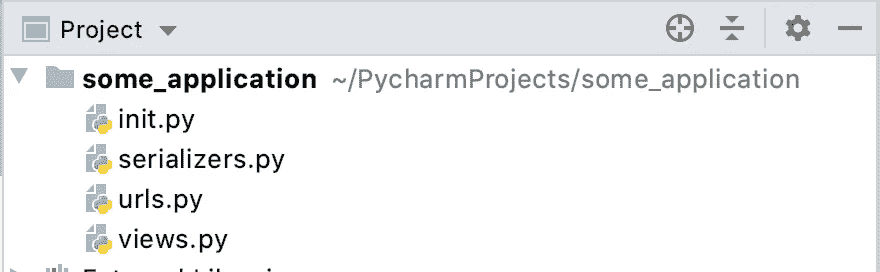

**第 2 步:根据推出的变更进行版本控制**
现在，您的应用程序的不同版本如下:

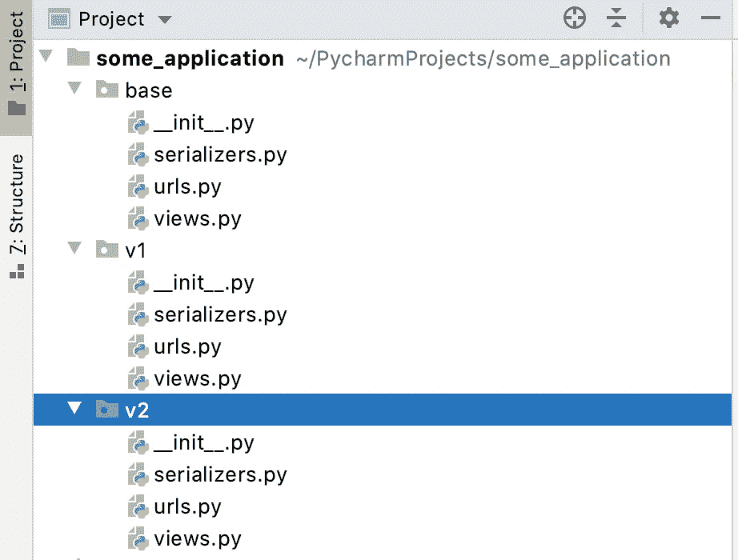

v1 和 v2 代表应用程序的版本 1 和版本 2

注意:每个版本都有自己的代码来运行应用程序

**第三步:创建派工文件**

在 base.urls 中，您可以编写调度文件，例如:

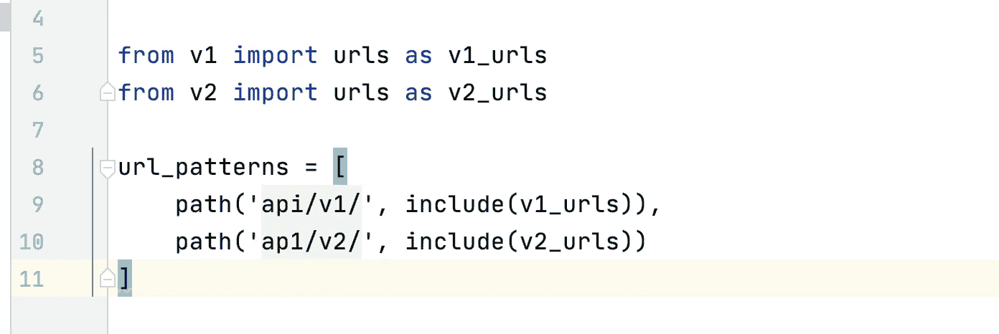

对 api/v1/*的调用将被定向到系统的 v1

因为凡事都有利弊，所以这种方法也是如此:

**优点:**
1:更少的 if-else 语句，因此代码可读性更好

**缺点:**
1:代码冗余
2:由于代码嵌套而难以调试
3:如果做了一些常见的更改，那么需要复制它

> 2:使用代码级版本控制:

这种方法将在请求本身中附加版本，您将能够像这样使用它:
***request . version*** 它将返回 v1 或 v2 或您在实现这种版本控制时设置的任何字符串。

稍后我将解释代码级版本控制实际上是如何完成的，但是现在，现在，让我们假设您已经实现了代码级版本控制。

实现之后，您可以应用 if-else 语句来返回基于版本的序列化响应。

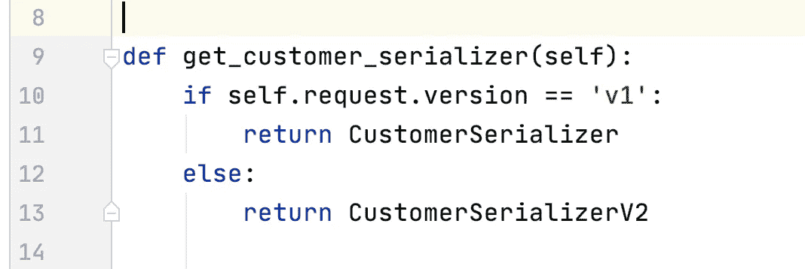

假设您有两个客户序列化器，它们返回不同结构的数据

因此不需要为每个版本创建自己的目录等。

***- >实现代码级版本化:***

为了解释这一点，我将使用 Django Rest 框架示例:

**第一步:**你需要在 settings.py 中定义你将使用哪种版本，选项有:
1:accept header versioning
2:urlpath versioning
3:namespace versioning
4:hostname versioning
5:query parameter versioning

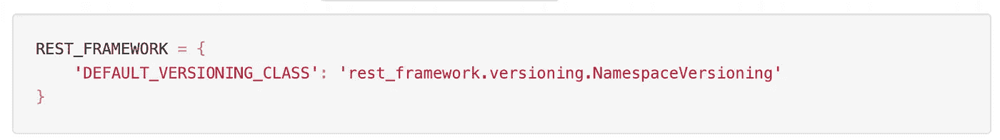

**第二步**:使用

下面解释的方法只是让 Django 知道请求连接到哪个版本的不同方式，您可以使用下面解释的任何方法:

**1:accept header version**

在这种版本控制方法中，**您需要在 Accept 报头**中将版本指定为媒体类型的一部分

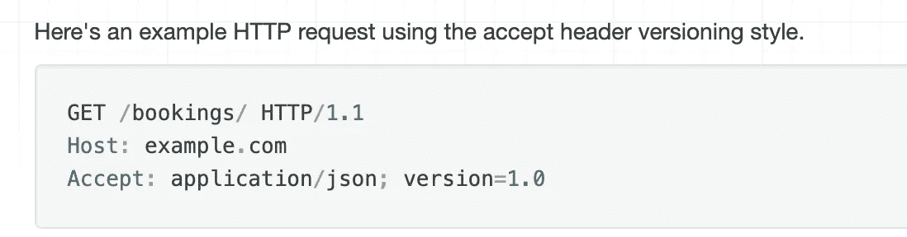

之后，您可以使用上面解释的 request.version

**2: URLPathVersioning**

在这种方法中，您需要在 URL 中指定版本，如下所示

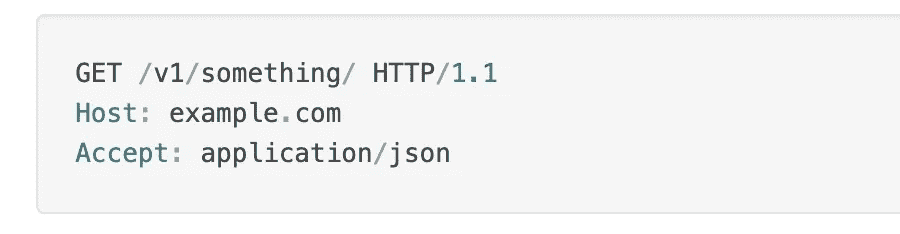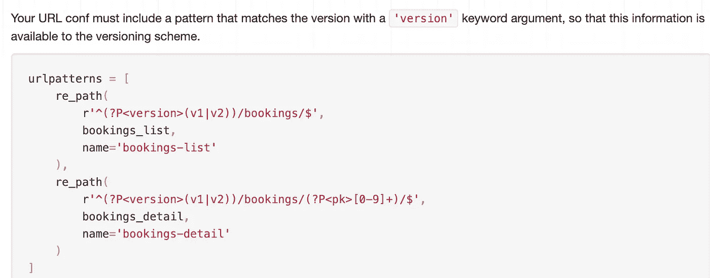

**3:命名空间版本** ( *个人喜好*)

在此方法中，您需要在 URL 中指定类似于 UrlPathVersioning 的版本

而`request.version`是基于与传入请求匹配的`namespace`来确定的(如下所示)

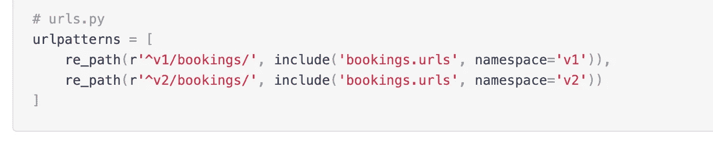

**4:主机名版本**

在这种方法中，版本是在主机本身中定义的

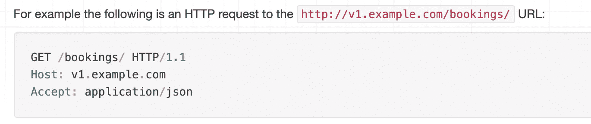

版本:v1

**5:查询参数版本**

此方案是一种简单的样式，它将版本作为查询参数包含在 URL 中，如下所示:

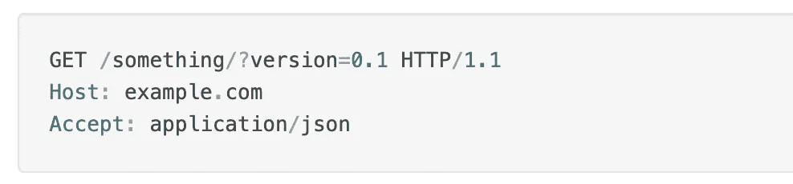

**优点:**
1:没有代码冗余
2:代码调试和可维护性更容易

缺点:
1:if-else 语句越多，代码越不直观

我希望你读得很好:)