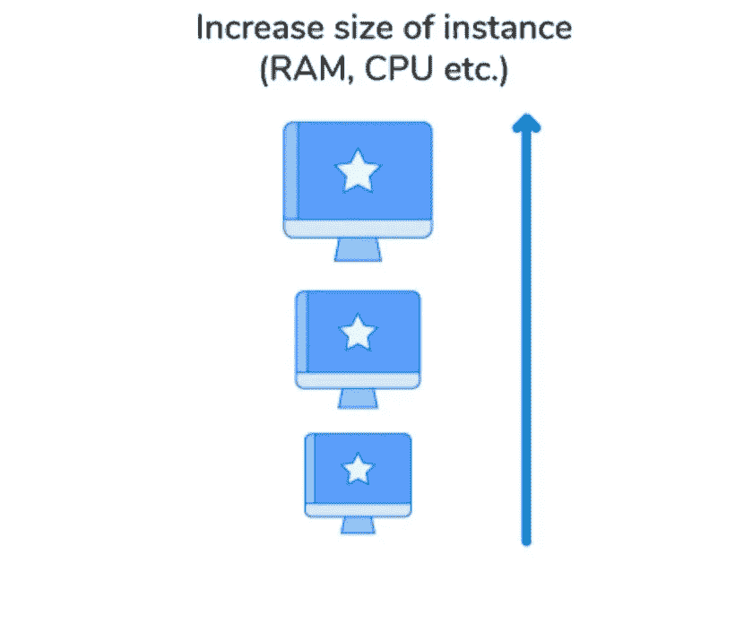
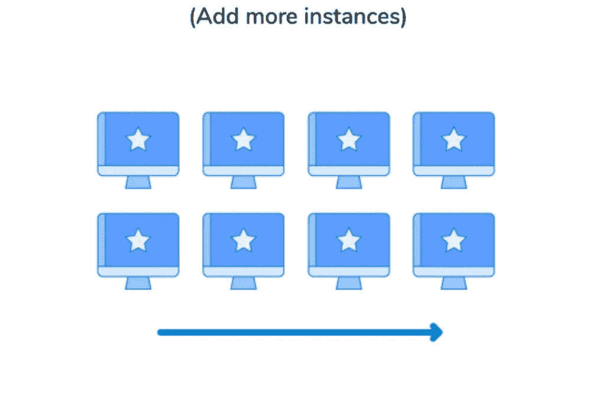

# 垂直与水平缩放。！

> 原文：<https://medium.com/analytics-vidhya/vertical-vs-horizontal-scaling-b2754d68d77f?source=collection_archive---------12----------------------->

缩放比例

当考虑系统设计时，我们想到的一个要点是伸缩性。**基本上什么是缩放？**

想象一下这样一个场景，你已经开发了一个产品，并且还获得了一些客户。一切都很顺利，直到用户数量激增，他们期望一个完美无瑕的应用程序。如果您没有为此做好准备，应用程序性能将开始下降，最终，您将失去您的受众和业务。这对你来说是一个关键问题，你想尽快解决它，否则，你的产品将会死亡。你如何解决这个问题？

这里你想改进你的产品，使它能够处理所有的用户，或者你需要扩展你的产品来处理所有的用户。系统的扩展基于许多因素，更具体地说是基于流量的行为。如果业务量逐渐增加(线性增长)，或者如果有突然的峰值(指数增长)，或者如果业务量仅在特定时间增加，等等。

**在软件工程中，伸缩仅仅意味着让系统能够服务更多的用户。**

我们可以通过两种方式扩展我们的系统，我们可以通过购买更大的机器来增加资源(如 CPU、内存等)的处理能力/大小，或者我们可以添加更多的资源并并行使用它们。前者称为垂直缩放，后者称为水平缩放。

# **垂直缩放(Scaling up)**

垂直缩放

在垂直扩展中，我们为现有的服务器(购买更大的机器)增加更多的能力(CPU、RAM 和磁盘)。垂直扩展很容易实现，唯一要做的就是升级我们的服务器，以获得更高的处理能力或内存，或者两者兼而有之。例如，如果您正在使用 AWS EC2 实例，只需将其升级到下一个级别。

其优势在于，由于我们只需要管理一台机器，因此不需要任何复杂的设计或架构。但是垂直扩展是有限制的，我们不能将服务器的功率增加到超出限制，这也会成为单点故障。

# 水平扩展(向外扩展)

水平缩放

在水平扩展中，我们通过向系统添加更多的服务器(购买越来越多的机器)并在它们之间分配负载来进行扩展。这里，单个服务器的能力不会很高，但是所有这些服务器共同提高了系统吞吐量。

与垂直扩展不同，水平扩展没有限制，因为我们可以拥有任意多的服务器，并在它们之间分配负载。但这样做的缺点是，我们需要复杂的设计和架构来让不同的机器协同工作，并在这些资源之间高效地共享流量。

# 选哪个？

这个问题没有直截了当的答案，在以上两者之间做出选择取决于许多因素，

**可用性:**在垂直扩展中，因为只有一台机器可用，所以这是一个单点故障，如果那台机器出现问题，整个系统将不可用。而在水平扩展中，由于我们将流量划分到不同的机器上，因此即使任何一台机器出现故障，其余的机器也会处理流量。如果您的应用程序很受欢迎，那么对用户不可用是您最不希望发生的事情！

**灵活性:**纵向扩展更容易，你唯一想做的就是买一台更大的机器。但是这种扩展有一些实际限制，即您只能购买市场上可用的机器，即使是最大的可用机器也有一些限制，如果您想要扩展甚至超过这些限制，那将非常困难。但是在水平扩展中，没有实际限制，因为您可以购买 N 台机器并将它们添加到您的系统中。理论上，您可以使用水平缩放实现无限缩放。

**跨地域扩展:**如果您想要跨大洲扩展您的应用程序，以便为世界各地的所有用户提供无缝体验，或者将您的应用程序从可能摧毁您所在地区的服务器的自然灾害中拯救出来，垂直扩展是完全不可能的，您必须使用水平扩展。

**易于更新:**很难在不关闭整个系统的情况下为单个大型服务器更新新功能，但在水平扩展的情况下，我们可以有一个持续的部署过程。

**易于实施:**纵向扩展比横向扩展更容易。在水平扩展中，我们需要复杂的架构，比如平衡不同服务器之间的负载。